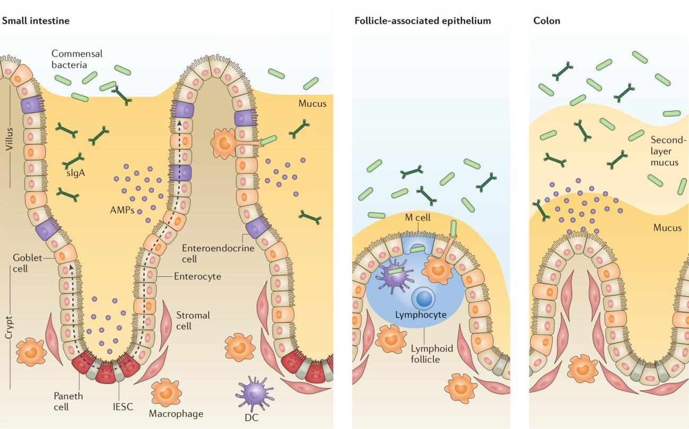

# Introduction

The [inflammatory bowel disease](https://en.wikipedia.org/wiki/Inflammatory_bowel_disease) (IBD) involves [Crohn's disease](https://en.wikipedia.org/wiki/Crohn%27s_disease)(CD) and [ulcerative colitis](https://en.wikipedia.org/wiki/Ulcerative_colitis)(UC).
It generally affects the terminal ileum and the colon but it can affect any segment of the gastrointestinal tract.
UC is a recurrent, chronic and continuous inflammation of the colon and rectum while the CD is not a continuous inflammation and affects the whole gastrointestinal tract.

IBD etiology is unknown.
However, once it has initiated the most prevalent hypothesis of its chronicity suggests an aberrant immunological response to antigens of the commensal microbiome.

Treatments provided for the IBD are palliative.
Those treatments include, noninflammatory drugs, suppressors and biologic.
The therapeutic options can induce remission in some patients, however they often need continuous treatment to avoid recurrence.
Nevertheless, many patients are refractory or intolerant to those therapies and need to undergo surgery.

The disease present unique characteristics that require the usage of integration methods in order to find the specific relationship of the microbiome and the intestine on the disease.

## Integration

Data integration is informally widely used with varying definitions, according to the dictionary integration is defined as:

> "the process of combining two or more things into one" --- [Cambridge Dictionary](https://dictionary.cambridge.org/dictionary/english/integration)

Other words that are used are integrati(-on, -ve), if specific to data from sequencing technologies multi-omics, pluri-omics.
Here integration will be used as it is the more general one and not restricted to omics or sequencing technologies.
Since the beginning of the integration methods there have been many methods proposed.
Some of the early methods were initially used for surveying the agreement of different evaluating systems, others were developed for agricultural sciences [@hotelling_relations_1936].
Some of these methods are specific for one application or data while others are more general.
Lately, the increase of bigger datasets with more variables and often from the same samples has increased the focus of the research community on the methodologies available on several disciplines but mainly on the biological science.
The explosion of data on the biological science has been driven by the new sequencing technologies that allow to measure thousand of variables of many samples at the same time, if done with multiple sequencing tecnologies it is usually referred as multi-omics methods, which usually only integrate omic data.

It has been observed the importance of classification, review and comparison of the tools available, as well as, benchmarking these tools against the same dataset as a way to provide clear recommendations to anyone wishing to use them [@wu_selective_2019].
Part of these efforts uses the methods' strategies to classify them [@cavill_transcriptomic_2016; @chongComputationalApproachesIntegrative2017].
Following this view I'll review the integration methods according to several axis: type of data used, aim of the method, relationships between variables, relationships between samples, relationship between variables and samples, input data, mathematical framework and results of the method.

### Classification of integration method's

Here I outline how to classify integration methods in the bioscience field, mainly using omics datasets, with relationships (and references) to concrete methodology and in occasions to articles using them.

#### Data type: numeric vs categorical

The most important distinction in integration methods is what kind of data are combined.
In general data can be divided between categorical and numeric variables, which are usually found in several fields.
Sometimes doctors want to understand the relationship between a phenotype they observe and the underlying mechanism.
Usually this involves looking how the metabolites, the gene expression, the methylation, the number of variants a gene has, and other numeric variables are related to the observed (categorical) phenotype (like pain).

Depending on what does a method aim for it handles both data types or just one, often they are used differently.
The most common way to handle different type of data is converting the categorical values to a mock or dummy variable.
For each categorical factor there is a new variable whose value is 1 if that sample had this factor and 0 otherwise.
For instance, if the categorical variable has three values (A, B, C) it would be converted to A (1, 0, 0) B (0, 1, 0) and C (0, 0, 1).
Often the number of variables created is one less than the number of factors that existed, on this example only A and B would be kept.
This transformation allows to use the categorical values in methods though for numeric variables.

If the method only accepts categorical data but you want to provide numeric values usually those values are categorized.
For example if a variable is (0.123, 0.25, 0.56, 0.78) one could make to categorical values like ("\<0.5", "\<0.5", "\>0.5", "\>0.5").
The number of categories to use and how is the numeric value split depends on case by case.

#### Objective

The objective of the method might be one of the most important defining properties.
Sometimes the objective of a methods is formally defined as a function to be optimized or a procedure to be followed until certain conditions are meet.

Data integration can be classified according to their objective and the (biological) question they try to answer.
Most of the times one (or all) of the following results are expected from integration methods:

-   An overview of the role of each individual block in a biological system

Sometimes the question is which omic method is the best one to describe the disease.
This could prevent to do expensive tests that can be estimated by other cheaper or easier techniques that are enough sensitive and specific for the task.
Some examples of this is the search of markers on blood to identify if there are cancer cells on tissues.

-   A better understanding of the relationships between the 'omics types

Several methods are used to understand better how the different data sets interact.
When the relationship between omics is known further focused methods are used to understand the mechanistic relationship between them.
For instance, checking that in a particular case or condition is present on a given relationship, and that this relationships follows our model or not.

-   Finding a molecular signature.

A signature is usually a group of features that describe/are representative of a cell line, a process or a stage.
Identifying a subset of the variables from the omics that are related is often a desired goal because it reduces the amount of variables allowing to perform experiments on the bench on just those that might be important.
In other fields, such as machine learning, selecting the important variables is known as [feature selection](https://en.wikipedia.org/wiki/Feature_selection "Wikipedia page of feature selection").
There are several methods that are used to this.

-   A predictive model

Usually predictive models require also a very good understanding of the current or past relationships as well as a good feature selection.
Often to make a prediction the model is first evaluated on a previously known data according to this features.
If a good model is known it can be used as a prediction if enough information is gathered, which might improve treatments, diagnosis and prognosis prediction.

-   Impute values

Some methods aim to make an accurate guess of which values does have one block given some other information.
Missing values can happen for a variety of reasons from practical ones, sample not available to technical ones such as laboratory method failing.
However, this is often a intermediate step to other goals.

To complete these goals it is important to have enough statistical power to determine the significance of tests preformed (if any) and to understand how complete are the data sources used on the integration [@tarazona2021].
This reflects on the relationships between variables and samples.

#### Relationship between variables and samples

Depending on the amount of variables and in which samples they have been measures we can classify two types of integration.
Traditionally for each sample few variables were measured, for instance for a tree only the height and width are measured, however with the new omics techniques (transcriptomics, metabolomics, methylomics, genomics), thousands of variables are measured for the same sample.
This has lead to the following situation:

-   More variables than samples

For a single sample of RNA around 50k genome identifiers (genes, long non coding RNAs, iRNA, pseudogenes,...) can be measured.
Which leads to the case where there are (many) more variables than samples.
Thus high-throughput data analysis typically falls into the category of $p \gg n$ problems ( big p, little n), where the number of genes or proteins, $p$, is considerably larger than the number of samples, $n$.
With such high number of variables the identification of the relevant variables is complicated because variables will co-variate.
When two variables are tightly correlated, discerning which is the lead and which is following using just numerical methods is near to impossible.

-   More samples than variables

This was the usual case when for instance, when from a cohort of patients the temperature is measured along the stage of a disease: two variables for each sample.
If there are more than 2 patients, then the number of samples is greater than the number of variables studied.
This is described in the literature as $n \gg p$.
Nowadays this is less frequent on the bioscience world, and does not causes trouble analyzing it because the high number of samples allow to better estimate of the errors, allowing better statistical power.

Having just the enough amount of samples for the desired statistical power is not enough if the samples of different blocks do not match between them.

#### Relationship between samples

Depending on the relationship between the samples of the different blocks of data, the questions answerable and the methods that work on them differ.

If each sample has all the expected data we wanted to measure it is a complete case.

Sometimes because the sample is not enough, or there are some technical or organizational problems we might lose a source of data for a sample (which is known as an incomplete case).
This results in a new source of variation that has to be dealt with, which complicates the conclusion one can draw from the studies of these kind of data.

Even when all the cases of a patient are complete the samples can come from several sites of the same individual or with different combinations of variables, which makes is relevant to understand the relationships between the different samples.

There is no easy classification of this as each experiment might be designed differently.
In general, experiments are designed to be as consistent as possible but in face of adverse events that become a variation of the design the analysis complicates.
Often, imputation of some samples is done or the deletion, not using them of some, or if the differences are minor to use them as being from a different group.

This can happen with samples taken at different timepoints as patients might not come to the visit with the doctor on time.

##### Time {.unnumbered}

As mentioned above, time is one of the factors that sometimes cannot be controlled, despite having programmed visits every two weeks some patients might come early or later due to multiple reasons (holidays, other conflicting duties,...).

Sometimes, precisely the objective of the study is to analyze the relationships at different time, or see how the relationships change with time.
Simultaneously is very important to consider it because two variables can seem correlated if we don't take time into consideration.
Also, to discover causality between two variables the cause must be before the consequence, which highlights the importance of time.
Being aware of the time differences and time scales is crucial in most cases.

On cell lines or other lab experiments conditions can be repeated even if they are at different time points.
However with patients we can not obtain a sample at the same timepoint.
This makes it harder to study time related change on patients.

Lastly, it has been seen that time between the collection of a fresh samples and its processing also influences the readings of the samples of the omics technology, specially RNA-seq [@massoni-badosa2020; @zhu2017].
Some features and genes are more affected by time than others.

#### Relationship between variables

As seen some variables influence other variables and affects the outcome in a complex way.
With many variables present it is important to be aware of known relationships between variables.
Even in a single dataset it is important to be aware of the relationships between variables.

One the best example the correlation between some variables can be used to reduce the number of variables being analyzed.
However, sometimes this is not desired or feasible as the correlation doesn't explain the direction of the causality of the interaction between the variables (if there is any).

Since the lactose [operon](https://en.wikipedia.org/wiki/Operon) we know how some genes regulate each other.
We don't know how other variables are related between them.
For instance, how does the increase in expression of a gene affects the growth of a microorganism?
Usually the relationships between variables are mediated by many factors or interactions.

Network approaches relate the variables between them (such as [@koh_iomicspass_2019]).
These approaches are fairly new and growing in popularity.
Other methods ignore the relationships between them and use the most representative variables (less correlated or with more variation), this is usually done by the dimension reduction methods.

In partial correlations some or all of the other variables are considered on how much do they affect the others and this effect is reduced.
This assumes a linear relationship and is computationally expensive when there are thousands of variables.

#### Input data

Some of the methods to account for relationships of variables only work when data is from the same patients on each data set used to integrate while other do not.

-   Data from the same samples:

These methods do not handle well or at all missing data.
They need complete cases/data of the samples in order to be able to integrate the results.
These methods include Regularized Generalized Canonical Correlation Analysis (RGCCA) [@tenenhaus_regularized_2011; @tenenhaus_variable_2014], Multiple co-inertia analysis (MCIA) [@culhane_cross-platform_2003], Multi-Study Factor Analysis (MSFA) [@vito_multi-study_2019], Multi-Omics Factor Analysis (MOFA) [@argelaguet_multi-omics_2018], STATegRa [@gomez-cabreroSTATegraComprehensiveMultiomics2019].

-   Data from different samples:

These methods do not need data from the same sample.
They draw their conclusions generalizing from the the data available.
Some of them handle missing data, while others do use the data at face value.
These method includes MetaPhlAn2, HUMAnN, LEfSe [@franzosaSpecieslevelFunctionalProfiling2018; @truongMetaPhlAn2EnhancedMetagenomic2015; @segataMetagenomicBiomarkerDiscovery2011].

Furthermore, some methods are designed to integrate specific types of datasets, (usually because they make some assumptions that are only met on that kind of data).
For instance, HCG, 16S, RNA-seq and metabolomics do not share the same data distribution, and are different between them.
Also even with the same data depending on the processing of the data they can have very different properties: OTUs (operational taxonomic unit) do not behave equally as ASV (amplicon sequence variants).

#### Mathematical framework

Depending on the input and the objective methods use different mathematical framework to process the data.
Some of them have previously appeared:

-   Networks

    Networks methods were mentioned because they use and find information about interaction of variables.
    Multilayer networks, including the multiplex, Molti-C-DREAM, RWR-MH, RWR-M. Network embedding MultiVERSE are some of the methods using networks.

    Bayesian approaches are also quite frequent and methods use the Bayes theorem to see the relationships between variables.
    Some methods that use these approaches are X, Y, Z.

-   Dimensional Reduction

    These methods focus on finding just a few variables and summarizing them using some function that has some properties.
    The selection of variables is usually done with L1 or Lasso Regression regularization technique or L2 also known as Ridge Regression.
    L1 regularization adds a penalty equal to the absolute value of the magnitude of coefficients which leads to some coefficients can become zero and the variable eliminated from the model.
    On the other hand, L2 regularization doesn't result in elimination of coefficients or sparse models and can only be used when there is multicollinearity.

    Other methods use bayesian approaches

    Momix, RGCCA,

-   Active module identification

    Multiomic objective genetic algorithm (scores based in two metrics, node score and density of interactions score).
    MOGAMUN

Usually depending on the mathematical framework used they return these methods return similar output.

#### Output results

According to the output the integration methods can be classified in several groups:

For the network methods the following output is usually returned:

Connection between the variables/nodes, a measure of how strong is the connection (or simply if there is a connection or if there isn't one).

For those from dimensional reduction methods there are three: Shared factor across the data, specific factors for each data or mixed factors.

-   Shared factors:

The integration results in a vector of the samples in a lower dimensional space that is shared by all the data used to integrate.
Such methods include iCluster, Multi-Omics Factor Analysis (MOFA) [@argelaguet_multi-omics_2018].

-   Specific factors:

The integration results in several vectors of the samples in a lower dimensional space of each data used to integrate.
Such methods include Regularized Generalized Canonical Correlation Analysis (RGCCA) [@tenenhaus_regularized_2011; @tenenhaus_variable_2014], Multiple co-inertia analysis (MCIA) [@culhane_cross-platform_2003], Multi-Study Factor Analysis (MSFA) [@vito_multi-study_2019].

-   Mixed factors:

The integration results in both previous factors, specific of each data and common to all the data.
Such methods include Joint and Individual Variation Explained (JIVE), integrative Non-negative Matrix Factorization (intNMF).

For active module identification the common output is XXXYYYZZZ.

Given this output the researcher task is usually to understand and discuss the results with previous knowledge or independent sources of data.

### Interpretation

How to interpret the results of the methods is highly linked to understanding the method and its output.
On a correlation between two variables, the interpretation of the analysis is clear, if one variable increase, the other one too.
The implications of these observation can be far reaching but the principles to understand them are simple.

However, on more complex methods the interpretation becomes less clear.
The interpretation of a canonical correlation analysis is much harder [@sherry2005].
Also on more complex methods the number of parameters required increases so the time and intellectual effort to understand the relationships between the parameters is also higher.

The interpretation also helps to discuss the results and relate it to other previously know information.

-   Individually:

How each variable relates to another, like in the correlation analysis, the relationship between two variables under study.
Or by patient: how do interpret that in these patient variable A and B is X and Y?

-   Globally:

In a PCA for instance how do we interpret that some variables have the same loading?
What happens in a more difficult method like canonical correlation analysis?

There have been some articles about how to interpret those methods on real datasets [@sherryConductingInterpretingCanonical1981].
Others, to benchmark and to learn how to interpret propose analyzing a simulated dataset [@chung_multi-omics_2019; @martinez-mira_mosim_2018].

To help interpretation frequently synthetic datasets are used to compare the results of the integration with the dataset of interest and to compare different tools.
This datasets are created with some relationships that the tools are expected to find.

There exists several methods to create synthetic datasets like MOSim, metaSPARSim, CAMISIM, ballgown, polyester and even edgeR can be used.
These methods are useful to compare different setup and methods but they can miss some subtle not previously reported relations.

### Conclusion

The field of integration is large and complex, with high interest in the recent days, specially in the psychology and omics field.
As a method they are quite complex and diverse which hasn't stopped the growing interest on them to help answer complex questions.
The differences between the many methods that exist do not make the interpretation of the results easier

### Reviews and benchmarking

The comparison and review of methods independently from original authors have become a crucial step for selecting the right tool for a research [@cantini_benchmarking_2020].

Some of these reviews are focused on a field: metabolomics (ref), genomics, microbiomics... or on a specific characteristic: ?.

Others focus on the disease and the challenges of each omics and the need of an integrative approach to provide better therapies [@de_souza_ibd_2017].

### Summary

Methods to integrate have many characteristics, depending on the objectives and data that available some methods might not be yet available.
Regardless of the method used, interpretation and reporting is usually a main problem when using any of these methods.

## Inflammatory bowel disease {#IBD}

Inflammatory bowel disease (IBD) includes the chronic diseases Crohn's disease (CD) and ulcerative colitis (UC) which are characterized by alternating periods of remission and clinical relapse that mainly affect the gastrointestinal tract.
CD is a progressive relapsing disease that can affect all the gastrointestinal tract but shows mostly on both terminal ilium and colon with a discontinuous inflammation.
The UC is a colonic relapsing disease characterized by a continuous inflammation of the colon.
Both of them have different risk factors, clinical, endoscopic an histological characteristics.

<!-- Check with Elena Basolas Tesis p18-->

Some differences between them is that on CD a granulome, that is a region with big multinucleous cells, can appear on any intestinal layer, while on UC we observe a different damage consisting in many neutrophil in the crypt lumen.

To distinguish between the diseases, in addition to the inflamed location(s), mosaic zones (patches of inflamed and non-inflamed areas) are more characteristic of CD [@bassolasmolina2018].

Sometimes blood analysis are also used, if there are some factors altered such as leucocits, a high globular sedimentation speed, increas of protein C reactive and anemia could indicate inflammatory bowel disease.
Also, if there is an increase of calprotectine in fecal samples is indication of CD disease [@sands2015].

<!-- Finish -->

Around 3.5 million individuals have IBD in Europe and North America combined [@jairath2020].
The disease has been used as a condition that prevents people to [apply to certain positions](https://civio.es/el-boe-nuestro-de-cada-dia/2019/02/13/las-enfermedades-que-vetan-el-acceso-a-ciertos-empleos-publicos/ "Link to a Civio.es about disease disqualifying for some public positions").
The dysregulation of the inflammatory response observed in IBD requires interplay between host genetic factors and the intestinal microbiome.
Several studies support the concept that IBD arise from an exacerbate immune response against commensal gut microorganisms.
Nonetheless, the disease could result from an imbalanced microbial composition leading to generalized or localized dysbiosis[^introduction-1].

[^introduction-1]: A signature is usually a group of features that describe/are representative of a cell line or a process or a stage.

The role of the gut microbiome in IBD is an active ongoing field of research.
Several authors are currently studying the alterations reported in IBD of the intestinal microbiome.
However, it is still unclear the cause-effect relation between dysbiosis and IBD.
Partly due to the multiple variables already identified that might contribute to the disease progression; for instance, age, diet, usage of antibiotic, tobacco, and eventually socioeconomic status.
Other variables that has been linked to IBD are genetic predisposition and environmental factors; for instance, bacterial or viral infection, diet, usage of antibiotic, and eventually the socioeconomic status (see [@human_microbiome_project_consortium_framework_2012]).

The relationship between host and microbiome has been proposed to play a fundamental role to maintain the disease.
Little is known of the influence of the gastrointestinal microbiome in the expression of the gastrointestinal tract.

### Etiology and pathogenesis

Several explanations has been proposed of the origin of the disease [?c
itation needed].
Some of them base on a relationship between the immune system and the microbiome and different experiments provide partial evidence to this, such as restarting the B-cell repertoire [@corralizaDifferencesPeripheralTissue].
It is also unclear if Crohn's disease and the ulcerative colitis share the same origin considering their different symptoms.

There is also evidence of some genetic component on the onset of the disease, specially if it is very early.

Although so far we do not know what starts the disease there are differences on the disease when appears at different age.
There is a rough classification between very early, early or adult on-set disease.
The main differences are [ask Isa?]
.
On very early on-set the genetic component is high.
GWAS studies has linked the IBD disease to *NOD2* gene, but so far there isn't any known mechanism how this gene could start the disease.
On early and adult disease the genetic component is lower and it is thought that the environmental factors are the main cause of the disease.

Either case it is not known how it starts or is maintained and causes those characteristics relapses.

#### Genetics

The inflammatory bowel disease is not an heritable disease but it has some genetic influence that predisposes people to have it.
On some patients that the disease show up very early , diagnosed before the age of 2 or just early following the Montreal classification (See [Clinical care] section) , the genetic component is higher.

This has lead the studies looking for genetic factors on IBD both on general population and on the early cases.
Genome wide association studies (GWAS) is one of the most common genetic studies, together with methylation studies.
They help discover through linkage desequilibrium genetic variations linked to phenotypes.

With GWAS several allels on protein coding loci have been found rising to around 300 genetic variants [@kumar2019].
Particularly, one on the *NOD2* gene is highly relevant for the disease on European patients, as it is a risk alleles for Crohn's disease loci but show significant (P \< 0.005) protective effects in ulcerative colitis [@jostins2012; @momozawa2018].
However, there hasn't been a proposed mechanism for how does it work.

Many of the relevant genetic loci related to IBD are not on protein coding fragments of the genome.
Recently expression quantitative trait loci (eQTL) particularly showed this [@mcgovern2015].
Usually they are on enchancer or promoters like e.g.
H3K27Ac or promoter e.g.
H3K4me1 marks as found by ChIP-Seq (chromatin immunoprecipitation sequencing).

#### Microbiome

Microbiome, is often studies, both with 16S DNA studies or with whole metagenome study on the fecal or intestinal samples.

<!--Elenea tesis -->

Many studies show that patients with inflammatory bowel disease has less biodiversity.
Biodiversity is measured on $\alpha$ (alfa) and $\beta$ (beta) diversity.
$\alpha$-diversity is a mesure of the species present on a single sample and how much of each there is.
There are some reports of taxonomic changes and increase on *Enterobacteriaceae sp*, *Escherichia coli* (specially the invasive) at the mucosal layer of IBD patients [@ott2004].
At the same time there is often a reduction on protective species like *Bifidobacterium*, *Lactobacillus* i *Faecalibacterium.* Specially the *Faecalibacterium prausnitzii* is one microorganism of interest [@kostic2014].

One of the proposed mechanism is through the chemical compounds they generate.
Chemical compounds may interact with the cells and modulate the state of the intestine.
One example of such molecular is butyrate which has been linked to microorganisms presents on healthy intestines and to induce a better healing of intestine cells [@ferrer-picón2020].

<!-- End-->

#### Immunology

As explained on the introduction one of the possible causes of the inflammatory bowel disease is the immune system.
Crohn's disease presents altered innate and adaptive immune responses.
IBD is often characterized as an immune-mediated disease, if not outright autoimmune disease.

A loss of tolerance to commensal bacteria has been suggested as the underlying mechanism.
The mechanism involves many different cells lines and regions.
For a better understanding it is important to know the organization of the intestinal organization.

<!--Image from Ana tesis p29: -->

From the luminal side of intestine, the first layer is the mucosa.
The mucus is organized in two layers: the inner layer, a firm mucus layer; and the outer, loose mucus layer [@okumura2017].
Later the intestinal epithelium is a single layer of cells organized into crypts and villi (and circular folds on the large intestine) that carries out a diverse array of functions besides digestion performed by specialized cell lineages.
These cells usually come from the basal side of the crypt and mature as they move towards the apical side.

Both the adaptive and the innate immunity related cells are present on the intestine, right below the epithelium.
On IBD due to antigen translocation into the lamina propria, the immune response leads the adaptative cells to generate immune response to harmless components of the intestinal microbiota.
This initial response would induce a local increase in the production of pro-inflammatory cytokines and mediators which would damage the epithelium.
This damage is what would be later identified as inflammatory bowel disease.

On these kind of diseases autologous haematopoietic stem cell transplantation has shown some benefits on IBD [@corraliza].
The benefit of HSCT in autoimmunity is thought to originate from the depletion of auto-reactive cells regardless of their specificity.
However, due to its associated risk this therapy is only given when patients are refractory to all available therapeutic options.

#### Environmental

### Crohn's disease physiology

As previously introduced, Crohn's disease is a chronic inflammatory disorder characterized by alternating periods of remission and clinical relapse it is frequently associated with extraintestinal manifestation and/or concomitant immuno-mediated diseases.
Inflammation on the gastrointestinal tract is transmural and can affect from the mouth to the anus, but mainly it manifests on the ileum and colon.

#### Clinical presentation

The disease itself manifest an heterogeneous symptoms that can involve, diarrhea, weight loss, abdominal pain, fever, anorexia, malaise.
Other co-occurring manifestations are arthritis, primary sclerosing cholangitis, skin disorders venous or arterial thromboembolism and/or pulmonary involvement.
All these symptoms make it hard to provide a diagnosis by non-specialists and can lead to delays on correct diagnosis of the disease as there isn't a single gold standard test for its diagnosis.

<!--Tesis Ana p21-->

The detection of parasites or bacteria, such as *Clostridium difficile*, would admit an infectious disease.
The detection of fecal calprotectin, is a good marker of endocopic activity with sensitivity above 70% and specificity above 80% generally [@guardiola2018].
Usually the diagnosis is performed with a colonoscopy, whether there is inflammation on the gastroinestinal tract on discontinuous regions then is Crohn's disease.
This inflammation could also present as an ulceration and rectal sparing [@corralizamárquez2019].
Histological lesions also help to diagnose the patients .

<!--Finish-->

To address this difficulty the Montreal classification aims to classify patients according to their age of disease onset, standardized anatomical disease location an disease behaviour.
This classification assumes that the location of Crohn's disease remains stable over time after diagnosis but behavioral phenotypes change with most patients progressing from an inflammatory phenotype to a stricturing or penetrating one.

There is to some extent a disassociated between patient's (clinic) well-being report and the colonoscopy observation.
Often patients report feeling better but their gut is as inflamed as previously.
This has lead to several scores and thresholds used on research and treatment of the patients.

#### Disease course

In the early stages of the disease the relapsing and remitting course is more frequent.
Often relapses are accompanied by clinical symptoms, and very few have prolonged clinical remission.
When there is clinical remission, as mentioned above there can still remain some other lesions and sublinical inflammation often persists.
Often the damage caused by the disease evolves to fibrostenotic stricture or penetrating lesions (fistula and abscess).

Although Crohn's disease and colon disease are similar the drugs and treatments for each is different.
The order of the treatment/drugs changes depending on the disease.

### Ulcerative colitis physiology

Around a third of the patients with ulcerative colitis suffer proctitis, followed by left colitis, when the affected area starts on the rectum and extends to the left colon, distal colitis, defined as disease limited to rectum and sigmoid colon, extensive colitis as involvement of at least the descending colon, and pancolitis, when the disease affects all the colon.
The extension and severity of the disease does correlate with the clinical observation, where longer extension is a worse prognosis [@etchevers2009].
Extensive colitis is also associated with extensive care [@etchevers2009].

#### Clinical presentation

#### Disease course

Starting age usually around 15-20?

Some subset of early \< 17 and also very early subset \< 5 years.

### Clinical care

The goal of treatment is not limited to clinical remission[^introduction-2] but rather to mucosal healing, which means the reconstitution of the structure and function of the intestinal epithelial barrier.
Mucosal healing is a first step towards the healing of deeper layers of the inflamed bowel wall on the Crohn's disease.

[^introduction-2]: clinical remission is the when the symptoms of IBD have lessened to the point that they're mostly absent, gone, or barely noticeable.

Clinical remission is not enough to avoid relapse and the bowel may not be free of lesions, evolving to other phenotypes such as fibrostenotic stricture or penetrating lesions increasing the structural bowel damage.

Colectomy[^introduction-3] is a surgery procedure done when there is colorectal cancer or the damage on the colon has been too big.
That sometimes IBD patients have to endure.

[^introduction-3]: A surgical procedure to remove part or all of your colon.

Patients that undergo a colectomy need to have their bowel reconnected with a procedure called ileoanal anastomosis (J-pouch) surgery.
This often ends up in a pouchitis[^introduction-4].
Which might extend to healthy areas.

[^introduction-4]: inflammation that occurs in the lining of a pouch created during surgery to treat ulcerative colitis or certain other diseases.

Dysplasia[^introduction-5] is often associated with crhonic IBD patients, which is considered a precendence before colorectal cancer develops [@mark-christensen2018].

[^introduction-5]: Abnormal development of cells within tissues or organs.

Fistula[^introduction-6] is often found on the phenetrating phenotype of IBD patients.

[^introduction-6]: An abnormal connection between two body parts.

Herpes and citomegalovirus virus.

Imaging techniques

Many scores have been proposed for several purposes, from quality of life to disease severity or patient status.
Among the scores most used are the following:

-   Mayo: A score designed to be simple to calculate at the bedside based on stool frequency, bleeding, mucosal apperance at endocopy and disease activity.
    [@schroeder1987]

-   SES-CD: simple endoscopic score for Crohn's disease [@daperno2004].
    Score based on size of ulcers, ulcerate surface percentage, affected surface and presence of narrowings on the bowel.

-   IBDQ: A 32 questionnaire used to assess the quality of life grouped into four categories: bowel, systemic, social and emotional.
    [@irvine1999]

-   Montreal classification allows for early onset of disease to be categorized separately those with age of diagnosis at 16 years or younger, diagnosis at 17--40 years and \>40 years, respectively[@satsangi2006].

Other measured parameters include, weight, effective weight, calprotectin, Proteinc C reactive (PCR), hemoglobine.

#### Drugs and treaments

The ones given on the hospital more or less on the order of administration, although this varies between patients and time according to recurrent meetings doctors have and current recomendations:

anti-TNF$\alpha$, vedolizumab, ustekinumab, risankizumab, tofacitinib, infliximab, adalimumab a 5-asa treatement, corticoesteroids, Azathiprine/Mercaptopurine 6MCP, Methotrexate MTX, Tacrolimus FK, Cyclosporin A CyA.

All these drugs and procedures are available at the time of writing, and patients were taking one or more of those drugs as standard of care to contain the disease heal and have a good quality of life.

To reduce secondary effects of drugs or to find the right dose of the drugs often a reduction of dose is recommended.
Dose reduction often results in losing the response to the drug.
Thus, after an increase of the dose to the previous levels the patients not recover the initial response they had and doctors need to recommend other drugs or combinations of drugs.

If the drugs fail to contain the inflammation and heal the epithelium doctors might recommend to perform a surgery to remove the damaged section.
In some cases Hematopoietic Stem Cell Transplant (HSCT) is recommended.

This is a new procedure given only to the most extreme cases for which several publications have checked that it resets the immunological state of the patient.
Currently it is only performed on the Hospital Clínic (Barcelona).

Last there are several proposal of fecal microbiota transplantation, which are not done on the Hospital Clínic yet.
But are proposed to reset or change the intestinal microbiome of the patients to help them on the disease.
This has been doing experimentally on mice and mouse for some time and some experiments on patients resulted have been performed already.

### Summary

Inflammatory bowel disease is a complex disease that impacts the health of many people in different ways.

Current clinical care in some cases is enough to have a sustained clinical and endoscopic remission but most often is not enough and relapse is expected.
Several factors, such as becoming refractory to drugs, intermittent discourse of the disease, make the treatment complex.

The lack of knowledge of what are the factors of the ethiology and causes of the disease make those treatments and drugs to be addressed to block further inflammation and damage, but cannot prevent it and often they do not stop it completely.

#### Transcriptomics

Most useful

Healing, inflammation

Response to treatemnts

#### Microbiome

Controls diversity vs IBD patients

## Integration on IBD

One of the hypothesis behind the maintenance of the inflammation involves the microbiome.
Several studies have been carried out to discover links between microbiome and the inflammation.
Some of these studies used metabolites, DNA-seq sequencing of the microbiome content, or targeted 16S sequencing.

Also the technical method used can differ between extracted from stools or from biopsied samples at colonoscopy or from surgical samples.

Some articles use correlation like [@hasler_uncoupling_2016].
There are others that use a combination of methods from correlations to integrative methods.

Very rarely there is an experimental confirmation because it is complicated to test an interaction and to set up the right conditions for the many variables that are accounted for on the integrations.

One of the few methods published were the interaction is measured is to expose the ex-vivo sample or cell line with supernatant of a microbiome culture [aida].

Previous integration research on IBD used [RGCCA](https://cran.r-project.org/package=RGCCA "RGCCA package on CRAN"), [@tang_integrated_2017], [Maaslin2](https://bioconductor.org/packages/Maaslin2 "Maaslin2 on Bioconductor") [@huWholeExomeSequencing2021], partial correlations,

### Genetics

There aren't many studies integrating genetics and other data sources.
Most studies on genetics and IBD are genome-wide association studies [@kumar2019; @knights2013].
Probably because all the other factors are time dependent and the interpretation of any possible study would be far fetched.
Most studies try to relate a genetic variant to some function and from there to the patient state of microbiome.

### Microbiome

<!--Tesis Elena Ferrer-->

Some studies work with many dataset from IBD patients.
Most of them are based on correlation analysis between the microbiome and RNA-seq [@hasler_uncoupling_2016].
Conclusions of these integrations range from finding differences on the correlation depending on the disease ([@hasler_uncoupling_2016]) to finding relationships with inflammatory genes [@tang_integrated_2017].

### Metabolome

Microorganisms interact with the host also via their products and metabolites.
Some studies have integrated the metabolome with the RNAseq and state of the epithelium[@ahmed2016; @gallagher2021].

### Transcriptome

Normal one?

### Summary

Multiple methods and multiple studies have been done

Few focus on discovering the relationships on the disease [@huWholeExomeSequencing2021]

The integration of data might help to improve the medicine and reveal links in difficult diseases like IBD.
So far it has been applied in IBD with partial success.
