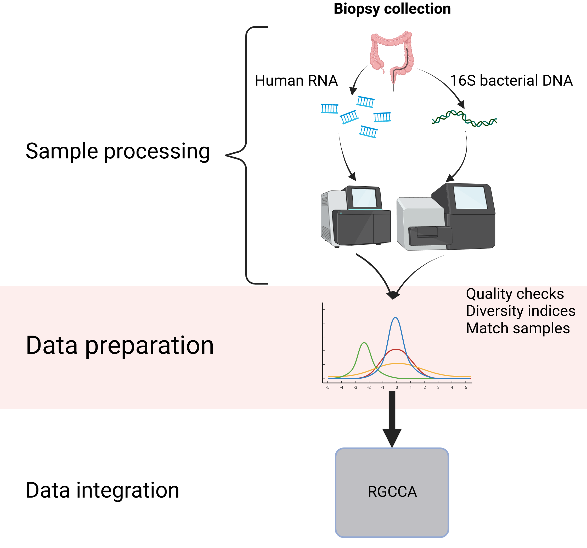
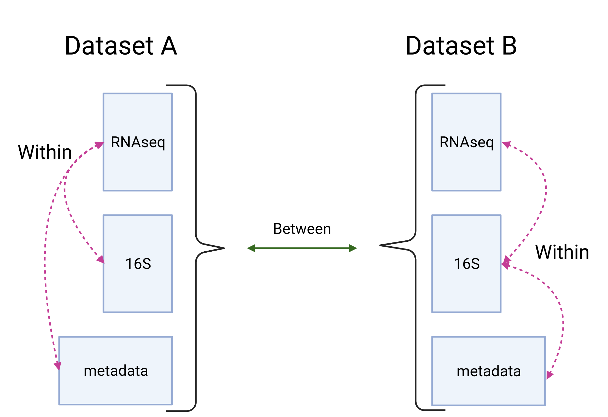

# Materials and methods

<!-- # Some sections of this chapter has been adapted from "Multi-Omic Modelling of IBD with Regularized Canonical Correlation Analysis" [@revilla2021] or other publications of the research group. -->

This chapter contains a brief description of the main characteristics of the different datasets used on this thesis .
The complete processing protocol before obtaining the data of those dataset that were not generated at Hosptial Clínic can be found on their respective reference.

Samples of the different cohorts collected in Hospital Clínic were collected similarly and described only once.
Differences between protocols are noted on the respective dataset's section.

Here we describe all the methods used to analyze data from the multiple cohorts included in this thesis.
The code used can be found on the links provided in the [appendix](#software "Link to the software appendix").

## Datasets

### Puget's dataset {#methods-puget}

The glioma dataset is the data provided as an example of biological data by the authors of RGCCA from a previous publication [@puget2012].
The data came from diffuse intrinsic pontine glioma patients whose transcriptome was analyzed with Agilent 44K Whole Human Genome Array G4410B and G4112F.
The copy number variation of the samples was processed with the ADM-2 algorithm, and data from comparative genomic hybridization (CGH) analyzed using [Mutation Surveyor software](https://www.softgenetics.com/mutationSurveyor.php "Website of the software").
In addition, this dataset contained information on age, localization of the tumor, sex and a numerical grading of the severity of the tumor [@puget2012].

| Characteristic            | Puget's  |
|:--------------------------|:--------:|
| Samples                   | 53       |
| Sex (female/male)         | 28/25    |
| Location (cort/dipg/midl) | 20/22/11 |

: (#tab:Puget) Characteristics of samples from Puget's dataset.

### HSCT dataset {#methods-hsct}

<!--# Adapted from article https://journals.plos.org/plosone/article?id=10.1371/journal.pone.0246367#sec005 -->

Samples from the HSCT dataset used in this thesis were from a cohort of patients with severe refractory CD undergoing HSCT.
Patients were treated in the Department of Gastroenterology (Hospital Clínic de Barcelona --Spain--).
The protocol was approved by the Catalan Transplantation Organization and by the Institutional Ethics Committee of the Hospital Clinic de Barcelona (Study Number HCB/2012/7244).
All patients provided written consent following extensive counselling about being included on the study and using their data on publications.

Colonic and ileal biopsies were obtained at several time points during ileo-colonoscopy, at inclusion and every 6 or 12 months after HSCT up to 4 years after the start of the treatment.
Samples were obtained when possible from both uninvolved and involved areas.
In addition, biopsies were taken from the ileum and colon regions of 19 non-IBD controls consisting of individuals with no history of IBD and who presented no significant pathological findings following endoscopic examination for colon cancer surveillance (Hospital Univesitari Mútua de Terrassa --Spain--).
The protocol was approved by the Institutional Ethics Committee of the Hospital Univesitari Mútua de Terrassa (Study Number NA1651).

At least one biopsy was collected and fresh-frozen at -80°C for microbial DNA extraction.
The remaining biopsies were placed in RNAlater RNA Stabilization Reagent (Qiagen, Hilde, Germany) and stored at -80°C until total RNA extraction.
In total 158 samples with both RNA and DNA extraction of the same segment and time were available \@ref(tab:HSCT):

| Characteristic                                       | HSCT        |
|:-----------------------------------------------------|:-----------:|
| Sex (female/male)                                    | 22/15       |
| Age at diagnostic (\<17/\<40/\>40 years)             | 7/11/0      |
| Duration (in years): mean (min-max)                  | 14 (8-28)   |
| Age: mean (min-max)                                  | 44 (23-70)  |
| Disease status (non-IBD/CD)                          | 51/107      |
| Sample location (ileum/colon/unknown)                | 48/108/2    |
| Local simple endoscopic score for CD: mean (min-max) | 2.15 (0-12) |
| CDAI: mean (min-max)                                 | 120 (0-450  |

: (#tab:HSCT) Characteristics of samples from HSCT dataset.

### Häsler's dataset {#methods-hasler}

An IBD-related dataset was obtained by Prof. Dr. Rosentiel and Prof. Dr. Robert Häsler [@hasler_uncoupling_2016].
Biopsies were obtained endoscopically during routine diagnosis RNA and DNA were extracted using standard procedures.
DNA from the 16S rRNA gene was amplified with primers 319F and 806R.
Both RNA and DNA was then sequenced on HiSeq 2000 and MiSeq respectively.
These biopsies included samples from the terminal ileum and sigma from CD, UC, infectious disease-controls and healthy non-IBD.
The dataset included information about gender, location, age, and the status (inflamed or non-inflamed) of the region from which the biopsy was taken.

| Characteristic                | Häsler's |
|:------------------------------|:--------:|
| Disease status (non-IBD/IBD)  | 33/26    |
| Sex (female/male)             | 42/17    |
| Sample location (ileum/colon) | 30/29    |

: (#tab:Hasler) Characteristics of samples from Häsler's dataset.

### Morgan's dataset {#methods-morgan}

A previously published dataset from a pouchitis study was analyzed [@morgan2015].
In this study patients having undergone proctocolectomy with ileal pouch-anal anastomosis for treatment of UC or familial adenomatous polyposis at least 1 year prior to enrollment were recruited at Mount Sinai Hospital (Toronto, Canada) excluding individuals with a diagnosis of CD.
The dataset has a total of 255 samples from 203 patients, containing data for both host transcriptome and intestinal microbiome.
On some cases several biopsyes were collected from the same patients.
This dataset included anonymous identifiers for patients, whether the sample was from the pre-pouch ileum (PPI) or from the pouch, the sex, the outcome of the procedure and an inflammation score.
The pouch ileum might be inflamed or not.

| Characteristic              | Morgan's |
|:----------------------------|:--------:|
| Samples (n)                 | 255      |
| Sex patients (female/male)  | 101/102  |
| Sample location (Pouch/PPI) | 59/196   |

: (#tab:Morgan) Characteristics of samples from Morgan's dataset.

### Howell's dataset {#methods-howell}

This dataset included a cohort of 66 treatment-naïve children at diagnosis of their IBD, along with 30 age- and sex-matched non-inflammatory control children, recruited at the Paediatric Gastroenterology unit at Addenbrooke's Hospital (England) [@howell2018].

Data from 77 samples that had both RNAseq and 16S data was used.
There are 10 non-IBD samples, 11 with CD and 11 with UC.
Data has the following characteristics: disease, age at diagnostic, age at time of study, sex, sample location, and disease activity:

| Characteristic                                  | Howell's  |
|:------------------------------------------------|:---------:|
| Disease (non-IBD/CD/UC)                         | 11/10/11  |
| Age at diagnostic (\<17/\<40/\>40 years)        | 32/0/0    |
| Age: mean (min-max)                             | 12 (6-15) |
| Sex (female/male)                               | 10/22     |
| Segment (ileum/colon)                           | 31/46     |
| Clinical history (inflammation/no inflammation) | 24/53     |

: (#tab:howell) Characteristics of samples from Howell's dataset.

## Sample processing {#processing}

### RNA sequencing

Total RNA from mucosal samples (HSCT cohort) was isolated using the RNAeasy kit (Qiagen, Hilde, Germany).
RNA sequencing libraries were prepared for paired-end sequencing using HighSeq-4000 platform.
Samples with good enough quality as recommended by [FastQC](https://www.bioinformatics.babraham.ac.uk/projects/fastqc/ "FastQC website") were processed with [cutadapt](https://github.com/marcelm/cutadapt "cutadapt repository") (version 1.7.1 [@martin2011]) for quality filtering.
Later, the libraries were mapped against the human reference genome using the [STAR aligner](https://github.com/alexdobin/STAR "STAR repository") (2.5.2a) with Ensembl annotation ([release 26 of GENCODE](https://www.gencodegenes.org/human/release_26.html "GENCODE release 26"), GRCh38.p10 or superior) [@dobin2013].

Read counts per gene were obtained with [RSEM](https://github.com/deweylab/RSEM "RSEM repository") (version 1.2.31) [@li2011] as previously described [@corralizaDifferencesPeripheralTissue].

### Microbial DNA sequencing

Biopsies from the HSCT CD cohort were resuspended in 180 $\mu$l TET (TrisHCl 0.02M, EDTA 0.002M, Triton 1X) buffer and 20mg/ml lysozyme (Carl Roth, Quimivita, S.A.). Samples were incubated for 1h at 37°C and vortexed with 25 $\mu$l Proteinase K before incubating at 56°C for 3h.
Buffer B3 (NucleoSpin Tissue Kit--Macherey-Nagel) was added followed by a heat treatment for 10 min at 70°C.
After adding 100% ethanol, samples were centrifuged at 11000 x g for 1 min.
Two washing steps were performed before eluting DNA.
Concentrations and purity were checked using NanoDrop One (Thermo Fisher Scientific).
Samples were immediately used or placed at -20°C for long-term storage until DNA sequencing.

#### DNA sequencing

Microbial cells were disrupted by mechanical lysis using FastPrep-24.
Heat treatment and centrifugation were conducted after adding a cooling adaptor.
Supernatants were treated with RNase to eliminate RNA.
Total DNA was purified using gDNA columns as described in detail previously [@berry2011].
Briefly, the V3-V4 regions of 16S rRNA gene were amplified (15x15 cycles) following a previously described two-step protocol [@klindworth2013] using forward and reverse primers 341F-ovh/785R-ovh [@edgar2013].
Purification of amplicons was performed by using the AMPure XP system (Beckmann).
Next, sequencing was performed with pooled samples in paired-end modus (PE275) using an MiSeq system (Illumina, Inc.) according to the manufacturer's instructions and 25% (v/v) PhiX standard library.

Library preparation and sequencing of the HSCT dataset were performed at the Technische Universität München.
Briefly, volumes of 600$\mu$L DNA stabilization solution (STRATEC biomedical) and 400$\mu$L Phenol:choloform:isoamyl alcohol (25:24:1, Sigma-Aldrich) were added to the aliquots.

#### Microbial profiling

For the HSCT dataset the processing of raw-reads was performed by using the [IMNGS](https://www.imngs.org/ "IMNGS website") (version 1.0 Build 2007) [@lagkouvardos2016] pipeline based on the [UPARSE](https://www.drive5.com/uparse/ "UPARSE website") approach [@edgar2013].
Sequences were demultiplexed, trimmed to the first base with a quality score \<3 and then paired.
Sequences with less than 300 and more than 600 nucleotides and paired reads with an expected error \>3 were excluded from the analysis.
The 5 nucleotides from each end of the remaining reads were trimmed to avoid GC bias and non-random base composition.
Operational taxonomic units (OTUs) were clustered at 97% sequence similarity.
Taxonomy assignment was performed at 80% confidence level using the RDP classifier and the SILVA ribosomal RNA gene database project.
Later the data was normalized using the same method as for RNA-seq described above.
The microbiome was visually inspected for batch effects in PCA; none were found.
The resulting OTUs table was normalized using edgeR (Version 3.28 or later) [@mccarthy2012].

For all the other datasets [dada2](https://bioconductor.org/packages/dada2) [@callahan2016] (Version 1.14 or later) was used to analyze microbiome data.
It creates amplicon sequencing variants from the 16S sequencing data, without merging similar sequences at any threshold.
It is an alternative to the use of OTUs which allows to compare results between studies and provides more resolution to identify differences on the fragment of 16S amplified.

We used Silva v138.1 to annotate the 16S fragments whenever possible [@quast2013].
If we did not have access to the direct ASV we used the annotation provided by the original authors of the dataset.

```{r workflow-process, fig.scap="Workflow of the analysis process.", fig.cap="Workflow of the main analysis process of the thesis. Created with BioRender.com"}

```

## Integration methods

The main method used on this thesis has been regularized generalized canonical correlation analysis (RGCCA) a method derived from the canonical correlation.
Canonical correlation is a method that uses data about the same unit but from different origins to find how much the different sources agree.
Regularized generalized canonical correlation analysis is implemented on the homonymous package [RGCCA](https://cran.r-project.org/package=RGCCA) [@tenenhaus2017] which was used here.
The method and implementation will be explained in detail in the next section.

```{r multiomic-datasets, fig.scap="Multiomic relationships.", fig.cap="Multiomic relationships on different datasets. Integration methods focus on relationships within datasets. Common relationships between datasets are used as confirmation/validation. Created with BioRender.com"}

```


### Regularized generalized canonical correlation analysis

To understand the regularized canonical correlation analysis I first provide a brief description of principal component analysis.

Principal component analysis defines a new orthogonal coordinate system that optimally describes variance in a single dataset.
It does so by decomposing the numerical matrix into the eigenvalues and eigenvectors with decreasing variance.
Its results include new variables (the eigenvectors) and a vector of loadings or weight indicating the importance of the original variables for these new variables.
Typically, data is normalized and standardized to avoid that a variable with higher variance and different scale dominate the results.

The canonical correlation analysis [@jordan1875; @hotelling1936] is a method to find agreement between two, or more, scorers (as it was first introduced on the literature) or sources.
It extends the PCA to a two sources of data.
It provides a similar output, new variables and weights of the existing variables indicating their importance.
The function it maximizes is:

$$
\rho = \underset{a, b}{\text{argmax}} (\text{cor}(a^T X, b^T Y))
$$

On this equation $a$ and $b$ are random variables that given $X$ and $Y$, the two data sources, maximize the correlation between $a^T X$ and $b^T Y$, the first canonical variables, the new variables.
$a$ and $b$ are also known as weights or loadings of the variables.

Over several years of progress on the field of canonical correlations [@tenenhaus_component-based_2008; @esposito_vinzi_bridge_2010; @tenenhaus_regularized_2011; @tenenhaus_regularized_2014; @tenenhaus_variable_2014; @tenenhaus_kernel_2015; @gloaguen2020], regularized generalized canonical correlation analysis (RGCCA) emerged with a generalization from canonical correlations extending the procedure to more than two sources of data [@R-RGCCA] and being made more flexible generalizing from other proposed methods.

#### Description

RGCCA works with numeric matrices that can be as big as needed, as it is designed for datasets with more variables than samples ( $p \gg n$).
However, for each sample it needs to have a complete case with no missing values (at the time of writing this thesis there is an [in-development version](https://github.com/rgcca-factory/RGCCA/tree/CRAN "RGCCA repository on github"), not released on CRAN[^methods-1] yet, that replaces any missing value by a 0) and in which time is not considered as a special variable.
It uses a dimensional reduction approach to relate the different blocks of data between them and produce specific factors for each dataset.
The objective function is:

[^methods-1]: CRAN is The Comprehensive R Archive Network available at <https://cran.r-project.org/>

$$
\underset{a_1,a_2, \dots,a_J}{\text{maximize}} \sum_{j, k = 1}^J c_{jk} g( \text{cov}(X_j a_j, X_k a_k)) \text{ s.t. } (1-\tau_j)var(X_j a_j)+\tau_j \Vert a_j \Vert^2 = 1, j=1, \ldots, J
$$

Being $X_j$ the values from sample $j$, the weights of the variables of said sample are represented by $a$.
While $g$ is a function that can take the form of $x$, also known as Horst method, $|x|$ known as centroid method, $x^2$ known as factorial method, or any user-supplied function.
$C$ is a symmetric matrix describing the network between blocks.

The shrinkage parameter is defined as:

$$
\widehat{\lambda}^{\star} = \dfrac{\sum_{i\neq j}\widehat{Var}(r_{ij})}{\sum_{i \neq j}r_{ij}^2}
$$

Where the $r_{ij}$ are the correlation coefficients of the matrix between variables $i$ and $j$ .
Where the variance is defined as:

$$
\widehat{Var}(S_{ij}) = \dfrac{n^2}{{(n-1)}²} \widehat{Var}({w}_{ij}) = \dfrac{n}{{(n-1)}^3} \sum_{k=1}^n ( w_{kij} - \overline{w_{ij}})^2
$$

And its components are: $w_{kij}=(x_{ki}-\overline{x}_i)(x_{kj}-\overline{x}_j)$ and $\overline{w}_{ij}=\frac{1}{n}\sum_{k=1}^nw_{kij}$ representing $x_{ij}$ the values of a sample $j$ on a variable $i$.

The authors realized that there is a special problem due to sparsity on biological data which could be handled using first another normalization to improve the stability and success of the canonical correlation methodology.
The method to perform the dimensional reduction using the sparse method consists on maximizing the same equation but with a different constraint: Specifically, RGCCA with all $\tau_j = 1$, combined with an L1-penalty that gives rise to SGCCA:

$$
\underset{a_1,a_2, \dots,a_J}{\text{maximize}} \sum_{j, k = 1}^J c_{jk}g( \text{cov}(X_j a_j, X_k a_k)) \text{~~s.t.~~} \Vert a_j \Vert_2 = 1 \text{ and } \Vert a_j \Vert_1 \le s_j, j=1,\ldots,J
$$

The $s_j$ controls the sparsity estimated of the data, the smaller it is, the higher the sparsity of $X_j$ is.
As $s_j$ is closer to 0, more features are selected as it looks to optimize covariance; while if it is closer to 1, less features are selected and the function resembles the correlation.
The values of $s_j$ were estimated using the Schäfer method [@schäfer2005] when the block included 16S data or RNAseq, otherwise 1 was used.

As previously mentioned, there are different $g$ functions that could be used; but the centroid method was chosen to detect both positive and negative relationships.

Categorical data was encoded as binary (dummy) variables for each factor except one to keep degrees of freedom, where 0 indicates not present and 1 indicates present.
One level was omitted to avoid overfitting the data.
Each block, regardless if it had continuous numeric variables or dummy variables was standardized to zero mean and unit variance.
Later, it was divided by the square root of the number of variables of the block for an unbiased estimation.

#### Output {#rgcca-output}

RGCCA, as other dimensional reduction techniques, provides specific weights for each variable on each dimension and a sample score on each dimension, together with quality scores.
The most important output are the canonical components of each block.
For each block there can be as many canonical components as the number of variables of a block minus 1. 
These canonical components represent a block by the largest source of variation on that block that satisfies the constrains explained below.

To measure the quality of the model, the implementation provides indicators based on the Average Variance Explained (AVE).
RGCCA returns an AVE score for each block, which measures how the variables of the block correlate with the dimension component of the block.
It also provides two AVE scores of the whole model: the inner, which measures how each dimension accounts for the variance, and the outer, which measures how variables correlate with the dimension components.
The closer the inner AVE is to 1, the better the model adjusts to the data.
However, that mathematically fits better to the data does not guarantee that the model provides more insights into the biology.

It can also generate results as other related methods based on the maximization of a function of correlations: SUMCOR (sum of correlations method) [@horst1961], SSQCOR (sum of squared correlations method) [@kettenring1971], SABSCOR (sum of absolute values of the correlations method) [@vandegeer1984].
Others methods are based on the maximization of a function of covariances: SUMCOV (sum of covariances method), SSQCOV (sum of squared covariances method), SABSCOV (sum of absolute values of the covariances method).
The following table summarizes the equivalent parameters needed on RGCCA to work:


| Method  | Scheme    | Normalization         | Shrinkage |
|:-------:|:---------:|:---------------------:|:---------:|
| SUMCOR  | Horst     | $Var(X_j a_j) = 1$    | 0         |
| SSQCOR  | Factorial | $Var(X_j a_j) = 1$    | 0         |
| SABSCOR | Centroid  | $Var(X_j a_j) = 1$    | 0         |
| SUMCOV  | Horst     | $\Vert a_j \Vert = 1$ | 1         |
| SSQCOV  | Factorial | $\Vert a_j \Vert = 1$ | 1         |
| SABSCOV | Centroid  | $\Vert a_j \Vert = 1$ | 1         |

: (#tab:RGCCA-methods) Equivalences of RGCCA for multi-block data analysis to other methods

There are other methods that can be performed with RGCCA, for example: The classical canonical correlation analysis would be equivalent to data variance equal to 1 and shrinkage of 0.
Partial least squares (PLS) regression, which maximizes covariance, would be equal to data variance of 1 and shrinkage of 1 in RGCCA.
Finally, redundancy analysis could be performed where one block's weight normalized value is 1 and the variance of the other equals to 1.

#### Models

There is no formal definition of what constitutes a block of data on multi-omics tools.
Most multi-omics and integration tools assume one block for each type of data, such as an essay a survey or an experiment.
We decided to split the block with the variables about the samples to separate independent variables.
The hypothesis we made was that more blocks with highly related variables but independent from the other blocks would fit better the data and thus help to identify causal or dependent variables.

To model what might be the relationships within datasets current practices include using a pre-selected model of relations between blocks (See figure \@ref(fig:multiomic-datasets)).
However, this model might not be an accurate representation of the relations between blocks and several models might need to be fitted.
To help find the fitting model for the data I created an R package, named [inteRmodel](https://llrs.github.io/inteRmodel/), which helps finding the right model for the dataset via a bootstrapping procedure.

This method was applied to the previously described datasets to find the relationship between microorganisms and the disease.
Following this method; to provide a ground truth, a model with only the relationships between the two experimental obtained data is analyzed, on what it is called the model 0.\
The next models analyzed consisted on relationships between the two experimental blocks and a block with all the metadata of the samples.
These models are denoted by 1.Y, where 1 denotes the family 1 and Y is used to label some of the models of this family.

Later instead of a big metadata block, following our theory we split this metadata block on several ones, having a block for time related variables, another one for location and the other about the people on the study.
This allows to design a model with an expected relationships between these blocks and makes more interpretable the relationships.
These models are from the family 2 denoted by the name 2.Y, where 2 denotes the family of the model and Y change for particular models with different relationships between the blocks change.

For each family of models we tested all possible relationships with weights between 0 and 1 by 0.1 intervals to find the best model on each datasets according to the AVE score.

The final models were further validated using a bootstrap approach to measure their accuracy and likelihood on the data available.

### Other

#### MCIA

Multiple co-inertia analysis, also known as MCIA, is a method to examine covariant gene expression patterns between two blocks [@meng2014].
It is implemented on the package [omicade4](https://bioconductor.org/packages/omicade4).
On its core MCIA maximizes the following formula:

$$
\sum_{k=1}^K w_k {cov}^2 (X_k Q_k u_k, v)
$$

where $K$ is the total number of matrices, $X_k$ the transformed matrices and $Q_k$ is a square matrix with $r_{ij}$ in diagonal elements indicating the hyperspace of features metrics, $u_k$ are auxiliary axes, $v$ the reference structure and w the weights of the matrices.
This can be used to obtain a dimension of $P_k^d=u_k^d(u_k^d Q_k {u_k^d}^T)^{-1} u_k^d Q_k$ given that for each dimension the residuals are obtained following $X_k^{d-1} = X_1^d- X_1^d P_1^{d-1}$ where $d$ are the dimensions needed.

MCIA was used as a baseline method to compare the RGCCA integration.

#### STATegRa

We used [`STATegRa`](https://bioconductor.org/packages/STATegRa) To explore how much do different blocks of a dataset have in common [@planell2021].
It is a framework for integrating datasets with two data types using parametric and non-parametric methods.
The methods used are omics component analysis based on singular value decomposition (SVD) of the data matrix.
There are three different methods provided to this end: *DISCO-SCA*, *JIVE* and *O2PLS*.

DISCO-SCA uses:

$$
X_k = TP_k ^ T + E_k
$$

Where $T$ is the $I \times R$ matrix of components scores that is shared between all blocks and $P_k$ the $J_k \times R$ matrix of components loadings for block $k$.

Let $X_1,X_2, \dots X_i$ be blocks of data and $X=[X_1,X_2, \dots X_i]$ represent the joint data, then the JIVE decomposition is defined as:

$$X_i=J_i+A_i+\epsilon_i \text{, }i = 1,2, \dots$$

where $J=[J_1,J_2, \dots J_i]$ is the $p \times n$ matrix of rank $r<rank(X)$ representing the joint structure, $A_i$ is the $p_i\times n$ matrix of rank $r_i < rank(X_i)$ representing the individual structure of $X_i$ and $\epsilon_i$ are $p_i \times n$ error matrices of independent entries.

Finally, the O2PLS approach uses multiple linear regression to estimate the pure constituent profiles and divides the systematic part into two, one common to both blocks and one not.
The O2PLS model can be written as a factor analysis where some factors are common between both blocks.

$$
\begin{aligned}
& \text{X model : } X = TW ^ T + T_{\text{Y-ortho}} P ^ T_{\text{Y-ortho}} + E \\
& \text{Y model : } Y = UC ^ T + U_{\text{X-ortho}} P ^ T_{\text{X-ortho}} + F \\
& \text{Inner relation : } U = T + H
\end{aligned}
$$

Each model is built similarly by adding the subtraction of the projected values of the other component keeping the relationship between them as stated on the third line.


## Statistics

Differential expression analysis was performed with the limma-trend method [@ritchie2015; @law2014] and edgeR [@mccarthy2012] (Bioconductor version 3.10 or superior) packages.
Data was normalized using the trimmed mean of M-values and log-2 transformed into counts per millions following the workflow previously described using voom [@law2018].

To correct for multiple testing, the false discovery rate was estimated using the method of Benjamini and Hochberg [@yoavbenjamini].
A gene was considered differentially expressed when it was significant at 5% FDR.
Special attention was given to those genes that showed a fold-change higher than \|1.5\|.

## Functional enrichment methods

### Over representation analysis {#ORA}

Functional enrichment methods are those methods that aim to provide with more information about the variables besides their numerical value measured.
They can be very different in nature but they all use the numeric values of the variables and other information, being it from the same experiment data collection or from external data sources.

Many functional enrichment methods are based on an over representation analysis, where a group of elements is tested for their mesure in other groups.
This can be done with [`clusterProfiler`](https://bioconductor.org/packages/clusterProfiler) which tests genes enrichment for functionality based on information on pathway databases [@wu2021] that it is used in several publications [@richter2021].
`clusterProfiler` checks the enrichment of features of a given group on the (background) list provided.

$$
\begin{aligned}
H_0 : P_{subset} \leq  P_{overall} \\
H_1 : P_{subset} > P_{overall}
\end{aligned}
$$

The statistical test used is usually the fisher test, the hypergeometric test or the proportion test.
I describe the hypergeometric test and the proportion test below.

#### Fisher test

The fisher test calculates how independently are two categories.
Say if genes in category X are independent of category Y, if we use the contingency table

|                       | In category X | Not in category X | Row total     |
|:----------------------|:-------------:|:-----------------:|:-------------:|
| **In category Y**     | $a$           | $b$               | $a+b$         |
| **Not in category Y** | $c$           | $d$               | $c+d$         |
| **Column total**      | $a+c$         | $b+d$             | $a+b+c+d = n$ |

: (#tab:fisher) Fisher contingency table

Given this contingency table \@ref(tab:fisher), the probability of X and Y being independent can be calculated with:

$$
\begin{aligned}
P & = \dfrac{ \binom{a+b}{a} \binom{c+d}{c} }{\binom{n}{a+c}} \\
& = \frac{(a+b)!~(c+d)!~(a+c)!~(b+d)!}{a!~~b!~~c!~~d!~~n!}
\end{aligned}
$$

#### Hypergeometric test

The hypergeometric distribution describes the probability of $k$ successes (when the object drawn has a specified feature) in $n$ draws[^methods-2], from a finite population of size $N$ that contains exactly $K$ objects with that feature, wherein each draw is either a success or a failure.

[^methods-2]: without replacement

In this context $N$ is the number of genes being used and $n$ the number of genes on a pathway.
It can be used to compare the genes found on a pathway ($k$ genes) compared to the expected $K$ numbers of the distribution using the following equation:

$$
P_X(k) = P(X = k) 
= \frac{\binom{K}{k} \binom{N - K}{n-k}}{\binom{N}{n}}
$$

This looks like the fisher test, because hypergeometric test assesses the extremeness of observing $k$ or more of that overlap ($a$ on ) and thus it is the same as a one-sided Fisher's exact test.

#### Proportion test

The overrepresentation of a given group of elements can also be tested with the proportion test, which is sometimes also used on clusterProfiler.
The proportion test uses the $\chi^2$ distribution to test if the observed frequency ($O_i$) is close to the expected frequency ($E_i$):

$$
\chi^2 = \sum_{i =1}^n \dfrac{(O_i - E_i)^2}{E_i} \simeq \chi_{n-p}^2
$$

As this is usually done on a 2x2 contingency table it is equivalent to the Z-test of proportion.
Sometimes, the expected frequency is so low that a correction must be done to the estimation:

$$
\chi_{\text{Yates}}^2 = \sum_{i =1}^n \dfrac{(|O_i - E_i | - 0.5)^2}{E_i}
$$

This increases the $p$-value as it raises the Chi-square statistic.

### Gene Set Enrichment Analysis

There are other methods that test if some variables show an unexpected importance according to a statistic like fold change or value, such as gene set enrichment analysis (GSEA) [@subramanian2005].
GSEA is a computational method originally developed to determine whether a priori defined set of genes shows statistically significant and concordant differences between two biological states.
This methods check if a group of variables present in an ordered list shows a skewed distribution and it compares it against a random group of similar size.
It has been widely used since its original publication, also on IBD [@protiva2016].

This method calculates the rank of genes $rank(g_j)=r_j$ where each $g$ is a gene, and then it calculates the following functions:

$$
\begin{aligned}
& P_{hit}(S, i) = \sum_{g_j \in S, j \leq i}\dfrac{|r_j|^p}{N_R} \text{, where } N_R = \sum_{g_j \in S}|r_j|^p \\
& P_{miss}(S, i) = \sum_{g_j \not \in S, j \leq i}\dfrac{1}{N - N_H}
\end{aligned}
$$

With these values the enrichment score (ES) defined as: $ES=max(|P_{hit}(S, i)-P_{miss}(S, i)\vert)$ is calculated from the walk.
At least 1000 permutations are usually used but a high number of permutations are required for an accurate estimation of the enrichment score.
However, when more than one pathway ($S$) is evaluated in order to compare between their enrichment scores, they must be normalized by dividing the scores by the mean of all the ES.
When power $p$ is 0 it is equivalent to the standard Kolmogorov--Smirnov statistic, though it is usually set to 1.

For testing GSEA I used [`fgsea`](https://bioconductor.org/packages/fgsea) [@korotkevich2021] implementation for its speed and integration with other methods used in this thesis.
Gene pathways from the REACTOME database were tested on the weight of different models or on the comparisons performed [@fabregat2016].

#### GSVA

To estimate the expression of the pathways and compare their expression levels between conditions gene set variation analysis as implemented on [GSVA](https://bioconductor.org/packages/GSVA) was used [@hänzelmann2013].
It is a method that summarizes the variables' numerical value changing the space of $\text{variable x sample}$ to $\text{group x sample}$ .
This enables other methods to use this new space instead of the original variables, which provides a successful way to look into data [@escudero-hernández2021].
GSVA was used (again from the REACTOME database) to find the relationships between the pathways and the microbiome at different taxonomic levels.

This is done via an estimation and a comparison with a discrete Poisson kernel: $i$ indicates the gene from a total of $k$ genes, and samples are indicated by $j$ from $n$ number of samples.

$$
z_{ij}=\hat{F_r}(x_{ij}) = \frac{1}{n}\sum_{k=1}^n\sum_{y=0}^{x_{ij}}\dfrac{e^{-(x_{ik}+r)}(x_{ik} + r)^y }{y!}
$$

$r = 0.5$ is used to set the mode of the Poisson kernel at each $x_{ik}$, that is, similar to the expression of a gene for a given sample.

Later this is converted to ranks $z_{(i)j}$ for each sample and normalized: $r_{ij}=|\frac{p}{2}-z_{(i)j}|$ to make the distribution of ranks symmetric around zero to later compare with a normal distribution using a Kolmogorov-Smirnov-like random walk statistic:

$$
v_{jk}(l)=\dfrac{\sum_{i=1}^l|r_{ij}|^{\tau}I(g_{(i)}\in \gamma_k)}{\sum_{i=1}^p|r_{ij}|^{\tau}I(g_{(i)} \in \gamma_k)}
- \dfrac{\sum_{i=1}^lI(g_{(i)} \not \in\gamma_k)}{p-|\gamma_k|}
$$

Here $\tau$ describes the weight of the tail in the random walk (default is set to 1).
$\gamma_k$ is the k-th gene set and $I(g_{(i)}\in \gamma_k)$ is the indicator function whether the gene ranked i-th belongs to the gene set $\gamma_k$ .
$|\gamma_k|$ indicates the ordination of the gene set, the number of genes of the gene set and $p$ the number of genes in the dataset.

This difference is later converted to enrichment score for each gene set for each sample, similar to GSEA.
This score can be calculated as a difference of hits and misses or the maximum deviation from zero of the random walk (which allows to detect gene sets that have genes with different opposing expression patterns).

## Variance and diversity methods {#variance}

### PERMANOVA

The PERMANOVA method [@anderson2001; @warton2012], provided by the [vegan](https://cran.r-project.org/package=vegan) package on the `adonis` function, was used to test if microbiome data variance is due to other variables when using distances metrics.
It uses the residual sum of squares such as:

$$
SS_W = \frac{1}{n} \sum_{i=1}^{N-1}\sum_{j=i+1}^N d_{ij}^2\epsilon{ij} 
$$

When using euclidian distances ($d$) it is equivalent to MANOVA.
Here $\epsilon_{ij}$ takes the value of 1 if the observation $i$ and the observation $j$ are in the same group, otherwise it takes the value of 0.
This can be later used to test which variance is bigger, inter-groups or intra-groups by using the following formula:

$$
F = \dfrac{SS_A/(\alpha -1)}{SS_W/(N-\alpha)}
$$

Where $SS_A$ is the among group sum of squares, representing the intra-group variance.
$N$ is the number of samples and $\alpha$ the number of different groups.

This allows to test if the variables are related to the variance of the data as it can be compared with the $F$ statistic after a high number of permutations.

### globaltest

It is a method for testing complex hypothesis and calculate the influence of each variable on a given outcome [@goeman2006].
I tested which variables, (sex, age, location, time since diagnosis, treatment) are important on the datasets with [globaltest](https://bioconductor.org/packages/globaltest) (Version 5.40 or later).
This method provides a general statistic to test hypothesis against a high dimensional dataset.

$$
S = \sum_{i=1}^p x_i^{'} x_i g(t_i^2)
$$

The global test performs a test statistic on the transformed t-test, where if $p$, the number of variables, is large the test is more powerful on average over all possible sparse alternatives of general functions $g$.

It was performed with variables individually and also with interactions between the different variables.

### Diversity indices

Microbiome diversity was measured using vegan and [phyloseq](https://bioconductor.org/packages/phyloseq) methods [@oksanen2020].
$\alpha$-diversity is a measure of how much a given microbiome at a taxonomic level is present on a sample.
Several measures exists, on the thesis I used the effective Simpson or effective Shannon diversity index to compare diversity between samples and conditions.

The effective Simpson (also known as inverse Simpson) and the effective Shannon are:

$$
\begin{aligned}
& D_{\text{effective Simpson}} = \dfrac{1}{\sum_{1=1}^Sp_i^2} \\
& D_{\text{effective Shannon}} = \dfrac{1}{-\sum_{i =1}^S p_i \log_e{p_i}}
\end{aligned}
$$

Where $p_i$ is the proportion of species $i$ and $S$ is the number of species.

$\beta$-diversity is a diversity index that compares how similar are two samples.
It was calculated using the phyloseq package for exploratory analysis.

## Other methods

### WGCNA

To look for relationships between the microbiome and the RNAseq we used weighted gene co-expression network analysis.
We used weighted gene co-expression network analysis as implemented on [WGCNA](https://cran.r-project.org/package=WGCNA) [@langfelder2008] as well as correlations.
The Spearman rank correlation coefficient is:

$$
R_s(X,Y) = \dfrac{\sum_{i=1}^n (R_i - \bar{R}) (S_i - \bar{S} )}{\sqrt{\sum_{i=1}^n (R_i - \bar{R})^2}\sqrt{\sum_{i=1}^n (S_i - \bar{S})^2}}
$$

Being $(X_1 , Y_1 ),\dots, (X_n , Y_n)$, assign a rank where $(R_1 , S_1 ), \dots , (R_n , S_n )$ for $n$ being all the variables where $\bar{R}=\dfrac{1}{n}\sum_{i=1}^n R_i$ and likewise $\bar{S}=\dfrac{1}{n}\sum_{i=1}^n S_i$.
The distribution of the Spearman correlation coefficient is symmetric around 0 and can be approximated to a normal distribution as $\sqrt{n-1}R_{s(X,Y)} \sim N(0,1)$ which can be used to calculate the p-value of a given estimation.

### BaseSet

[BaseSet](https://cran.r-project.org/package=BaseSet) was developed and used to find which variables are really involved on the interaction and how likely they were to be together.
It is a package that uses fuzzy set logic to calculate the probability to belong to a group, in this case, those genes and bacteria selected by the model that interact with the other.

Under the standard fuzzy set logic a set $S$ is a group of elements for which each element $e$ has an $\alpha$ membership to that set [@filzmoser2004; @dubois1993].
$\alpha$ is usually bounded between 0 and 1: $\alpha \in [0, 1]$ .
A given element $e$ can belong to more than one set.
Assimilating the membership function to probability we can calculate the probability of a given element $e$ to belong to a set $S$ and not any other set: $P(e \in S|e \not \in S^c)$.
Which applied to the data and the case at hand, it is the probability that a given variable is associated with a given outcome and not with any other outcome.

The membership function was derived from the bootstraps used for each model on the thousand iterations of the integrative method applied to give an estimation of how probable is a given gene and bacteria to be selected as relevant for the model.
The bootstraps of the models where used to calculate the probability of a variable to be selected by RGCCA.
This probability was used to calculate (via `set_size`) the genes and bacteria that are specific of the model that allows to separate the transcriptome by its location and the microbiome by the disease status.

### experDesign

[experDesign](https://cran.r-project.org/package=experDesign) was developed [@revillasancho2021] to prevent and quantify if a given experiment has batch effect due to the batches used to measure the values or other known variable.
It might help to detect a bad design of the experiment.

On pseudo code the core of the program can be described as:

``` {#pseudocode-experDesign}
for each index:

    for each batch

        pick size(batch) samples

        if samples are in another batch

            pick other samples

    for each batch

        calculate some summary statistics

        compare with the summary statistics of all the samples

keep the index with less differences between the index and all the samples
```

Summary statistics taken into account are the median, the variance, the range, the number of missing values, and the entropy of the categorical variables.
It can take into account spatial distribution and, given the number of samples that fit on a batch, provide which technical replicates[^methods-3] are best to use.

[^methods-3]: Technical replicates are samples that are measured multiple times to ensure the accuracy of the measurement.
    In contrast biological replicates are sample with the same conditions but different individuals or process before the measurement.

### ROC- AUC {#ROC}

To estimate if the selected features (genes or microorganism) by the integration methods have some biological meaningful contribution I measured if they can classify features, such as, which gastrointestinal segment is each sample from, or which type of disease does each patient have.

To compare between different models the area under the curve (AUC) of the receiver operating characteristic (ROC) was calculated with the [pROC](https://cran.r-project.org/package=pROC) package [@robin2011].
It is based on the following formulas, where $\text{FP}$ is false positive, $N$ is a negative, $P$ is positive, $\text{TP}$ is true positive and $\text{FN}$ is false negative:

$$
\begin{aligned}
FPR = \frac{FP}{N} = \dfrac{FP}{FP+TN} \\
TPR = \frac{TP}{P} = \dfrac{FP}{FP+FN} 
\end{aligned}
$$

The ROC curve is that where the true positive rate (TPR) or sensitivity, recall or hit rate is represented against the false positive rate (FPR) on the abscissa.
The area under this curve is a measure of how good such classifications performs overall, being 0.5 as good as a random selection.
The closer it is to 1 the better as it classifies incorrectly less samples and accurately classify more.
