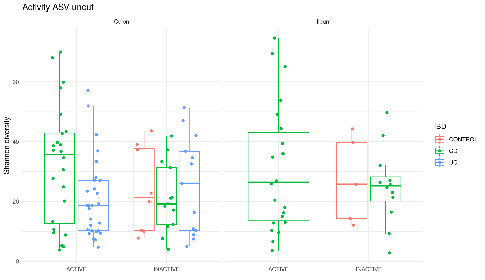

# Results

## Packages

### experDesign

`experDesign` package built in R was released for the first time on CRAN on 2020-09-08 after nearly a year after the initial release made on [github](https://github.com/llrs/experDesign).
It was published on a journal on 2021-11-27 [@revillasancho2021].

The package uses functional programming to create and modify objects and the features used.
The package bases its performance on the large body of work made by the R core team.
It adds the information to the introduced `data.frame` or returns an vector with the appropriate information.

`experDesign` functions are divided into several categories:

-   Helper functions to aid on deciding how many batches are or how many samples per batch.
    There are some also that report how good a given distribution of the samples felt for a given dataset.

-   Functions generating indexes.

-   Functions distributing the samples on indexes

Regarding time related variables `experDesign` will use them as factors, while issuing a warning to the user.

Since its development it has been used on a couple of RNA sequencing experiments that required a batch design, one of organoids bulk RNA-seq and another one of biopsies bulk RNA-seq from the BARCELONA cohort.
It was also used to check if there is any observable batch effect on the datasets analyzed.

On the designed datasets `experDesign` worked well and no batch effect was created when sequencing the samples.
However, on the organoids dataset, a change on the matrigel used to produce them introduced a batch effect that made it impossible to compare samples before and after that change (there were not any shared sample before and after the change of matrigel).

```{r experDesign, include=FALSE, eval=FALSE}
library("dlstats")
library("dplyr")
cran_stats("experDesign") %>% 
  group_by(month = format(end, "%Y/%m")) %>% 
  summarise(d = sum(downloads)) %>% 
  ungroup() %>% 
  pull(d) %>% 
  median()
```

Since its release on CRAN it has had a median of \~400 downloads each month from RStudio repository mirror.
Showing the interest the community have on solutions like this.

### BaseSet

`BaseSet` package, built in R, was released for the first time on CRAN on 2020-11-11, nearly two years after the initial work started on [github](https://github.com/llrs/BaseSet "Repository").

The package uses both functional programming and object oriented program to create and modify the TidySet S4 object defined[^results-1].
Mixing it with S3 generic functions it provides a powerful interface compatible with the tidyverse principles, a [group of packages](https://www.tidyverse.org/) following the same design.
The package provides a new class to handle fuzzy sets and the associate information.

[^results-1]: S4 is one of the object programming paradigms on R.
    For a more complete overview and differences see [Advanced R](https://adv-r.hadley.nz/oo.html "2nd edition") [@wickham2019].

`BaseSet` methods are divided into several categories:

-   [General functions](https://docs.ropensci.org/BaseSet/reference/index.html#general) to create sets of the TidySet class or convert from it to a list or about the package.

-   [Set operations](https://docs.ropensci.org/BaseSet/reference/index.html#set-operations) like adjacency cartesian product, cardinality, complement, incidence, independence, intersection, union, subtract, power set or size.

-   [Functions to work with TidySets](https://docs.ropensci.org/BaseSet/reference/index.html#set-operations) to add relationships, sets, elements or some complimentary data about them.
    Remove the same or simply move around data or calculate the number of elements, relations and sets.

-   [Functions to read](https://docs.ropensci.org/BaseSet/reference/index.html#reading-files) files from formats where sets are usually stored in the bioinformatician field: GAF, GMT and OBO formats.

-   Last, some [utility functions](https://docs.ropensci.org/BaseSet/reference/index.html#utiles) to use set name conventions and some other auxiliary functions.

The package had a long development process with initial iterations basing on GSEABase package which was later abandoned ([GSEAdv](https://github.com/llrs/GSEAdv)) to also include some uncertainty on the relationship of a gene with a given gene set.

The package also participated on an exploration on part of the Bioconductor community (project to develop, support, and disseminate free open source software that facilitates rigorous and reproducible analysis of data from current and emerging biological assay) for more modern and faster handling of sets.
There were three different packages created as part of this process, `BaseSet`, `BiocSet` published [on Bioconductor](https://bioconductor.org/packages/BiocSet/) and `unisets`, available [on github](https://github.com/kevinrue/unisets).
The three different approaches were presented at a birds of feather on BioC2019.

The package passed the review on the rOpenSci organization ([See review](https://github.com/ropensci/software-review/issues/359 "Review on Github")) and is now part of the packages hosted there too.

```{r BaseSet, include=FALSE, eval = FALSE}
library("dlstats")
library("dplyr")
cran_stats("BaseSet") %>%  
  group_by(month = format(end, "%Y/%m")) %>% 
  summarise(d = sum(downloads)) %>% 
  ungroup() %>% 
  pull(d) %>% 
  median()
```

Since its release on CRAN it has had a median of \~400 downloads each month from RStudio package manager.

### inteRmodels

The package was build once the method used to find accurate models of the relationships of the data available of a dataset using RGCCA was established.
Using the package [on github](https://github.com/llrs/intermodel "inteRmodel") simplifies the process and makes it easier to redo it .

The package has functions that can be grouped in three categories:

-   To look for models and evaluate them.
    There are functions to search for a model given some rules, that check them using leave-one-out methodology.

-   Reporting: To make better reports by improving handling of names or simplifying the objects or how to calculate scores.

-   Building: To easier build correct models on RGCCA, simplifying the process to create a symmetric matrix.

Currently it is only [available on github](https:intermodel.llrs.dev), so the number of downloads and usage is unknown but since its release a user has contacted to keep it up to date with development versions of RGCCA.
Currently, it is compatible with the next release of [RGCCA being prepared](https://github.com/rgcca-factory/RGCCA/tree/CRAN)[^results-2].

[^results-2]: I also contributed with some comments and feedback to the package to make it easier to read the source and check the inputs and improve the documentation so that it is coherent with the code and previous results of the functions.

## Analysis

On the following sections the main results of analyzing each dataset are presented.

### Puget's dataset {#results-puget}

On this dataset the different parameters and capabilities of RGCCA were tested.

The three different methods, centroid, factorial or horst were tested and compared.
The main result of this comparison was that the differences of the selection of the variables mattered more than the number of variables selected with each method.
The models were tested with different weights on all three schemes: horst, centroid and factorial.
The horst and the centroid scheme were similar while the factorial resulted in the most different AVE values (see [S1 Data](https://journals.plos.org/plosone/article?id=10.1371/journal.pone.0246367#pone.0246367.s001) of [@revilla2021]).
The centroid scheme was selected because it takes into account all the relationship regardless of the canonical correlation sign between the blocks and it is similarity to horst scheme.

The effect of the sparsity value was measured by its effect on the inner AVE scores and the combination of the different values for each block.


Exploratory analysis with the superblock model was done.
The first two components of the superblock did not help to explain the biology or classify the tumors:


The same data was used to look for a good model from the data itself including a model with a superblock but looking at the first component of the CGH and transcriptome block.
This allowed to visually inspect if each model's components helped to classify the samples:


Showing the components of the CGH and the transcriptomics of the superblock show better classification than that of the superblock.
However the other models show a better classification of the samples with much simpler models.

<!--# Slightly modified from the article!! -->

To find these models the three blocks with the best tau and the centroid scheme were analyzed by changing the weights between 0 and 1 by 0.1 intervals.
According to the inner AVE, the best model was the one in which the weights (1) between the host transcriptome and location, (2) the host transcriptome and the CGH, and (3) the CGH block were linked to variables related to the location with weights of 1, 0.1 and 0.1, respectively.

When we added a superblock to the data, there was a slight increase of 0.01 on the inner AVE of the model.
The model with the superblock that explained most of the variance was that in which the weights of the interaction within (1) the host transcriptome, (2) between the superblock and the CGH, (3) between the host transcriptome and the localization, and (4) between CGH and the host transcriptome were 1, 1, 1 and 1/3, respectively.
To see if the superblock could classify the sample by location, we plotted the first two components of the superblock.

We can clearly see that they do not classify the samples according to the location of the tumor, which is known to affect the tumor phenotype [@puget2012].

Adding one block containing the age of the patient and the severity of the tumor to the model, decreased the inner AVE.
The best model with these blocks, according to the inner AVE, was that in which the interactions (1) within the host transcriptome, (2) between the host transcriptome and the localization, (3) between the host transcriptome and(4) the CGH and between the CGH and the other variables were 1, 1, 1/3 and 1/3, respectively.
The first components of each model can be seen in the figure:

We can observe on the figure \@ref(fig:puget-models), the strong dependency between gene expression and location since the first model while the weaker relationship with the CGH assay [@puget2012].
On the other hand, the major difference is the dispersion on the CGH component on each model.

The effect of the superblock and weights on different models to the inner AVE.
There are significant differences between having the superblock and not having it.


### HSCT dataset {#results-hsct}

The permanova analysis was performed on this dataset to estimate which were the variables that are more relevant.
From the many variables the location, sex, patient id and others were found to be related to the variability of the microbiome or the transcriptome on this dataset.

<!--# From gourmiting 2 2018-03-13 -->

With the permanova analysis we found that more of the 50% of the variance of normalized RNA-seq data and microbiome data respectively is explained by the variables of location, disease, sex, and the interaction between disease and sex.
On the transcriptome the most important factor is location which is more than 15% of the variance, while on the microbiome data the most important factor is the patient id followed by location of the sample.

<!-- # Data on TRIM/intestinal_16S_RNAseq_metadb/models.RData and on TRIM/intestinal_16S_RNAseq_metadb/variance.R-->


<!--# global test from the comments on TRIM/intestinal_16S_RNAseq_metadb/variance.R -->

With globaltest the results were similar.
The resulting p-value was well below the 0,05 threshold defined for RNA-seq data on the models including the segment of the sample, sex and treatment.


On the microbiome data the results were similar but the p-value was considerably higher but still below the threshold.


Diversity indices of the samples were explored and compared for several subsets.
Splitting by location of the sample and disease provided the highest differences and the diversity index along time did not change much.

<!--# TODO: explain why WGCNA did not work out: there are some troubles with scales, n not enough for a diversity of samples (or this is for discussion)?-->

Weighted gene co-expression network analysis did not provide relevant links between bacteria and transcriptome as it failed to find an acceptable scale free degree.


As can be seen on the Figure \@ref(fig:hsct-wgcna-power), the scale free topology does not reach the recommended threshold of 0.9 and the mean connectivity is also very low even for the first power.

STATegRa was used between stool 16S data and intestinal 16S data under the assumption that there is a shared common factor without influence of other categorical variables.
However, it did not find a good agreement between these two data sources and 16S data source was not longer used on the analysis.
In addition, the model is fixed, so it did not allow to find new or other relationships that are not one to one.

With RGCCA we could select different models and use all the data available without much assumptions.
The models with the highest inner AVE of the family 1 and the family 2 models were similar to those on the Häsler dataset.


The weights of these models can be observed here:

The best model of the family 2 confirmed a relationship between the host transcriptome and the location-related variables, while the microbiome was associated with the demographic and location-related variables (see Figure and [S2](https://journals.plos.org/plosone/article?id=10.1371/journal.pone.0246367#pone.0246367.s002) data of [@revilla2021]).
Overall, we see that the relationships in the model affected the distribution of samples on the components of both the host transcriptome and the microbiome.

The different models selected different variables, some of which are shared between models.
The most similar models are those that have split the metadata into 3 blocks, followed by those that have the metadata in a single block.

In order to analyze the accuracy of the models, one thousand bootstraps were used to integrate the data from the HSCT CD dataset.
Each bootstrap had its own dispersion on the variables according to the samples selected, the distribution of the bootstraps used are represented here:


Evaluating the same model on each bootstrap lead to a dispersion on the inner AVE of the model.
The lower the dispersion, the more robust the model was to different conditions than in the initial testing.


With the bootstrapped models we used BaseSet to estimate the probability that each variable to be relevant for the association with a disease.
However, due to big amount of small probabilities when using the BaseSet package to calculate which variables are more relevant it could not provide a good estimation on time.

MCIA was applied as a baseline of the integration, the first two components were represented similarly to those of the blocks when using RGCCA.

<!--# TODO: Include plot with the result -->


The AUC of classifying the transcriptome in colon or ileum segments was compared between the two methods.

<!--# TODO: Add plot of the comparison of AUC -->


The different models selected different variables as can be seen below:


Differences and similarities between the selected features of each model can be observed on Figure \@ref(fig:hsct-features).
Genes are very similar between model 0 to 1.2 and between 2 to 2.3, while OTUs are very unique on model 0 and others shared between most models.

### Häsler's dataset {#results-hasler}

In this dataset, the parameter tau behaved slightly differently than with the previous dataset but the value from the Schäfer's method for tau was close to the best value.


<!-- # TODO: fill the  AVE numbers here -->

In contrast to the HSCT's dataset, the model with the highest inner AVE was model 1.2 (inner AVE value of ) but model 2.2 was close to it (inner AVE of ).
Model 2.2 has a relationship of 0.1 between microbiome and the host transcriptome and of 1 between the location and the host transcriptome.
The microbiome block is also related by a factor of 0.1 with the demographic block and of 1 with the time block.
Lastly, the time and the demographic block are related by a factor of a 0.1.
In either case the family 1 and family 2 models can correctly separate by sample location (colon or ileum) but not by disease type or inflammation status as can be seen below.


There is no observable cluster of IBD samples and the other samples, showing that on this dataset the differences of the microbiome between the different type of samples are less stark.

MCIA was applied as a baseline of the integration and compared to the different models to know which one separates best colon and ileum samples.

{alt="MCIA results"}

<!-- # Add ROC curves with RGCCA models on it-->

MCIA's AUC results was as high as the model 2.2 to classify samples according to their location.
It was even better to classify the samples according to the type of sample they are: 0.6248 vs 0.5514 the best AUC from RGCCA that corresponds to model 1.2 .

### Morgan's dataset {#results-morgan}

We tested if results of inteRmodel were consistent on this dataset with the other datasets.
The different models were not able to separate the samples neither by location or sex.


Nevertheless, we compared the classification with the MCIA algorithm and still resulted that model 2.2 provide a better classification than MCIA.

When exploring the bootstraps of the data we found that model 1.2 is highly variable:


<!--# TODO: Add points of the models on the real dataset -->

In addition the model 2.2 usually has a lower inner AVE compared to model 1.2.

<!--# TODO: AUC comparison of RGCCA and MCIA -->

### BARCELONA dataset {#results-barcelona}

This dataset was processed as usual but as part of the quality controls of the dataset the diversity measures of the samples was analyzed:



Control samples diversity should be lower and not on the same range as with samples of patients with IBD.
The dataset's 16S was sequenced several times by different platforms.
Despite the pilots and the negative controls on the sequencing process, each time there were different problems: contamination, low quality and then this suspicious diversity.
It does not seem to be a problem of the sequencing facility, so this data was abandoned as unreliable.

### Howell's dataset {#results-howell}

<!--# TODO: Update when reanalysis is done -->

This dataset was processed to confirm the results on the previous datasets.

Model 1.2 was the best according to the AVE score but perform worse when attempting to recreate known biological differences via classifying samples.
Model 2.2 was selected.


Model 1.2 has a 0.1 relationship between the ASV and the transcriptome and 1 between transcriptome and metadata.
While model 2.2 has a relationship of 1 between location and transcriptome and demographics and ASV but only of 0.1 between demographics and location.


The bootstrapping showed that model 1.2 has indeed higher inner AVE values than model 2.2 and is more stable than model 1.2.
While model 0 shows a high variation according to which samples are selected.

<!--# TODO: show MCIA plots -->

On this dataset we also focused on the most important ASV according to the model 2.2 that were present in more than 2 samples that in total were present in the whole dataset.
These ASV were summarized to a single value and then used to calculate the AUC, which was 0.85.
The dot product of the ASV and genes were also calculated and used to find out which ASV are related to which genes.

<!--# TODO show hair ball plot ? Doesn't work well; I don't like it -->

<!--# TODO continue/fix this -->

### Hernández' dataset {#results-hernandez}

This dataset was processed to confirm the results on the previous datasets.

The models are.

<!--# TODO models -->

<!--# TODO: Bootstrap -->

<!--# TODO MCIA -->
