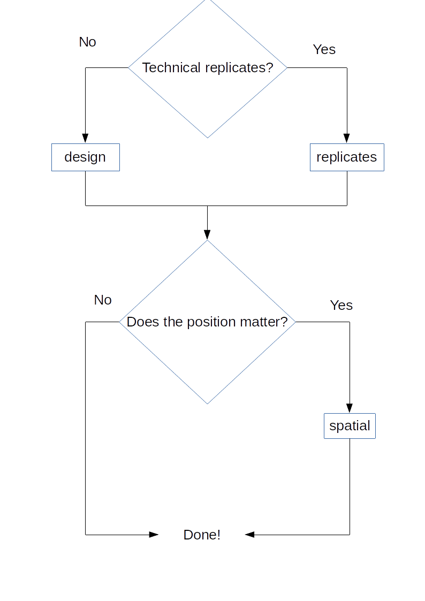
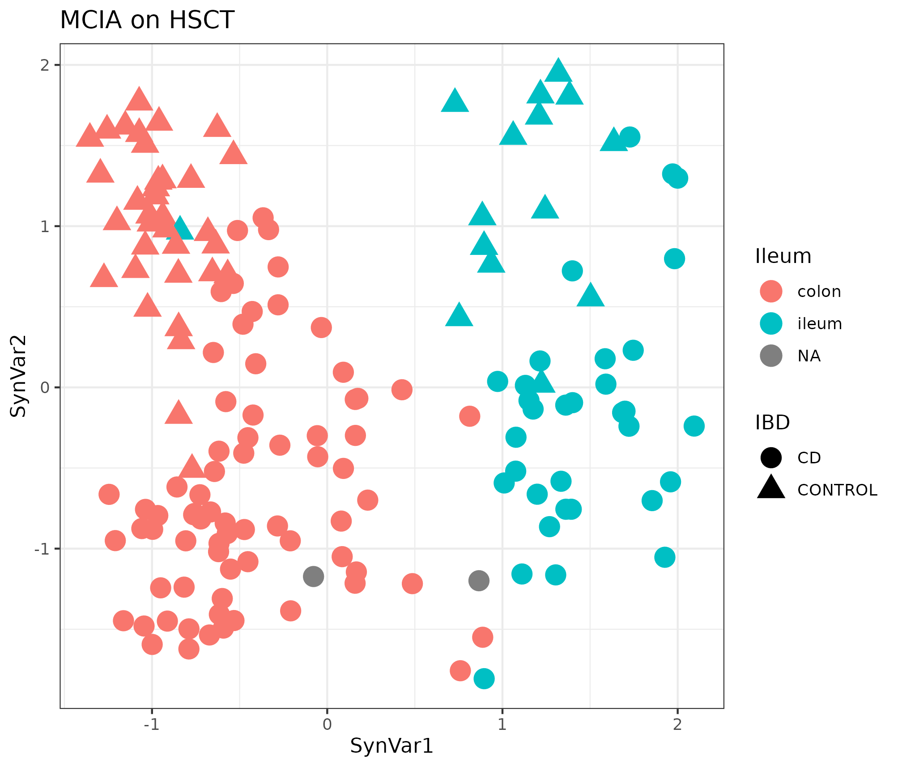
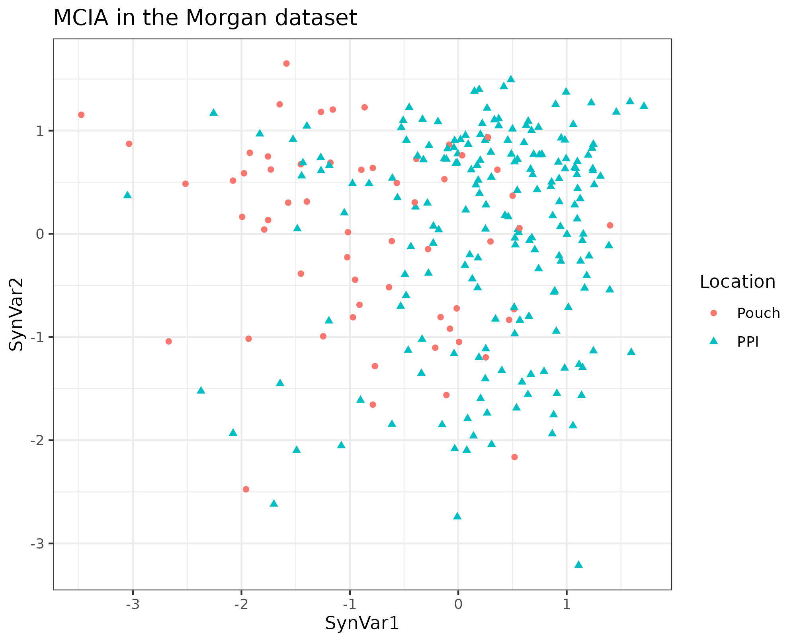

# Results

## Packages/methods

### experDesign

`experDesign` package built in R was released for the first time on CRAN on 2020-09-08 after nearly a year after the initial release made on [github](https://github.com/llrs/experDesign).
After peer review it was published on a journal on 2021-11 [@revillasancho2021].

The package uses functional programming to create and modify objects and the features used.
The package bases its performance on the large body of work made by the R core team.
It adds the information to the introduced `data.frame` or returns an vector with the appropriate information.

`experDesign` functions are divided into several categories:

-   Helper functions to aid on deciding how many batches are or how many samples per batch.
    There are some also that report how good a given distribution of the samples felt for a given dataset.

-   Functions generating indexes.

-   Functions distributing the samples on indexes

```{r experdesign-flowchart, fig.scap="`experDesign` flowchart", fig.cap="experDesign flowchart for users of the package showing which functions can be used depending on the experiment design they have."}

```

Regarding time related variables `experDesign` will use them as factors, while issuing a warning to the user.

Since its development it has been used on a couple of RNA sequencing experiments that required a batch design, one of organoids bulk RNA-seq (data not related to this thesis) and another one of biopsies bulk RNA-seq from the BARCELONA cohort (See appendix section \@ref(barcelona)).
It was also used to check if there is any observable batch effect on the datasets analyzed.

On the designed datasets `experDesign` avoided batch effects from the sequencing process.
However, on the organoids dataset, a change on the matrigel used to produce them introduced a batch effect that made it impossible to compare samples before and after that change (there were not any shared sample before and after the change of matrigel). 
On the BARCELONA cohort there were other problems described on the appendices (section \@ref(barcelona)).

```{r experDesign, include=FALSE, eval=FALSE}
library("dlstats")
library("dplyr")
cran_stats("experDesign") %>% 
  group_by(month = format(end, "%Y/%m")) %>% 
  summarise(d = sum(downloads)) %>% 
  ungroup() %>% 
  pull(d) %>% 
  median()
```

Since its release on CRAN it has had a median of \~400 downloads each month from RStudio repository mirror, showing the interest the community have on solutions like this.

### BaseSet

`BaseSet` package, built in R, was released for the first time on CRAN on 2020-11-11, nearly two years after the initial work started on [github](https://github.com/llrs/BaseSet "Repository").

The package uses both functional programming and object oriented program to create and modify the TidySet S4 object defined[^results-1].
Mixing it with S3 generic functions it provides a powerful interface compatible with the tidyverse principles, a [group of packages](https://www.tidyverse.org/) following the same design.
The package provides a new class to handle fuzzy sets and the associate information.

[^results-1]: S4 is one of the object programming paradigms on R.
    For a more complete overview and differences see [Advanced R](https://adv-r.hadley.nz/oo.html "2nd edition") [@wickham2019].

`BaseSet` methods are divided into several categories:

-   [General functions](https://docs.ropensci.org/BaseSet/reference/index.html#general) to create sets of the TidySet class or convert from it to a list or about the package.

-   [Set operations](https://docs.ropensci.org/BaseSet/reference/index.html#set-operations) like adjacency cartesian product, cardinality, complement, incidence, independence, intersection, union, subtract, power set or size.

-   [Functions to work with TidySets](https://docs.ropensci.org/BaseSet/reference/index.html#set-operations) to add relationships, sets, elements or some complimentary data about them.
    Remove the same or simply move around data or calculate the number of elements, relations and sets.

-   [Functions to read](https://docs.ropensci.org/BaseSet/reference/index.html#reading-files) files from formats where sets are usually stored in the bioinformatician field: GAF, GMT and OBO formats.

-   Last, some [utility functions](https://docs.ropensci.org/BaseSet/reference/index.html#utiles) to use set name conventions and other auxiliary functions.

The package had a long development process with initial iterations based on GSEABase package which was later abandoned ([GSEAdv](https://github.com/llrs/GSEAdv)) to also include some uncertainty on the relationship of a gene with a given gene set.

The package formed part of an exploration of the Bioconductor community (project to develop, support, and disseminate free open source software that facilitates rigorous and reproducible analysis of data from current and emerging biological assay) for more modern and faster handling of sets than (GSEABAse)[https://bioconductor.org/packages/GSEABase].
There were three different packages created as part of this process, `BaseSet`, `BiocSet` released [on Bioconductor](https://bioconductor.org/packages/BiocSet/) and `unisets`, available [on github](https://github.com/kevinrue/unisets).
The three different approaches were presented at a birds of feather on BioC2019, the annual conference of Bioconductor on 2019.

The package passed the review on the rOpenSci organization ([See review](https://github.com/ropensci/software-review/issues/359 "Review on Github")) and is now part of the packages hosted there too.

```{r BaseSet, include=FALSE, eval = FALSE}
library("dlstats")
library("dplyr")
cran_stats("BaseSet") %>%  
  group_by(month = format(end, "%Y/%m")) %>% 
  summarise(d = sum(downloads)) %>% 
  ungroup() %>% 
  pull(d) %>% 
  median()
```

Since its release on CRAN it has had a median close to \~400 downloads each month from RStudio package manager.

### inteRmodel

The package was build once the method used to find accurate models of the relationships of the data available of a dataset using RGCCA was established.
Using the package [on github](https://github.com/llrs/intermodel "inteRmodel") simplifies the process and makes easier to redo the model optimization used on this thesis.

The package has functions that can be grouped in three categories:

-   Look for models and evaluate them:
    To search for a model given some conditions, such as that all the blocks are connected, and check the models via bootstraping or leave one out procedures.

-   Reporting: To make better reports by improving handling of names or simplifying the objects or how to calculate scores.

-   Building: To easier build correct models on RGCCA, simplifying the process to create a symmetric matrix.

Currently it is only [available on github](https:intermodel.llrs.dev), so the number of downloads and usage is unknown but since its release a user has contacted to keep it up to date with development versions of RGCCA.
Currently, it is compatible with the next release of [RGCCA being prepared](https://github.com/rgcca-factory/RGCCA/tree/CRAN)[^results-2].

[^results-2]: I also contributed with some comments and feedback to the package to make it easier to read the source and check the inputs and improve the documentation so that it is coherent with the code and previous results of the functions.

The functions `analyze` helps to analyze code of a single integration, providing the results on a tidy format for further processing.
To create the connections between blocks the function `weight_design` is available.
It creates all the possible matrices given a number of blocks and a number of weights.
Optionally it can create just a subset of those based on a numeric vector.
However, it does not provide a way to have the design named.\
If the user wants to create their own design matrices, they can use `symm` and modify the design of the model with `subSymm`.
`symm`, takes an initial matrix to pick up the row and column names.
It is recommended that the user checks the design matrix is fully connected, which the package facilitates with the function `correct`.
This is also recommended even if the design matrices are created with `weight_design`.

To search models `search_models` starts with a initial connectivity of the blocks and creates all the combinations of connections given.

For the bootstrap procedure there is the function `boot_index` to create the bootstrapped index of samples to be used by `boot_index_sgcca`. 
`boot_index` randomly selects as much samples as specified by the arguments to create as much indices as the required by the second argument.
If the bootstrapped samples used is not important one can use `boot_samples_sgcca`.
If the users want to perform a leave-one-out procedure they can use `looIndex`.

```{r intermodel-workflows, fig.scap="inteRmodel functions and workflow.", fig.cap="Functions provided by the inteRmodel package to search and validate models of relationships using RGCCA. Created with BioRender.com"}
include_graphics("images/inteRmodel-workflows.png")
```

For more information, you can access the (manual online)[https://llrs.github.io/inteRmodel/] or once it is installed.

The package cannot choose which variables use from the block with information to split into several blocks.
However, it provides the `model_RGCCA` function to make it easy to prepare such variables for RGCCA input.
The inteRmodel procedure will only be useful if the user should decide which variables are independent from others and split them into different blocks.
To asses this the user can use the methods we used, as described on the above section \@ref(variance).
It is important to keep in mind the possible causal relationships on user's data [@greenland2002].

## Analysis

On the following sections the main results of analyzing each dataset are presented.

<!--# TODO Show taxonomy plots-->

### Puget's dataset {#results-puget}

On this dataset the different parameters and capabilities of RGCCA were tested.

The three different methods, centroid, factorial or horst were tested and compared.
The main result of this comparison was that the differences of the selection of the variables mattered more than the number of variables selected with each method.
The models were tested with different weights on all three schemes: horst, centroid and factorial.
The horst and the centroid scheme were similar while the factorial resulted in the most different AVE values (see [S1 Data](https://journals.plos.org/plosone/article?id=10.1371/journal.pone.0246367#pone.0246367.s001) of [@revilla2021]).
The centroid scheme was selected because it takes into account all the relationship regardless of the sign of the canonical correlation between the blocks.
It is similarity to horst scheme.

The effect of the sparsity value was measured by its effect on the inner AVE scores and the combination of the different values for each block as can be seen on Figure \@ref(fig:puget-tau2AVE).

```{r puget-tau2AVE, fig.cap="Effect of tau on the inner AVE on Puget's dataset. The suggested tau value is the column between the regular grid, on the ordinate axis the y's tau values and on the abscissa the gene expression (GE) on the left and the comparative genomic hybridization (CGH) on the right. The highest inner AVE is with high tau values for y and middle to upper values for GE and CGH.", fig.scap="Effect of tau on the inner AVE on Puget's dataset."}
knitr::include_graphics("images/pugets_tau_to_AVE.png")
```

The first model of the family of models 1 can be seen on Table \@ref(tab:puget-model1):


```{r puget-model1}
df <- data.frame(
  stringsAsFactors = FALSE,
  "Model 1" = c("GE", "CGH", "Localization"),
  GE = c(0L, 0L, 1L),
  CGH = c(0L, 0L, 1L),
  Localization = c(1L, 1L, 0L),
  check.names = FALSE
)
k <- kable(df, align = c("c", "c", "c", "c"),
           caption.short = "Model 1 for Puget's dataset.",
           caption = "Model 1 for Puget's dataset. Relationships between the different blocks on the Puget dataset for model 1. 0 indicates no relationship and 1 indicates a strong relationship.")
format_design(k, df)
```


When looking for the model that adjust better following this structure we arrived to model 1.2, described below (Table \@ref(tab:puget-model1-2)) :


```{r puget-model1-2}
df <- data.frame(
  stringsAsFactors = FALSE,
         "Model 1.2" = c("GE", "CGH", "Localization"),
                GE = c(0L, 0L, 1L),
               CGH = c(0, 0, 0.1),
      Localization = c(1, 0.1, 0)
)
k <- kable(df, align = c("c", "c", "c", "c"),
           caption.short = "Model 1.2 for Puget's dataset.",
           caption = "Model 1.2 for Puget's dataset. Relationships between the different blocks on the Puget dataset for model 1. 0 indicates no relationship and 1 indicates a strong relationship.")
format_design(k, df)
```


On model 2 we split the invariable variables from those related to the location (Table \@ref(tab:puget-model2)):

```{r puget-model2}
df <- data.frame(
  stringsAsFactors = FALSE,
           Model.2 = c("GE", "CGH", "Invariable", "Localization"),
                GE = c(0L, 1L, 1L, 1L),
               CGH = c(1L, 0L, 1L, 1L),
        Invariable = c(1L, 1L, 0L, 0L),
      Localization = c(1L, 1L, 0L, 0L)
)
k <- kable(df, align = c("c", "c", "c", "c", "c"),
           caption.short = "Model 2 for Puget's dataset.",
           caption = "Model 2 for Puget's dataset. Relationships between the different blocks on the Puget dataset for model 1. 0 indicates no relationship and 1 indicates a strong relationship.")
format_design(k, df)
```

Following this split, the model that has higher inner AVE for these blocks is the following (Table \@ref(tab:puget-model2-2)):

```{r puget-model2-2}
df <- data.frame(
  stringsAsFactors = FALSE,
         Model.2.2 = c("GE", "CGH", "Invariable", "Localization"),
                GE = c("1", "1/3", "0", "1"),
               CGH = c("1/3", "0", "1/3", "0"),
        Invariable = c("0", "1/3", "0", "0"),
      Localization = c(1L, 0L, 0L, 0L)
      )
k <- kable(df, align = c("c", "c", "c", "c", "c"),
           caption.short = "Model 2.2 for Puget's dataset.",
           caption = "Model 2.2 for Puget's dataset. Relationships between the different blocks on the Puget dataset for model 1. 0 indicates no relationship and 1 indicates a strong relationship.")
format_design(k, df)
```

If we added a superblock with all the data of the different blocks from model 1 we started with the standard relationship between blocks (Table \@ref(tab:puget-model-superblock)):

```{r puget-model-superblock}
df <- data.frame(
  stringsAsFactors = FALSE,
  Model.superblock = c("GE", "CGH", "Superblock", "Localization"),
                GE = c(0L, 0L, 1L, 0L),
               CGH = c(0L, 0L, 1L, 0L),
        Superblock = c(1L, 1L, 0L, 1L),
      Localization = c(0L, 0L, 1L, 0L)
      )
k <- kable(df, align = c("c", "c", "c", "c", "c"),
           caption.short = "Model with superblock for Puget's dataset.",
           caption = "Relationships between the different blocks on the Puget's dataset for model superblock. 0 indicates no relationship and 1 indicates a strong relationship.")
format_design(k, df)
```

But when the best model with the superblock that had highest inner AVE is quite different (Table \@ref(tab:puget-model-superblock-2)):


```{r puget-model-superblock-2}
df <- data.frame(
  stringsAsFactors = FALSE,
  Model.superblock = c("GE", "CGH", "Superblock", "Localization"),
                GE = c("1", "1/3", "0", "1"),
               CGH = c("1/3", "0", "1", "0"),
        Superblock = c(0L, 1L, 0L, 1L),
      Localization = c(1L, 0L, 0L, 0L)
      )
k <- kable(df, align = c("c", "c", "c", "c", "c"),
           caption.short = "Model with superblock.2 for Puget's dataset.",
           caption = "Relationships between the different blocks on the Puget's dataset for model superblock.2. 0 indicates no relationship and 1 indicates a strong relationship.")
format_design(k, df)
```

Exploratory analysis with the superblock model was done.
The first two components of the superblock did not help to explain the biology or classify the tumors (See \@ref(fig:puget-superblock)):

```{r puget-superblock, fig.cap="First components of the superblock which has all the data of the samples on the Puget's dataset.", fig.scap="Superblock components on Puget's dataset"}
knitr::include_graphics("images/pugets_superblock.png")
```


The same data was used to look for a good model from the data itself including a model with a superblock but looking at the first component of the CGH and transcriptome block.
This allowed to visually inspect if each model's components helped to classify the samples (Figure \@ref(fig:puget-models)):

```{r puget-models, fig.scap="Different models tried with the same data showing the first components of the CGH data and the transcriptome.", fig.cap="Different models tried with the same data showing the first components of the CGH data and the transcriptome. Model 1 and 1.2 with transcriptomics, CGH data and all the data about the samples together. Model 2 and 2.2 with transcriptomics, CGH data and all the data bout the samples on different blocks. Model superblock and superblock.2 have all the data in different blokcs and one block with all the data."}
knitr::include_graphics("images/pugets_models.png")
```


The first components of the CGH and the transcriptomics blocks of the superblock.2 model show better classification than that of the superblock.
However, the other models show a better classification of the samples with much simpler models.

<!--# Slightly modified from the article!! -->

To find these models the three blocks with the best tau and the centroid scheme were analyzed by changing the weights between 0 and 1 by 0.1 intervals.
According to the inner AVE, the best model was the one in which the weights (1) between the host transcriptome and location, (2) the host transcriptome and the CGH, and (3) the CGH block were linked to variables related to the location with weights of 1, 0.1 and 0.1, respectively.

When we added a superblock to the data, there was a slight increase of 0.01 on the inner AVE of the model (See Table \@ref(tab:puget-models-ave)).
The model with the superblock that explained most of the variance was that in which the weights of the interaction within (1) the host transcriptome, (2) between the superblock and the CGH, (3) between the host transcriptome and the localization, and (4) between CGH and the host transcriptome were 1, 1, 1 and 1/3, respectively (See table \@ref(tab:puget-model-superblock-2).
To see if the superblock could classify the sample by location, we plotted the first two components of the superblock.

We can clearly see that they do not classify the samples according to the location of the tumor, which is known to affect the tumor phenotype [@puget2012].

Adding one block containing the age of the patient and the severity of the tumor to the model, decreased the inner AVE.
The best model with these blocks, according to the inner AVE, was that in which the interactions (1) within the host transcriptome, (2) between the host transcriptome and the localization, (3) between the host transcriptome and(4) the CGH and between the CGH and the other variables were 1, 1, 1/3 and 1/3, respectively.
The first components of each model can be seen in the figure:

We can observe on the figure \@ref(fig:puget-models), the strong dependency between gene expression and location since the first model while the weaker relationship with the CGH assay [@puget2012].
On the other hand, the major difference is the dispersion on the CGH component on each model.

The effect of the superblock and weights on different models to the inner AVE.
There are significant differences between having the superblock and not having it.

<!--TODO double check which interaction indicates yes/no -->

```{r puget-weights, fig.scap="Effect of superblock and weights on the inner AVE on Puget's dataset.", fig.cap="Effect of superblock and weights on the inner AVE on Puget's dataset. Designs with the superblock showed higher inner AVe scores than without it. Interaction yes/no indicates RNA and RNA interaction."}
knitr::include_graphics("images/pugets-weights.png")
```


The different models resulted on the following AVE values as reported on \@ref(tab:puget-models-ave):

```{r puget-models-ave}
df <- data.frame(
  stringsAsFactors = FALSE,
             Model = c("1", "1.2", "2", "2.2", "superblock", "superblock.2"),
         "inner AVE" = c(0.6333592,0.851236,0.2791546,
                       0.6902329,0.7055847,0.8047477),
         "outer AVE" = c(0.06920968,0.06923187,
                       0.07386952,0.06927069,0.07345775,0.06958205),
  check.names = FALSE
)
k <- kable(df, caption.short ="AVE values of RGCCA models on Puget's dataset.", 
           caption = "AVE values of RGCCA models on Puget's dataset. Values for both inner and outer AVE of the first canonical component of models 1, 1.2, 2 2.2 and superblock and superblock.2 are shown.")
format_design(k, df)
```


### HSCT dataset {#results-hsct}

The permanova analysis was performed on this dataset to estimate which were the variables that are more relevant.
From the many variables the location, sex, patient id and others were found to be related to the variability of the microbiome or the transcriptome on this dataset.

<!--# From gourmiting 2 2018-03-13 -->

With the permanova analysis we found that more of the 50% of the variance of normalized RNA-seq data and microbiome data respectively is explained by the variables of location, disease, sex, and the interaction between disease and sex.
On the transcriptome the most important factor is location which is more than 15% of the variance, while on the microbiome data the most important factor is the patient id followed by location of the sample.

<!-- # Data on TRIM/intestinal_16S_RNAseq_metadb/models.RData and on TRIM/intestinal_16S_RNAseq_metadb/variance.R-->

```{r hsct-permanova-rnaseq}
df <- data.frame(Factor = c("Location", "IBD", "Sex", "IBD:Sex", "Location:IBD", "Location:Sex", "Location:IBD:Sex", "Residuals"),
                 R = c(0.18057, 0.03120, 0.01306, 0.01279, 0.02427, 0.00816, 0.00486, 0.72508),
                 "p-value" = c(.0002, .0002, .0012, 0.11798, 0.11458, 0.03519, 0.52190, NA),
                 check.names = FALSE)
k <- kable(df, caption.short = "Permanova analysis of transcriptome.",
      caption = "Permanova analysis of transcriptome. The variables and their interactions (shown with :) and the $R^2$ values and the associated p-value. The higher the $R^2$ the more variance is explained by that factor.")
format_design(k, df)
```

```{r hsct-permanova-microbiome}
df <- data.frame(Factor = c("Location", "IBD", "Sex", "IBD:Sex", "Location:IBD", "Location:Sex", "Location:IBD:Sex", "Residuals"),
                 R = c(0.06061, 0.04967, 0.01712, 0.01091, 0.02089, 0.01139, 0.00289, 0.82652),
                 "p-value" = c(.0002000, .0002000, .0003999, 0.6604679, 0.8476305, 0.00759185, 0.9994001, NA),
                 check.names = FALSE)
k <- kable(df, caption.short = "Permanova analysis of microbiome",
      caption = "Permanova analysis of microbiome. The variables and their interactions (shown with :) and the $R^2$ values and the associated p-value. The higher the $R^2$ the more variance is explained by that factor.")
format_design(k, df)
```

<!--# global test from the comments on TRIM/intestinal_16S_RNAseq_metadb/variance.R -->

With globaltest the results were similar: sex, ibd, location, age and time since diagnosis were able to explain the SESCD score (p-value $5.7 \cdot 10^{-21}$ ).
The resulting p-value was well below the 0,05 threshold defined for RNA-seq data on the models including the segment of the sample, sex and treatment.

On the microbiome data the results were similar but the p-value was considerably higher but still below the threshold.

```{r hsct-diversity, fig.cap="Microbiome diversity on HSCT dataset. On the upper section the Shannon effective and on the lower row the Simpson effective diversity splitted by colon and ileum and controls and CD.", fig.scap="Microbiome diversity on HSCT dataset."}
knitr::include_graphics("images/hsct-ASV-diversity.png")
```


Diversity indices of the samples were explored and compared for several subsets.
Splitting by location of the sample and disease provided the highest differences and the diversity index along time did not change much.

Weighted gene co-expression network analysis did not provide relevant links between bacteria and transcriptome as it failed to find an acceptable scale free degree.
As can be seen on the Figure \@ref(fig:hsct-wgcna-power), the scale free topology does not reach the recommended threshold of 0.9 and the mean connectivity is also very low even for the first power.


STATegRa was used between stool 16S data and intestinal 16S data under the assumption that there is a shared common factor without influence of other categorical variables.
However, it did not find a good agreement between these two data sources and 16S data source was not longer used on the analysis.
In addition, the model is fixed, so it did not allow to find new or other relationships that are not one to one.

With RGCCA we could select different models and use all the data available without much assumptions.
The models with the highest inner AVE of the family 1 and the family 2 models were similar to those on the Häsler dataset.


The weights of these models can be observed here:

| Model 0           | Transcriptome | Microbiome |
|-------------------|:-------------:|:----------:|
| **Transcriptome** |       0       |     1      |
| **Microbiome**    |       1       |     0      |

: (#tab:hsct-model0) Relationships between the different blocks on the HSCT dataset for model 0. 0 indicates no relationship and 1 indicates a strong relationship.

| Model 1.1         | Transcriptome | Microbiome | metadata |
|-------------------|:-------------:|:----------:|:--------:|
| **Transcriptome** |       0       |     0      |    1     |
| **Microbiome**    |       0       |     0      |    1     |
| **metadata**      |       1       |     1      |    0     |

: (#tab:hsct-model1-1) Relationships between the different blocks on the HSCT dataset for model 1. 0 indicates no relationship and 1 indicates a strong relationship.

When looking for the model that adjust better following this structure we arrived to model 1.2, described below:

| Model 1.2         | Transcriptome | Microbiome | metadata |
|-------------------|:-------------:|:----------:|:--------:|
| **Transcriptome** |       0       |     0      |    1     |
| **Microbiome**    |       0       |     0      |   0.1    |
| **metadata**      |       1       |    0.1     |    0     |

: (#tab:hsct-model1-2) Relationships between the different blocks on the HSCT dataset for model 1.2. 0 indicates no relationship and 1 indicates a strong relationship.

On model two we split the invariable variables from those related to the location:

| Model 2           | Transcriptome | Microbiome | Location | Demographic | Time |
|-------------------|:-------------:|:----------:|:--------:|:-----------:|:----:|
| **Transcriptome** |       0       |     1      |    1     |      1      |      |
| **Microbiome**    |       1       |     0      |    1     |      1      |      |
| **Demographic**   |       1       |     1      |    0     |      0      |      |
| **Location**      |       1       |     1      |    0     |      0      |      |

: (#tab:hsct-model2) Relationships between the different blocks on the HSCT dataset for model 2. 0 indicates no relationship and 1 indicates a strong relationship.

Following this split, we used inteRmodel (See section above \@ref(intermodel) )to find the model that has higher inner AVE for these blocks is the following:

| Model 2.2         | Transcriptome | Microbiome | Demographic | Location | Time |
|-------------------|:-------------:|:----------:|:-----------:|:--------:|:----:|
| **Transcriptome** |       0       |     0      |      0      |   1    | 0    |
| **Microbiome**    |       0       |     0      |     0.2     |   0.1    | 0    |
| **Demographic**   |       0       |    0.2     |      0      |    0     | 0.6    |
| **Location**      |      1      |    0.1     |      0      |    0     | 0    |
| **Time**              |       0       |     0      |      0.6    |    0     | 0    |

: (#tab:hsct-model2-2) Relationships between the different blocks on the HSCT dataset for model 2.2. 0 indicates no relationship and 1 indicates a strong relationship.

We also tested specifically a model from the family 2.3 

<!--# TODO fix this  the model is the same as in 2.2 and it shouldn't or would it? (wrong on the paper) -->

| Model 2.3         | Transcriptome | Microbiome | Demographic | Location | Time|
|-------------------|:-------------:|:----------:|:-----------:|:--------:|:---:|
| **Transcriptome** |       0       |   0.1      |      0      |    1     | 0   |
| **Microbiome**    |      0.1      |     0      |     0.1     |   0.1    | 0   |
| **Demographic**   |       0       |    0.1     |      0      |    0     | 1   |
| **Location**      |       1       |    0.1     |      0      |    0     | 0   |
| **Time**          |       0       |     0      |      1      |    0     | 0   |
|                   |               |            |             |          |     |

: (#tab:hsct-model2-3) Relationships between the different blocks on the HSCT dataset for model 2.3. 0 indicates no relationship and 1 indicates a strong relationship.

The best model of the family 2 confirmed a relationship between the host transcriptome and the location-related variables, while the microbiome was associated with the demographic and location-related variables (see figure \@ref(fig:hsct-models) and [S2](https://journals.plos.org/plosone/article?id=10.1371/journal.pone.0246367#pone.0246367.s002) data of [@revilla2021]).
Overall, we see that the relationships in the model affected the distribution of samples on the components of both the host transcriptome and the microbiome.

| Model | inner AVE | outer AVE  |
|-------|-----------|------------|
| 0     | 0.3999234 | 0.10016886 |
| 1     | 0.623019  | 0.08423331 |
| 1.1   | 0.5678189 | 0.08487135 |
| 1.2   | 0.7043881 | 0.07757663 |
| 2     | 0.2517363 | 0.09820497 |
| 2.1   | 0.6940253 | 0.09402657 |
| 2.2   | 0.818764  | 0.09416275 |
| 2.3   | 0.7761846 | 0.09439379 |

: (#tab:hsct-models-ave) The models on the HSCT and their AVE values.

The different models selected different variables, some of which are shared between models.
The most similar models are those that have split the metadata into 3 blocks, followed by those that have the metadata in a single block.

In order to analyze the accuracy of the models, one thousand bootstraps were used to integrate the data from the HSCT CD dataset.
Each bootstrap had its own dispersion on the variables according to the samples selected, the distribution of the bootstraps used are represented here:


Evaluating the same model on each bootstrap lead to a dispersion on the inner AVE of the model.
The lower the dispersion, the more robust the model was to different conditions than in the initial testing.


With the bootstrapped models we used BaseSet to estimate the probability that each variable to be relevant for the association with a disease.
However, due to big amount of small probabilities when using the BaseSet package to calculate which variables are more relevant it could not provide a good estimation on time.

MCIA was applied as a baseline of the integration, the first two components were represented similarly to those of the blocks when using RGCCA \@ref(fig:hsct-mcia).

```{r hsct-mcia, fig.scap="MCIA on the HSCT dataset", fig.cap="MCIA first two synthetic variables on the IBD related cohorts. In red circles the colon and in blue triangles the ileum."}

```

The AUC of classifying the transcriptome in colon or ileum segments was compared between the models (see \@ref(fig:hsct-auc-plot) and with MCIA.

```{r hsct-auc-plot, fig.scap="ROC curves of the RGCCA models on the HSCT dataset.", fig.cap="ROC curve of the different datasets with the models from RGCCA and the result with MCIA. In gray the MCIA method and with discontinued lines the models of RGCCA."}
include_graphics("images/hsct-auc-models.png")
```

These models have the following AUC to classify the location of the sample according to the first component of the transcriptome block.

```{r hsct-auc}
df <- data.frame(Model = c("0", "1", "1.1", "1.2", "2", "2.1", "2.2", "2.3"),
           AUC = c(0.453703703703704, 0.430941358024691, 0.463927469135802, 0.595871913580247, 
0.945023148148148, 0.998842592592593, 0.998070987654321, 0.996913580246914
))
k <- kable(df, caption.short = "AUC values of RGCCA models on the HSCT dataset.",
      caption = "AUC values of RGCCA models of the HSCT dataset classyfing the location of the sample according to the first component of the transcriptome block. From model 0 to model 2.3, the best classification is achieved with model 2.1. Note that this is removing two samples for which the location is unkown.")
format_design(k, df)
```


On MCIA the AUC for the classification of ileum or colon samples is of 0.9851 once those two samples with unknown location are excluded. 
This is on par with the models of family 2 as can be seen on the table \@ref(tab:hsct-auc).

The different models selected different variables as can be seen below:


Differences and similarities between the selected features of each model can be observed on Figure \@ref(fig:hsct-features).
Genes are very similar between model 0 to 1.2 and between 2 to 2.3, while OTUs are very unique on model 0 and others shared between most models.

### Häsler's dataset {#results-hasler}

In this dataset, the parameter tau behaved slightly differently than with the previous dataset but the value from the Schäfer's method for tau was close to the best value.


Models for Häsler dataset are:


```{r hasler-model-0}
m0 <- data.frame("Model 0" = c("RNAseq", "micro"),
                 RNAseq = c(0, 1),
                 micro = c(1, 0),
                 check.names = FALSE)
k <- kable(m0, caption.short = "Model 0 of H\u00E4sler dataset", 
           caption = "Model 0 of H\u00E4sler dataset")
format_design(k, m0)
```

The first model for family 1 is on table \@ref(tab:hasler-model-1-1):

```{r hasler-model-1-1}
m1.1 <- data.frame(
  "Model 1.1" = c("RNAseq", "micro", "meta"),
  RNAseq = c(0, 0, 1), 
  micro = c(0, 0, 1), 
  meta = c(1, 1, 0),
  check.names = FALSE
)
k <- kable(m1.1, caption.short = "Model 1.1 of H\u00E4sler dataset", 
           caption = "Model 1.1 of H\u00E4sler dataset")
format_design(k, m1.1)
```

The after optimization of the model of family 1, the best one is on table \@ref(tab:hasler-model-1-2):

```{r hasler-model-1-2}
m1.2 <- structure(c(0, 0, 1, 0, 0, 0.1, 1, 0.1, 0), .Dim = c(3L, 3L), .Dimnames = list(
    c("RNAseq", "micro", "meta"), c("RNAseq", "micro", "meta"
    )))
k <- kable(as.data.frame(m1.2), caption.short = "Model 1.2 of H\u00E4sler dataset", 
           caption = "Model 1.2 of H\u00E4sler dataset")
format_design(k, m1.2)
```

The first model for family 2 is on table \@ref(tab:hasler-model-2-1):

```{r hasler-model-2-1}
m2.1 <- structure(c(0, 0, 1, 0, 0, 0, 0, 0.5, 1, 0, 1, 0.5, 0, 0, 0, 
0, 1, 0, 0, 1, 0, 0, 0, 1, 0), .Dim = c(5L, 5L), .Dimnames = list(
    c("RNAseq", "micro", "Location", "Demographic", "Time"), 
    c("RNAseq", "micro", "Location", "Demographic", "Time")))
k <- kable(as.data.frame(m2.1), caption.short = "Model 2.1 of H\u00E4sler dataset", 
           caption = "Model 2.1 of H\u00E4sler dataset")
format_design(k, df)
```

After optimization of models of family 1 the best model according to the inner AVE score is on table \@ref(tab:hasler-model-2-2):

```{r hasler-model-2-2}
m2.2 <- structure(c(0, 0.1, 1, 0, 0, 0.1, 0, 0, 0.1, 1, 1, 0, 0, 0, 0, 
0, 0.1, 0, 0, 0.1, 0, 1, 0, 0.1, 0), .Dim = c(5L, 5L), .Dimnames = list(
    c("RNAseq", "micro", "Location", "Demographic", "Time"), 
    c("RNAseq", "micro", "Location", "Demographic", "Time")))
k <- kable(as.data.frame(m2.2), caption.short = "Model 2.2 of H\u00E4sler dataset", 
           caption = "Model 2.2 of H\u00E4sler dataset")
format_design(k, df)
```

On table \@ref(tab:hasler-aves), we can see here the AVE scores of each of the previous models:

```{r hasler-aves}
df <- data.frame(Model = c("0", "1.1", "1.2", "2.1", "2.2"),
           "inner AVE" = c(0.8217371, 0.7461423, 0.8349410, 0.4980681, 0.7513065),
           "outer AVE" = c(0.0961236, 0.1024148, 0.1025486, 0.1008395, 0.1009915),
         check.names = FALSE)
k <- kable(df, caption.short = "AVE values of RGCCA models on H\u00E4sler's dataset",
      caption = "AVE values of RGCCA models on H\u00E4sler's dataset. The inner and the outer AVE scores of multiple models tested on the H\u00E4sler dataset are shown. The model with the hightes inner AVE is model 1.2.")
format_design(k, df)
```

In contrast to the HSCT's dataset (table \@ref(tab:hsct-models-ave)), the model with the highest inner AVE was model 1.2 but model 2.2 was close to it (see table \@ref(tab:hasler-aves)).
Model 2.2 has a relationship of 0.1 between microbiome and the host transcriptome and of 1 between the location and the host transcriptome.
The microbiome block is also related by a factor of 0.1 with the demographic block and of 1 with the time block.
Lastly, the time and the demographic block are related by a factor of a 0.1.
In either case the family 1 and family 2 models can correctly separate by sample location (colon or ileum) but not by disease type or inflammation status as can be seen on figure \@ref(fig:hasler-models).


There is no observable cluster of IBD samples and the other samples, showing that on this dataset the differences of the microbiome between the different type of samples are less stark.
The classification of samples was very accurate in all the models, specially on model 2.2, see figure \@ref(fig:hasler-auc-plot):


```{r hasler-auc-plot, fig.scap="AUC for models with RGCCA on Häsler's dataset", fig.cap="AUC for models with RGCCA on Häsler's dataset. The AUC was calculated with the first dimension of the gene expression block ability to predict location of the sample."}
include_graphics("images/hasler-auc.png")
```

This accuracy resulted on high AUC values for all the models, as can be seen on table \@ref(tab:hasler-auc):

```{r hasler-auc}
df <- data.frame(
  Model = c("0", "1.1", "1.2", "2.1", "2.2"),
  AUC = c(0.801149425287356, 0.97816091954023, 0.997701149425287, 1, 1))
k <- kable(df, caption.short = "AUC for models with RGCCA on H\u00E4sler's dataset",
      caption = "AUC for models with RGCCA on H\u00E4sler's dataset. The AUC was calculated with the first dimension of the gene expression block ability to predict location of the sample.")
format_design(k, df)
```

MCIA was applied as a baseline of the integration and compared to the different models to know which one separates best colon and ileum samples.
The result on the first two dimension is shown on figure \@ref(fig:hasler-mcia):

{alt="MCIA results"}


MCIA's AUC results was as high as the model 2.2 to classify samples according to their location.
It was even better to classify the samples according to the type of sample they are: 0.6248 vs 1 the best AUC from RGCCA that corresponds to model 1.2.

### Morgan's dataset {#results-morgan}

We tested if results of inteRmodel were consistent on this dataset with the other datasets.

| Model 0           | Transcriptome | Microbiome |
|-------------------|:-------------:|:----------:|
| **Transcriptome** |       0       |     1      |
| **Microbiome**    |       1       |     0      |

: (#tab:morgan-model0) Relationships between the different blocks on the Morgan's dataset for model 0. 0 indicates no relationship and 1 indicates a strong relationship.

| Model 1           | Transcriptome | Microbiome | metadata |
|-------------------|:-------------:|:----------:|:--------:|
| **Transcriptome** |       0       |     0      |    1     |
| **Microbiome**    |       0       |     0      |    1     |
| **metadata**      |       1       |     1      |    0     |

: (#tab:morgan-model1) Relationships between the different blocks on the Morgan's dataset for model 1. 0 indicates no relationship and 1 indicates a strong relationship.

When looking for the model that adjust better following this structure we arrived to model 1.2, described below:

| Model 1.2         | Transcriptome | Microbiome | metadata |
|-------------------|:-------------:|:----------:|:--------:|
| **Transcriptome** |       0       |    0.1     |    0     |
| **Microbiome**    |      0.1      |     0      |    1     |
| **metadata**      |       0       |     1      |    0     |

: (#tab:morgan-model1-2) Relationships between the different blocks on the Morgan's dataset for model 1.2. 0 indicates no relationship and 1 indicates a strong relationship.

On model two we split the invariable variables from those related to the location (see \@ref(tab:morgan-model2)):

| Model 2           | Transcriptome | Microbiome | Demographic | Location |
|-------------------|:-------------:|:----------:|:-----------:|:--------:|
| **Transcriptome** |       0       |     1      |      1      |    1     |
| **Microbiome**    |       1       |     0      |      1      |    1     |
| **Demographic**   |       1       |     1      |      0      |    0     |
| **Location**      |       1       |     1      |      0      |    0     |

: (#tab:morgan-model2) Relationships between the different blocks on the Morgan's dataset for model 2. 0 indicates no relationship and 1 indicates a strong relationship.

Following this split, the model that has higher inner AVE for these blocks is the following:

| Model 2.2         | Transcriptome | Microbiome | Demographic | Location |
|-------------------|:-------------:|:----------:|:-----------:|:--------:|
| **Transcriptome** |       0       |    0.1     |      1      |   0.1    |
| **Microbiome**    |      0.1      |     0      |      0      |    0     |
| **Demographic**   |       1       |     0      |      0      |    0     |
| **Location**      |      0.1      |     0      |      0      |    0     |

: (#tab:morgan-model2-2) Relationships between the different blocks on the Morgan's dataset for model 2.2. 0 indicates no relationship and 1 indicates a strong relationship.

Each model is different from previous models.
After model 2.2 we looked on the model similar to model 2.3 on HSCT dataset showed but it is the same as in model 2.2. 
However, it is kept on the further analysis.

The different models were not able to separate the samples neither by location or sex.


Nevertheless, we compared the classification with the MCIA algorithm and still resulted that model 2.2 provide a better classification than MCIA.

| Model | inner AVE | outer AVE |
|-------|-----------|-----------|
| 0     | 0.4735601 | 0.1098639 |
| 1     | 0.6333592 | 0.115228  |
| 1.1   | 0.2448234 | 0.1104746 |
| 1.2   | 0.7868443 | 0.042266  |
| 2     | 0.4404123 | 0.108873  |
| 2.1   | 0.6052598 | 0.10749   |
| 2.2   | 0.6895661 | 0.1081315 |
| 2.3   | 0.6895661 | 0.1081315 |

: (#tab:morgan-models-ave) The models and their AVE values.

When exploring the bootstraps of the data we found that model 1.2 is highly variable:


<!--# TODO Add points of the models on the real dataset -->

In addition the model 2.2 usually has a lower inner AVE compared to model 1.2.

```{r morgan-auc-plot, fig.scap="AUC plot for Morgan's dataset", fig.cap="AUC for Morgan's dataset classificating the localization of the sample according to the first component of the gene expression of the models generated with RGCCA."}

```

The area under the curve for these models is:

```{r morgan-auc}
df <- data.frame(Model = c("0", "1", "1.1", "1.2", "2", "2.1", "2.2", "2.3"),
           AUC = c(0.496973365617433, 0.793497059840886, 0.816153580076098, 0.560619162919405, 
0.85463507436873, 0.847371151850571, 0.835264614320304, 0.835264614320304
))
k <- kable(df, caption.short="AUC for Morgan's dataset", 
      caption="AUC for Morgan's dataset classificating the localization of the sample according to the first component of the gene expression of the models generated with RGCCA.")
format_design(k, df)
```

With MCIA:

```{r morgan-mcia-plot, fig.scap="MCIA firsts dimensions on Morgan's dataset.", fig.cap="MCIA firsts dimensions on Morgan's dataset. Color and shape is according to the location of the sample. There is some separation by location."}

```
If we quantify this separation by the first dimension of MCIA, the AUC is 0.818, which is slightly worst than the models of family 2.

### Howell's dataset {#results-howell}


This dataset was processed to confirm the results on the previous datasets.
As always first we started with model 0, connecting both the RNAseq and the 16S blocks:

| Model 0 | RNAseq | 16S |
|---------|:------:|:---:|
| RNAseq  |   0    |  1  |
| 16S     |   1    |  0  |

: (#tab:howell-model0) Relationships between the different blocks on the Howell's dataset for model 0. 0 indicates no relationship and 1 indicates a strong relationship.

Later we look for the best model of family 1.
This resulted on the following model \@ref(tab:howell-model1-2):

| Model 1.2 | RNAseq | 16S | metadata |
|-----------|:------:|:---:|:--------:|
| RNAseq    |  0.0   | 0.1 |    1     |
| 16S       |  0.1   | 0.0 |    0     |
| metadata  |  1.0   | 0.0 |    0     |

: (#tab:howell-model1-2) Relationships between the different blocks on the Howell's dataset for model 1.2. 0 indicates no relationship and 1 indicates a strong relationship.

Model 1.2 \@ref(tab:howell-model1-2) was the best according to the AVE score but perform worse when attempting to recreate known biological differences via classifying samples as we can see below \@ref(fig:howell-models):

<!--# Found a bug on the plotting!! -->


Model 2.2 was selected for further analysis as it describes more accurately the biology of the dataset it.
Model 2.2 can be seen on \@ref(tab:howell-model2-2).

| Model 2.2    | RNAseq | 16S | demographics | location |
|--------------|:------:|:---:|:------------:|:--------:|
| RNAseq       |   0    |  0  |      0       |    1     |
| 16S          |   0    |  0  |      1       |    0     |
| demographics |   0    |  1  |      0       |   0.1    |
| location     |   1    |  0  |     0.1      |    0     |

: (#tab:howell-model2-2) Relationships between the different blocks on the Howell's dataset for model 2.2. 0 indicates no relationship and 1 indicates a strong relationship.

Model 1.2 has a 0.1 relationship between the ASV and the transcriptome and 1 between transcriptome and metadata.
While model 2.2 has a relationship of 1 between location and transcriptome and demographics and ASV but only of 0.1 between demographics and location.

| Model | inner AVE | outer AVE |
|-------|-----------|-----------|
| 0     | 0.718098  | 0.111239  |
| 1.2   | 0.8972258 | 0.1660267 |
| 2.2   | 0.8433274 | 0.1659844 |

: (#tab:howell-models-ave) The models and their AVE values.


The bootstrapping showed that model 1.2 has indeed higher inner AVE values than model 2.2 and is more stable than model 1.2.
While model 0 shows a high variation according to which samples are selected.


```{r howell-mcia, fig.scap="MCIA method on Howell's dataset.", fig.cap="MCIA method on Howell's dataset. The first dimensions separates by location."}
include_graphics("images/howell-mcia.png")
```

If we look at the classification of the models on figure \@ref(fig:howell-auc-plot), we can see that models 1.2, 2 and 2.2 classify perfectly the samples by the transcriptome into the location of the sample. 

```{r howell-auc-plot, fig.scap="AUC of the RGCCA models on Howell's dataset.", fig.cap="AUC of the RGCCA models on Howell's dataset. The classification of the location of the sample according to the first componenent of the models shown."}

```

The AUC of each model can be seen on \@ref(tab:howell-auc):

```{r howell-auc}
df <- data.frame(
  model = c("0", "1", "1.2", "2", "2.2"),
  AUC = c(0.625525946704067, 0.597475455820477, 1, 1, 1)
)
k <- kable(df, caption.short = "AUC of the RGCCA models on Howell's dataset",
      caption = "AUC of the RGCCA models on Howell's dataset. The classification of the location of the sample according to the first componenent of the models shown. Model 0, 2 and 2.2 have a perfect classification of the samples to their respective location.")
format_design(k, df)
```


On this dataset we also focused on the most important ASV according to the model 2.2 that were present in more than 2 samples that in total were present in the whole dataset.
These ASV were summarized to a single value and then used to calculate the AUC, which was 0.85.
The dot product of the ASV and genes were also calculated and used to find out which ASV are related to which genes.


### Between datasets

The HSCT genes were compared to the Howell's genes from model 2.2.
There are 3580 selected on model 2.2 on HSCT dataset and 2189 genes on Howell's dataset.
From them the 1228 genes in common were analyzed for which GO terms and pathways they are enriched.
The results is represented on \@ref(fig:pathways-hsct-howell).

```{r pathways-hsct-howell, fig.scap="Significance of pathways on common genes on HSCT and Howell's dataset.", fig.cap="Significance of pathways on common genes on HSCT and Howell's dataset ordered by p-value, the size is according to the number of genes on the pathway found on the dataset."}
include_graphics("images/pathways_hsct_howell.png")
```

