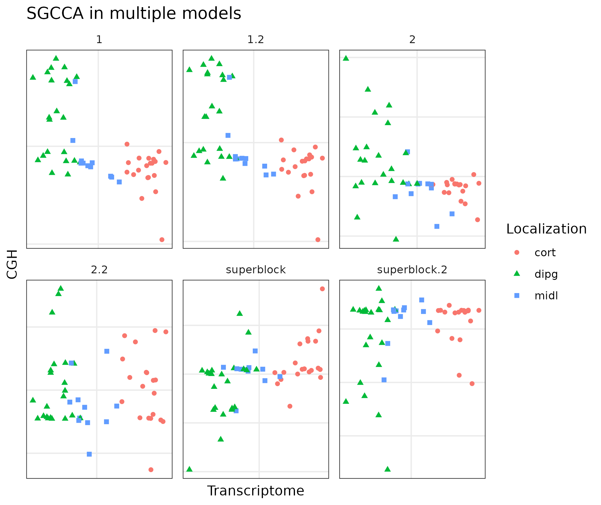
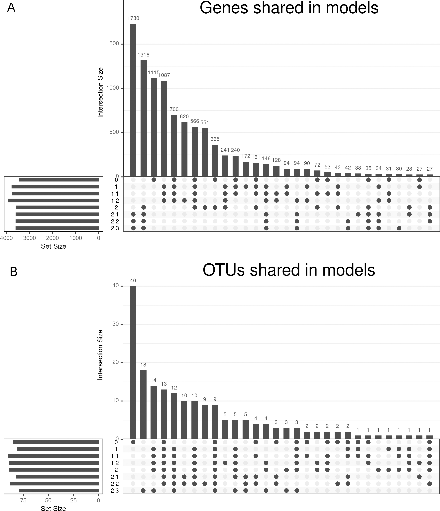
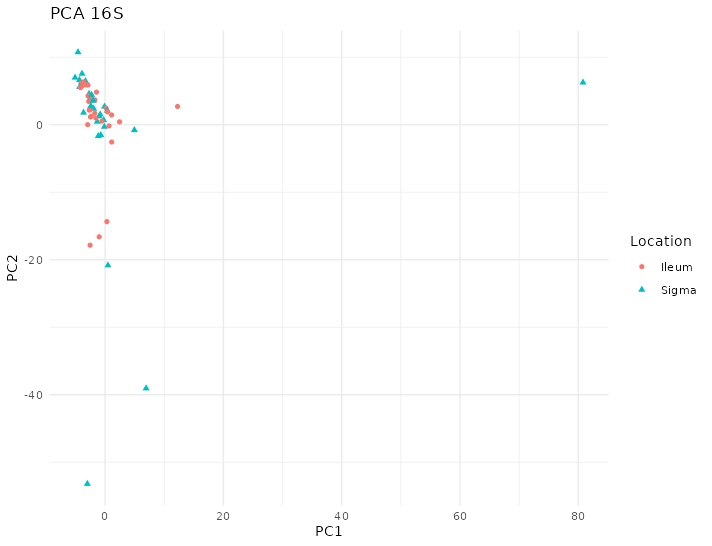
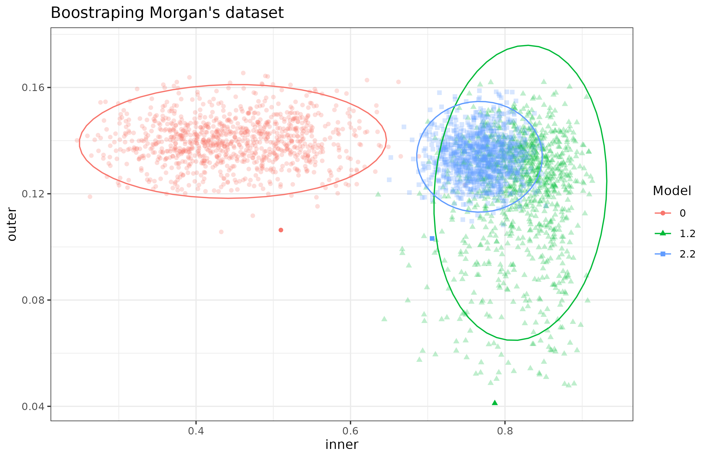

# Results

## Packages/methods

### experDesign

`experDesign` package built in R was released for the first time on CRAN on 2020-09-08 after nearly a year after the initial release made on [github](https://github.com/llrs/experDesign).
After peer review it was published on a journal on 2021-11 [@revillasancho2021].

The package uses functional programming to create and modify objects and the features used.
The package bases its performance on the large body of work made by the R core team.
It adds the information to the introduced `data.frame` or returns an vector with the appropriate information.

`experDesign` functions are divided into several categories:

-   Helper functions to aid on deciding how many batches are or how many samples per batch.
    There are some also that report how good a given distribution of the samples felt for a given dataset.

-   Functions generating indexes.

-   Functions distributing the samples on indexes

```{r experdesign-flowchart, fig.scap="experDesign functions and workflow", fig.cap="`experDesign` functions and workflow. Workflow for users of the package showing which functions can be used depending on the experiment design they have."}
include_graphics("images/experDesign-flowchart.png")
```

Regarding time related variables `experDesign` will use them as factors, while issuing a warning to the user.

Since its development it has been used on a couple of RNA sequencing experiments that required a batch design, one of organoids bulk RNAseq (data not related to this thesis) and another one of biopsies bulk RNAseq from the \acr{BARCELONA} cohort (See appendix section \@ref(barcelona)).
It was also used to check if there is any observable batch effect on the datasets analyzed.

On the designed datasets `experDesign` avoided batch effects from the sequencing process.
However, on the organoids dataset, a change on the matrigel used to produce them introduced a batch effect that made it impossible to compare samples before and after that change (there were not any shared sample before and after the change of matrigel). 
On the \acr{BARCELONA} cohort there were other problems described on the appendices (section \@ref(barcelona)).

```{r experDesign, include=FALSE, eval=FALSE}
library("dlstats")
library("dplyr")
cran_stats("experDesign") %>% 
  group_by(month = format(end, "%Y/%m")) %>% 
  summarise(d = sum(downloads)) %>% 
  ungroup() %>% 
  pull(d) %>% 
  median()
```

Since its release on CRAN it has had a median of \~400 downloads each month from RStudio repository mirror, showing the interest the community have on solutions like this.

\FloatBarrier

### BaseSet

`BaseSet` package, built in R, was released for the first time on CRAN on 2020-11-11, nearly two years after the initial work started on [github](https://github.com/llrs/BaseSet "Repository").

The package uses both functional programming and object oriented program to create and modify the TidySet S4 object defined[^results-1].
Mixing it with S3 generic functions it provides a powerful interface compatible with the tidyverse principles, a [group of packages](https://www.tidyverse.org/) following the same design.
The package provides a new class to handle fuzzy sets and the associate information.

[^results-1]: S4 is one of the object programming paradigms on R.
    For a more complete overview and differences see Advanced R, freely available online: https://adv-r.hadley.nz/oo.html [@wickham2019].

`BaseSet` methods are divided into several categories:

-   [General functions](https://docs.ropensci.org/BaseSet/reference/index.html#general) to create sets of the TidySet class or convert from it to a list or about the package.

-   [Set operations](https://docs.ropensci.org/BaseSet/reference/index.html#set-operations) like adjacency cartesian product, cardinality, complement, incidence, independence, intersection, union, subtract, power set or size.

-   [Functions to work with TidySets](https://docs.ropensci.org/BaseSet/reference/index.html#set-operations) to add relationships, sets, elements or some complimentary data about them.
    Remove the same or simply move around data or calculate the number of elements, relations and sets.

-   [Functions to read](https://docs.ropensci.org/BaseSet/reference/index.html#reading-files) files from formats where sets are usually stored in the bioinformatician field: GAF, GMT and OBO formats.

-   Last, some [utility functions](https://docs.ropensci.org/BaseSet/reference/index.html#utiles) to use set name conventions and other auxiliary functions.

The package had a long development process with initial iterations based on GSEABase package which was later abandoned ([GSEAdv](https://github.com/llrs/GSEAdv)) to also include some uncertainty on the relationship of a gene with a given gene set.

The package formed part of an exploration of the Bioconductor community (project to develop, support, and disseminate free open source software that facilitates rigorous and reproducible analysis of data from current and emerging biological assay) for more modern and faster handling of sets than [GSEABase](https://bioconductor.org/packages/GSEABase).
There were three different packages created as part of this process, `BaseSet`, `BiocSet` released [on Bioconductor](https://bioconductor.org/packages/BiocSet/) and `unisets`, available [on github](https://github.com/kevinrue/unisets).
The three different approaches were presented at a birds of feather on BioC2019, the annual conference of Bioconductor on 2019.

The package passed the review on the rOpenSci organization ([See review](https://github.com/ropensci/software-review/issues/359 "Review on Github")) and is now part of the packages hosted there too.

```{r BaseSet, include=FALSE, eval = FALSE}
library("dlstats")
library("dplyr")
cran_stats("BaseSet") %>%  
  group_by(month = format(end, "%Y/%m")) %>% 
  summarise(d = sum(downloads)) %>% 
  ungroup() %>% 
  pull(d) %>% 
  median()
```

Since its release on CRAN it has had a median close to \~400 downloads each month from RStudio package manager.

\FloatBarrier

### inteRmodel

The package was build once the method used to find accurate models of the relationships of the data available of a dataset using RGCCA was established.
Using the package [on github](https://github.com/llrs/intermodel "inteRmodel") simplifies the process and makes easier to redo the model optimization used on this thesis.

The package has functions that can be grouped in three categories:

-   Look for models and evaluate them:
    To search for a model given some conditions, such as that all the blocks are connected, and check the models via bootstrapping or leave one out procedures.

-   Reporting: To make better reports by improving handling of names or simplifying the objects or how to calculate scores.

-   Building: To easier build correct models on \acr{RGCCA}, simplifying the process to create a symmetric matrix.

Currently it is only [available on github](https:intermodel.llrs.dev), so the number of downloads and usage is unknown but since its release a user has contacted to keep it up to date with development versions of RGCCA.
Currently, it is compatible with the next release of [`RGCCA` being prepared](https://github.com/rgcca-factory/RGCCA/tree/CRAN)[^results-2].

[^results-2]: We also contributed with some comments and feedback to the package to make it easier to read the source and check the inputs and improve the documentation so that it is coherent with the code and previous results of the functions.

The functions `analyze` helps to analyze code of a single integration, providing the results on a tidy format for further processing.
To create the connections between blocks the function `weight_design` is available.
It creates all the possible matrices given a number of blocks and a number of weights.
Optionally it can create just a subset of those based on a numeric vector.
However, it does not provide a way to have the design named.\
If the user wants to create their own design matrices, they can use `symm` and modify the design of the model with `subSymm`.
`symm`, takes an initial matrix to pick up the row and column names.
It is recommended that the user checks the design matrix is fully connected, which the package facilitates with the function `correct`.
This is also recommended even if the design matrices are created with `weight_design`.

To search models `search_models` starts with a initial connectivity of the blocks and creates all the combinations of connections given.

For the bootstrap procedure there is the function `boot_index` to create the bootstrapped index of samples to be used by `boot_index_sgcca`. 
`boot_index` randomly selects as much samples as specified by the arguments to create as much indices as the required by the second argument.
If the bootstrapped samples used is not important one can use `boot_samples_sgcca`.
If the users want to perform a leave-one-out procedure they can use `looIndex`.

```{r intermodel-workflows, fig.scap="inteRmodel functions and workflow.", fig.cap="`inteRmodel` functions and workflow. Functions provided by the inteRmodel package to help on the process, search and validate models of relationships using RGCCA. Created with BioRender.com"}
include_graphics("images/inteRmodel-workflows.png")
```

For more information, you can access the [manual online](https://llrs.github.io/inteRmodel/) or once it is installed.

The package cannot choose which variables use from the block with information to split into several blocks.
However, it provides the `model_RGCCA` function to make it easy to prepare such variables for RGCCA input.
The inteRmodel procedure will only be useful if the user should decide which variables are independent from others and split them into different blocks.
To asses this the user can use the methods we used, as described on the above section \@ref(variance).
It is important to keep in mind the possible causal relationships on user's data [@greenland2002].

## Analysis

On the following sections the main results of analyzing each dataset are presented.


(ref:poins-col-shape) Each point represents a sample (colored and shaped by location).


(ref:poins-col-disease) Each point represents a sample (colored by location and shape by disease).


(ref:points-boot) Each point represents a bootstrapped sample (colored by model used).

### Puget's dataset {#results-puget}

On this dataset the different parameters and capabilities of \acr{RGCCA} were tested.

The three different methods, centroid, factorial or horst were tested and compared.
The main result of this comparison was that the differences of the selection of the variables mattered more than the number of variables selected with each method.
The models were tested with different weights on all three schemes: horst, centroid and factorial.
The horst and the centroid scheme were similar while the factorial resulted in the most different \acr{AVE} values (see [S1 Data](https://journals.plos.org/plosone/article?id=10.1371/journal.pone.0246367#pone.0246367.s001) of [@revilla2021]).
The centroid scheme was selected because it takes into account all the relationship regardless of the sign of the canonical correlation between the blocks.
It is similarity to horst scheme.

The effect of the sparsity value was measured by its effect on the inner \acr{AVE} scores and the combination of the different values for each block as can be seen in figure \@ref(fig:puget-tau2AVE).

```{r puget-tau2AVE, fig.cap="Effect of tau on the inner AVE in the Puget dataset. The suggested tau value is the column between the regular grid, on the ordinate axis the y's tau values and on the abscissa the gene expression (GE) on the left and the comparative genomic hybridization (CGH) on the right. The highest inner AVE is with high tau values for y and middle to upper values for GE and CGH.", fig.scap="Effect of tau on the inner AVE in the Puget dataset."}
knitr::include_graphics("images/pugets_tau_to_AVE.png")
```

The first model of the family of models 1 can be seen in table \@ref(tab:puget-model1). 
The \acr{GE} is related to the metadata available.
Similarly, \acr{CGH} is also related to the location data available. 
All other relationships are not included on the model.


```{r puget-model1}
df <- data.frame(
  stringsAsFactors = FALSE,
  "Model 1" = c("GE", "CGH", "metadata"),
  GE = c(0L, 0L, 1L),
  CGH = c(0L, 0L, 1L),
  metadata = c(1L, 1L, 0L),
  check.names = FALSE
)
k <- kable(df, align = rep("c", ncol(df)), digits = 2,
           caption.short = "Model 1 for the Puget dataset.",
           caption = "Model 1 for Puget dataset. Relationships between the different blocks in the Puget dataset for model 1. 0 indicates no relationship and 1 indicates a strong relationship. The matrix represent relations between the gene expression and CGH with the metadata.")
format_design(k, df)
```


When looking for the model that adjust better following this structure we arrived to model 1.2, described in (Table \@ref(tab:puget-model1-2)). 
In this model the \acr{CGH} relationship with the location variables is much weaker than \acr{GE} with them. 

```{r puget-model1-2}
df <- data.frame(
  stringsAsFactors = FALSE,
  "Model 1.2" = c("GE", "CGH", "metadata"),
  GE = c(0L, 0L, 1L),
  CGH = c(0, 0, 0.1),
  metadata = c(1, 0.1, 0),
  check.names = FALSE
)
k <- kable(df, align =  rep("c", ncol(df)), digits = 2,
           caption.short = "Model 1.2 for the Puget dataset.",
           caption = "Model 1.2 for the Puget dataset. Relationships between the different blocks in the Puget dataset for model 1. 0 indicates no relationship and 1 indicates a strong relationship. CGH has a weaker relationship with the metadata than GE. ")
format_design(k, df)
```


On model 2 we split the metadata variables into invariable variables and those related to the location (Table \@ref(tab:puget-model2)).
We relate the \acr{GE} and \acr{CGH} to these blocks and between them.

```{r puget-model2}
df <- data.frame(
  stringsAsFactors = FALSE,
         'Model 2' = c("GE", "CGH", "Invariable", "Location"),
                GE = c(0L, 1L, 1L, 1L),
               CGH = c(1L, 0L, 1L, 1L),
        Invariable = c(1L, 1L, 0L, 0L),
          Location = c(1L, 1L, 0L, 0L),
  check.names = FALSE
)
k <- kable(df, align =  rep("c", ncol(df)), 
           caption.short = "Model 2 for the Puget dataset.",
           caption = "Model 2 for the Puget dataset. Relationships between the different blocks in the Puget dataset for model 1. 0 indicates no relationship and 1 indicates a strong relationship.")
format_design(k, df)
```

Following this split, the model that has higher inner \acr{AVE} for these blocks is the following (Table \@ref(tab:puget-model2-2)).

```{r puget-model2-2}
df <- data.frame(
  stringsAsFactors = FALSE,
       'Model 2.2' = c("GE", "CGH", "Invariable", "Location"),
                GE = c("0", "1/3", "0", "1"),
               CGH = c("1/3", "0", "1/3", "0"),
        Invariable = c("0", "1/3", "0", "0"),
          Location = c(1L, 0L, 0L, 0L),
  check.names = FALSE
      )
k <- kable(df, align = rep("c", ncol(df)), 
           caption.short = "Model 2.2 the for the Puget dataset.",
           caption = "Model 2.2 for the Puget dataset. Relationships between the different blocks in the Puget dataset for model 1. 0 indicates no relationship and 1 indicates a strong relationship.")
format_design(k, df)
```

If we added a superblock with all the data of the different blocks from model 1 we started with the standard relationship between blocks (Table \@ref(tab:puget-model-superblock)).

```{r puget-model-superblock}
df <- data.frame(
  stringsAsFactors = FALSE,
  'Model superblock' = c("GE", "CGH", "Superblock", "metadata"),
                GE = c(0L, 0L, 1L, 0L),
               CGH = c(0L, 0L, 1L, 0L),
        Superblock = c(1L, 1L, 0L, 1L),
      metadata = c(0L, 0L, 1L, 0L),
  check.names = FALSE
      )
k <- kable(df, align =  rep("c", ncol(df)),
           caption.short = "Model with superblock for the Puget dataset.",
           caption = "Model with superblock for the Puget dataset. Relationships between the different blocks in the Puget dataset for model superblock. 0 indicates no relationship and 1 indicates a strong relationship. The superblock is related to all other blocks but they are only related to the superblock.")
format_design(k, df)
```

But when the best model with the superblock that had highest inner \acr{AVE} is quite different (Table \@ref(tab:puget-model-superblock-2)).
It does not have a relationship between the superblock and the \acr{GE} and the metadata is related to \acr{GE} and \acr{CGH} too. 


```{r puget-model-superblock-2}
df <- data.frame(
  stringsAsFactors = FALSE,
  'Model superblock.2' = c("GE", "CGH", "Superblock", "metadata"),
                GE = c("1", "1/3", "0", "1"),
               CGH = c("1/3", "0", "1", "0"),
        Superblock = c(0L, 1L, 0L, 1L),
      metadata = c(1L, 0L, 0L, 0L),
  check.names = FALSE
      )
k <- kable(df, align = rep("c", ncol(df)), 
           caption.short = "Model with superblock.2 for the Puget dataset.",
           caption = "Model with superblock.2 for the Puget dataset. Relationships between the different blocks in the Puget dataset for model superblock.2. 0 indicates no relationship and 1 indicates a strong relationship. In this optimized design the GE and the metadata is related to GE and CGH too. The relationship between GE and CGH is weaker than other relations.")
format_design(k, df)
```

Exploratory analysis with the superblock model was done.
The first two components of the superblock did not help to explain the biology or classify the tumors (See figure \@ref(fig:puget-superblock)).

```{r puget-superblock, fig.scap="Superblock components of the Puget dataset.", fig.cap="Superblock components of the Puget dataset. First components of the model superblock.2 which has all the data of the samples on the Puget's dataset. Samples colored and shaped acording to the localization of the tumor. There is a mix of samples of all locations and then some far from it."}
knitr::include_graphics("images/pugets_superblock.png")
```


The same data was used to look for a good model from the data itself including a model with a superblock but looking at the first component of the \acr{CGH} and transcriptome block.
This allowed to visually inspect if each model's components helped to classify the samples (Figure \@ref(fig:puget-models)).

```{r puget-models, fig.scap="Different RGCCA models in the Puget dataset.", fig.cap="Different RGCCA models in the Puget dataset. The different models with the same data showing the sample position on the first components of the CGH  and the transcriptome (or GE) block. Model 1 and 1.2 with transcriptomics, CGH data and all the data about the samples together. Model 2 and 2.2 with transcriptomics, CGH data and all the data about the samples on different blocks. Model superblock and superblock.2 have all the data from different blokcs and one block with all the data. All of them separate the samples according according to the transcriptome component by the localization of the tumors."}

```


The first components of the \acr{CGH} and the transcriptomics blocks of the superblock.2 model show better classification than that of the superblock.
However, the other models show a better classification of the samples with much simpler models.

<!--# Slightly modified from the article!! -->

To find these models the three blocks with the best tau and the centroid scheme were analyzed by changing the weights between 0 and 1 by 0.1 intervals.
According to the inner \acr{AVE}, the best model was the one in which the weights (1) between the host transcriptome and location, (2) the host transcriptome and the \acr{CGH}, and (3) the \acr{CGH} block were linked to variables related to the location with weights of 1, 0.1 and 0.1, respectively.

When we added a superblock to the data, there was a slight increase of 0.01 on the inner \acr{AVE} of the model (See Table \@ref(tab:puget-models-ave)).
The model with the superblock that explained most of the variance was that in which the weights of the interaction within (1) the host transcriptome, (2) between the superblock and the \acr{CGH}, (3) between the host transcriptome and the localization, and (4) between acr{CGH} and the host transcriptome were 1, 1, 1 and 1/3, respectively (See table \@ref(tab:puget-model-superblock-2)).
To see if the superblock could classify the sample by location, we plotted the first two components of the superblock.

We can clearly see that they do not classify the samples according to the location of the tumor, which is known to affect the tumor phenotype [@puget2012].

Adding one block containing the age of the patient and the severity of the tumor to the model, decreased the inner \acr{AVE}.
The best model with these blocks, according to the inner \acr{AVE}, was that in which the interactions (1) within the host transcriptome, (2) between the host transcriptome and the localization, (3) between the host transcriptome and(4) the \acr{CGH} and between the \acr{CGH} and the other variables were 1, 1, 1/3 and 1/3, respectively.
The first components of each model can be seen in the figure:

We can observe on the figure \@ref(fig:puget-models), the strong dependency between gene expression and location since the first model while the weaker relationship with the \acr{CGH} assay [@puget2012].
On the other hand, the major difference is the dispersion on the \acr{CGH} component on each model.

We explored the effect of the superblock and weights on different models to the inner \acr{AVE}.
There are significant differences between having the superblock and not having it.
There is also some significant increase of the inner \acr{AVE} when adding a superblock.

```{r puget-weights, fig.scap="Effects of superblock and weights on the inner AVE on Puget's dataset.", fig.cap="Effects of superblock and weights on the inner AVE on Puget's dataset. Designs with the superblock showed higher inner AVE scores than without it. Interaction yes/no indicates RNA and RNA interaction. Higher inner AVE values are associated with relationships within the GE (p-values shown on top of the violin plots)."}
knitr::include_graphics("images/pugets-weights.png")
```


The different models resulted on the following \acr{AVE} values as reported in table  \@ref(tab:puget-models-ave).

```{r puget-models-ave}
df <- data.frame(
  stringsAsFactors = FALSE,
             Model = c("1", "1.2", "2", "2.2", "superblock", "superblock.2"),
         "inner AVE" = c(0.6333592,0.851236,0.2791546,
                       0.6902329,0.7055847,0.8047477),
         "outer AVE" = c(0.06920968,0.06923187,
                       0.07386952,0.06927069,0.07345775,0.06958205),
  check.names = FALSE
)
k <- kable(df, align = rep("c", ncol(df)), 
           caption.short = "AVE values of RGCCA models in the Puget dataset.", 
           caption = "AVE values of RGCCA models in the Puget dataset. Values for both inner and outer AVE of the first canonical component of models 1, 1.2, 2 2.2 and superblock and superblock.2 are shown. The model with the highest inner AVE is the model 1.2 and  superblock.2 of those with superblock.")
format_design(k, df)
```

The model 1.2, is the one with the highest inner AVE, followed by model superblock.2.
All of them classify the samples according to the type of tumor by the first component of the transcriptome. 

\FloatBarrier

### HSCT dataset {#results-hsct}

The \acr{PERMANOVA} analysis was performed on this dataset to estimate which were the variables that are more relevant.
From the many variables the location, sex, patient id and others were found to be related to the variability of the microbiome or the transcriptome on this dataset.

<!--# From gourmiting 2 2018-03-13 -->

With the \acr{PERMANOVA} analysis we found that more of the 50% of the variance of normalized RNAseq data and microbiome data respectively is explained by the variables of location, disease, sex, and the interaction between disease and sex.
On the transcriptome the most important factor is location which is more than 15% of the variance, while on the microbiome data the most important factor is the patient id followed by location of the sample.

<!-- # Data on TRIM/intestinal_16S_RNAseq_metadb/models.RData and on TRIM/intestinal_16S_RNAseq_metadb/variance.R-->

```{r hsct-permanova-RNAseq}
df <- data.frame(Factor = c("Location", "IBD", "Sex", "IBD:Sex", "Location:IBD", "Location:Sex", "Location:IBD:Sex", "Residuals"),
                 R = c(0.18057, 0.03120, 0.01306, 0.01279, 0.02427, 0.00816, 0.00486, 0.72508),
                 "p-value" = c(.0002, .0002, .0012, 0.11798, 0.11458, 0.03519, 0.52190, NA),
                 check.names = FALSE)
k <- kable(df, align = rep("c", ncol(df)), 
           caption.short = "PERMANOVA analysis of the transcriptome in the HSCT dataset.",
      caption = "PERMANOVA analysis of the transcriptome in the HSCT dataset. The variables and their interactions (shown with :) and the $R^2$ values and the associated p-value. The higher the $R^2$ the more variance is explained by that factor. Location and IBD are the biggest variables affecting the transcriptome, but overall they explain a small part of all the variability.")
format_design(k, df)
```

```{r hsct-permanova-microbiome}
df <- data.frame(Factor = c("Location", "IBD", "Sex", "IBD:Sex", "Location:IBD", "Location:Sex", "Location:IBD:Sex", "Residuals"),
                 R = c(0.06061, 0.04967, 0.01712, 0.01091, 0.02089, 0.01139, 0.00289, 0.82652),
                 "p-value" = c(.0002000, .0002000, .0003999, 0.6604679, 0.8476305, 0.00759185, 0.9994001, NA),
                 check.names = FALSE)
k <- kable(df, align = rep("c", ncol(df)), 
           caption.short = "PERMANOVA analysis of the microbiome in the HSCT dataset.",
      caption = "PERMANOVA analysis of the microbiome in the HSCT dataset. The variables and their interactions (shown with :) and the $R^2$ values and the associated p-value. The higher the $R^2$ the more variance is explained by that factor. Location and IBD are the biggest variables affecting the microbiome, but overall they explain a small part of all the variability (smaller than with the gene expression).")
format_design(k, df)
```

Both tables (\@ref(tab:hsct-permanova-RNAseq) \|ref(tab:hsct-permanova-microbiome)) show that location and IBD is a variable that affects the \acr{GE} and microbiome, but there are some interactions that explain similar percentage of variance.
<!--# global test from the comments on TRIM/intestinal_16S_RNAseq_metadb/variance.R -->

With globaltest the results were similar: sex, \acr{IBD}, location, age and time since diagnosis were able to explain the simple endoscopic score for Crohn's disease (p-value $5.7 \cdot 10^{-21}$ ).
The resulting p-value was well below the 0,05 threshold defined for RNAseq data on the models including the segment of the sample, sex and treatment.

On the microbiome data the results were similar but the p-value was considerably higher but still below the threshold.

```{r hsct-diversity, fig.scap="Microbiome diversity in the HSCT dataset.", fig.cap="Microbiome diversity in the HSCT dataset. On the upper section the Shannon effective and on the lower row the Simpson effective diversity splitted by colon and ileum and controls and CD. There is high diversity between the samples on the same condition."}
knitr::include_graphics("images/hsct-ASV-diversity.png")
```


Diversity indices of the samples were explored and compared for several subsets.
Splitting by location of the sample and disease provided the highest differences and the diversity index along time did not change much.

The \acr{PCA} didn't show any pattern on the microbiome according to the location, as can be seen in the first dimensions of the \acr{PCA} in figure \@ref(fig:hsct-pca-16s).

```{r hsct-pca-16s, fig.scap="PCA of 16S data from the HSCT dataset.", fig.cap = "PCA of the 16S data from the HSCT dataset. There are no clear patterns according to the location. (ref:poins-col-shape)"}

```

The \acr{PCA} on the transcriptome shows a clear pattern splitting by location of the sample on the first dimension (see figure \@ref(fig:hsct-pca-RNAseq)).

```{r hsct-pca-RNAseq, fig.scap="PCA of RNAseq data from the HSCT dataset.", fig.cap = "PCA of the RNAseq data from the HSCT dataset. The samples separate according to the location. (ref:poins-col-shape)"}

```

Weighted gene co-expression network analysis did not provide relevant links between bacteria and transcriptome as it failed to find an acceptable scale free degree.
As can be seen in the figure \@ref(fig:hsct-wgcna-power), the scale free topology does not reach the recommended threshold of 0.9 and the mean connectivity is also very low even for the first power.

```{r hsct-wgcna-power, fig.scap="Power evaluation of WGCNA in the HSCT dataset.", fig.cap="Power evaluation of WGCNA in the HSCT dataset. On the ordinate the power on the abscissa on the left the scale free topology model fit; on the right the mean connectivity. There is a low fit even on large power and the mean connectivity is below 100 from the very first value."}
include_graphics("images/hsct-wgcna-power.png")
```

STATegRa was used between stool \acr{16S} data and intestinal \acr{16S} data under the assumption that there is a shared common factor without influence of other categorical variables.
However, it did not find a good agreement between these two data sources and \acr{16S} data source was not longer used on the analysis.
In addition, the model is fixed, so it did not allow to find new or other relationships that are not one to one.

With \acr{RGCCA} we could select different models and use all the data available without much assumptions.
The models with the highest inner \acr{AVE} of the family 1 and the family 2 models were similar to those on the Häsler dataset.

```{r hsct-models, fig.scap="Models in the HSCT dataset.", fig.cap="Models in the HSCT dataset. On the abscissa the transcriptome, on the ordinate the Microbiome. Each square represents a different model of the HSCT dataset. On panel A colored by disease status, on panel B colored by sample location. Model 0 has only transcriptome and microbiome data, models 1 to 1.2 with data about the samples and models 2.1 to 2.3 with data about the samples split in 3 blocks."}
include_graphics("images/hsct-models.png")
```


The weights of these models can be observed here in table \@ref(tab:hsct-model0).

```{r hsct-model0}
df <- data.frame(
  stringsAsFactors = FALSE,
           "Model 0" = c("Transcriptome", "Microbiome"),
     Transcriptome = c(0L, 1L),
        Microbiome = c(1L, 0L),
  check.names = FALSE
)
k <- kable(df, align = rep("c", ncol(df)), 
           caption.short = "Model 0 of the HSCT dataset.",
      caption = "Relationships between the different blocks in the HSCT dataset for model 0. 0 indicates no relationship and 1 indicates a strong relationship.")
format_design(k, df)
```

If we include the information about the samples all together in a block called metadata we can start from this model in table \@ref(tab:hsct-model1-1).

```{r hsct-model1-1}
df <- data.frame(
  stringsAsFactors = FALSE,
         "Model 1.1" = c("Transcriptome", "Microbiome", "metadata"),
     Transcriptome = c(0L, 0L, 1L),
        Microbiome = c(0L, 0L, 1L),
          metadata = c(1L, 1L, 0L),
  check.names = FALSE
)
k <- kable(df, align = rep("c", ncol(df)), 
           caption.short = "Model 1.1 the of HSCT dataset.",
           caption = "elationships between the different blocks in the HSCT dataset for model 1.1. 0 indicates no relationship and 1 indicates a strong relationship.")
format_design(k, df)
```

When looking for the model that adjust better following this blocks we arrived to model 1.2 thanks to `inteRmodel`, described in table \@ref(tab:hsct-model1-2).

```{r hsct-model1-2}
df <- data.frame(
  stringsAsFactors = FALSE,
  "Model 1.2" = c("Transcriptome", "Microbiome", "metadata"),
  Transcriptome = c(0L, 0L, 1L),
  Microbiome = c(0, 0, 0.1),
  metadata = c(1, 0.1, 0),
  check.names = FALSE
)
k <- kable(df, align = rep("c", ncol(df)), 
           caption.short = "Model 1.2 of the HSCT dataset.", 
           caption = "Relationships between the different blocks in the HSCT dataset for model 1.2. 0 indicates no relationship and 1 indicates a strong relationship.")
format_design(k, df)
```

On model two we split the invariable variables from those related to the location:

```{r hsct-model2}
df <- data.frame(
  stringsAsFactors = FALSE,
  "Model 2" = c("Transcriptome", "Microbiome","Demographic","Location", "Time"),
  Transcriptome = c(0L, 1L, 1L, 1L, 0L),
  Microbiome = c(1L, 0L, 1L, 1L, 0L),
  Demographic = c(1L, 1L, 0L, 0L, 1L),
  Location = c(1L, 1L, 0L, 0L, 0L),
  Time = c(0L, 0L, 1L, 0L, 0L),
  check.names = FALSE)
k <- kable(df, align = rep("c", ncol(df)),
           caption.short = "Model 2 of the HSCT dataset.",
           caption = "Relationships between the different blocks in the HSCT dataset for model 2. 0 indicates no relationship and 1 indicates a strong relationship.")
format_design(k, df)
```

Following this split, we used `inteRmodel` (See section above \@ref(intermodel)) to find the model that has higher inner \acr{AVE} for these blocks is the one in table \@ref(tab:hsct-model2-2).

```{r hsct-model2-2}
df <- data.frame(
  stringsAsFactors = FALSE,
               "Model 2.2" = c("Transcriptome",
                             "Microbiome","Demographic","Location","Time"),
     Transcriptome = c(0L, 0L, 0L, 1L, 0L),
        Microbiome = c(0, 0, 0.2, 0.1, 0),
       Demographic = c(0, 0.2, 0, 0, 0.6),
          Location = c(1, 0.1, 0, 0, 0),
              Time = c(0, 0, 0.6, 0, 0),
  check.names = FALSE)
k <- kable(df, align = rep("c", ncol(df)),
           caption.short = "Model 2.2 of the HSCT dataset.", 
           caption = "Relationships between the different blocks in the HSCT dataset for model 2.2. 0 indicates no relationship and 1 indicates a strong relationship.")
format_design(k, df)
```

We also tested specifically a model from the family 2.3, which can be seen in table \@ref(tab:hsct-model2-3).

```{r hsct-model2-3}
df <- data.frame(
  stringsAsFactors = FALSE,
               "Model 2.3" = c("Transcriptome",
                             "Microbiome","Demographic","Location","Time"),
     Transcriptome = c(0, 0.1, 0, 1, 0),
        Microbiome = c(0.1, 0, 0.1, 0.1, 0),
       Demographic = c(0, 0.1, 0, 0, 1),
          Location = c(1, 0.1, 0, 0, 0),
              Time = c(0L, 0L, 1L, 0L, 0L),
  check.names = FALSE
      )
k <- kable(df, align = rep("c", ncol(df)), 
           caption.short = "Model 2.3 of the HSCT dataset.", 
           caption = "Relationships between the different blocks in the HSCT dataset for model 2.3. 0 indicates no relationship and 1 indicates a strong relationship.")
format_design(k, df)
```

The best model of the family 2 confirmed a relationship between the host transcriptome and the location-related variables, while the microbiome was associated with the demographic and location-related variables (see figure \@ref(fig:hsct-models) and [S2](https://journals.plos.org/plosone/article?id=10.1371/journal.pone.0246367#pone.0246367.s002) data of [@revilla2021]).
Overall, we see that the relationships in the model affected the distribution of samples on the components of both the host transcriptome and the microbiome.


```{r hsct-models-ave}
df <- data.frame(
       Model = c(0, 1, 1.1, 1.2, 2, 2.1, 2.2, 2.3),
         "inner AVE" = c(0.3999234,0.623019,0.5678189,
                       0.7043881,0.2517363,0.6940253,0.818764,0.7761846),
         "outer AVE" = c(0.10016886,0.08423331,
                       0.08487135,0.07757663,0.09820497,0.09402657,0.09416275,
                       0.09439379),
       check.names = FALSE
      )
k <- kable(df, align = rep("c", ncol(df)),
      caption.short = "The models in the HSCT dataset and their AVE values.",
      caption = "The models in the HSCT and their AVE values. For each model the inner AVE and the outer AVE is presented.")
format_design(k, df)
```

The different models selected different variables, some of which are shared between models.
The most similar models are those that have split the metadata into 3 blocks, followed by those that have the metadata in a single block.

In order to analyze the accuracy of the models, one thousand bootstraps were used to integrate the data from the \acr{HSCT} \acr{CD} dataset.
Each bootstrap had its own dispersion on the variables according to the samples selected, the distribution of the bootstraps used are represented here:

```{r hsct-bootstrap-quality, fig.scap="Characteristics of the samples from the HSCT bootstraped samples.", fig.cap="Characteristics of the samples from the HSCT bootstraped samples. Dispersion of the bootstraped samples on age and percentage of colon and controls samples. The bootstraps represent a wide range of different composition."}
include_graphics("images/hsct-bootstrap-characteristics.png")
```


Evaluating the same model on each bootstrap lead to a dispersion on the inner \acr{AVE} of the model.
The lower the dispersion, the more robust the model was to different conditions than in the initial testing.

```{r hsct-bootstrap, fig.scap="Bootstrap results from the HSCT dataset.", fig.cap="Bootstrap results from the HSCT dataset. Bootstrap of the models 0, 1.2 and 2.2 in the HSCT dataset. Model 0 and 1.2 have lower inner and outer AVE score, model 2.2 has lower outer score but higher inner value than the bootstrapped. (ref:points-boot) The dispersion is shown by the ellipses. The point with the black circle is the AVE of the original data."}

```

With the bootstrapped models we used `BaseSet` to estimate the probability that each variable to be relevant for the association with a disease.
However, due to big amount of small probabilities when using the `BaseSet` package to calculate which variables are more relevant it could not provide a good estimation on time.

\acr{MCIA} was applied as a baseline of the integration, the first two components were represented similarly to those of the blocks when using \acr{RGCCA}, see figure \@ref(fig:hsct-mcia) of its outcome.

```{r hsct-mcia, fig.scap="MCIA dimensions in the HSCT dataset.", fig.cap="MCIA dimensions in the HSCT dataset. MCIA first two synthetic variables. The first variable separates the samples in colon and ileum. (ref:poins-col-disease)"}
include_graphics("images/hsct-mcia.png")
```

The \acr{AUC} of classifying the transcriptome in colon or ileum segments was compared between the models (see figure \@ref(fig:hsct-auc-plot) and with \acr{MCIA}).

```{r hsct-auc-plot, fig.scap="AUC of the RGCCA models in the HSCT dataset.", fig.cap="AUC of the RGCCA models in the HSCT dataset. The classification of the localization of the sample according to the first component of the gene expression of the models generated with RGCCA on the HSCT dataset. Models of family 2 classify much better the samples than models of family 1 or model 0."}
include_graphics("images/hsct-auc-models.png")
```

These models have the following \acr{AUC} to classify the location of the sample according to the first component of the transcriptome block.

```{r hsct-auc}
df <- data.frame(Model = c("0", "1", "1.1", "1.2", "2", "2.1", "2.2", "2.3"),
           AUC = c(0.453703703703704, 0.430941358024691, 0.463927469135802, 0.595871913580247, 
0.945023148148148, 0.998842592592593, 0.998070987654321, 0.996913580246914
))
k <- kable(df, align = rep("c", ncol(df)),
           caption.short = "AUC values of RGCCA models in the HSCT dataset.",
           caption = "AUC values of RGCCA models of the HSCT dataset classyfing the location of the sample according to the first component of the transcriptome block. From model 0 to model 2.3, the best classification is achieved with model 2.1. Note: this is removing two samples for which the location is unkown.")
format_design(k, df)
```


On \acr{MCIA} the \acr{AUC} for the classification of ileum or colon samples is of 0.9851 once those two samples with unknown location are excluded. 
This is on par with the models of family 2 as can be seen in the table \@ref(tab:hsct-auc).

The different models selected different variables as can be seen in figure \@ref(fig:hsct-features).

```{r hsct-features, fig.scap="Upset plot of variables selected from the HSCT dataset.", fig.cap="Upset plot of variables selected in the HSCT dataset. The variables selected on each model from 0 to 2.3 showing the intersection between them regarding genes, panel A, and OTUs, panel B. Genes are common on models of family 2, while OTUs are common on all models."}

```


Differences and similarities between the selected features of each model can be observed in figure \@ref(fig:hsct-features).
Genes are very similar between model 0 to 1.2 and between 2 to 2.3, while \acr{OTUs} are very unique on model 0 and others shared between most models.

\FloatBarrier

### Häsler's dataset {#results-hasler}

If we look at the dataset 16S, the \acr{PCA} does not show a pattern as can be seen in figure \@ref(fig:hasler-pca-16s).

```{r hasler-pca-16s, fig.scap="PCA of 16S of the Häsler dataset.", fig.cap = "PCA of 16S of Häsler dataset. There are some samples that are very different from the others. (ref:poins-col-shape)"}

```

The \acr{PCA} on the transcriptome shows a distinction between colon and ileum according to the first dimension of the \acr{PCA} that can be seen in figure \@ref(fig:hasler-pca-RNAseq).

```{r hasler-pca-RNAseq, fig.scap="PCA of RNAseq of the Häsler dataset.", fig.cap = "PCA of RNAseq of the Häsler dataset. There are two clear groups according to the location on the first component. (ref:poins-col-shape)"}
include_graphics("images/hasler_PCA_RNAseq.png")
```

In this dataset, the parameter tau behaved slightly differently than with the previous dataset but the value from the Schäfer's method for tau was close to the best value.

```{r hasler-tau, fig.scap="Tau effect on the inner AVE in the Häsler dataset.", fig.cap="Tau effect on the inner AVE in the Häsler dataset. Changes on tau on the centroid scheme in the Häsler dataset affect the inner AVE score on the model 1. The panel A shows on the ordinate the RNAseq tau value, the panel B on the right, shows the tau of the microorganism; both of them show the y's tau on the abscissa."}

```

Models for Häsler dataset are the following:

```{r hasler-model-0}
m0 <- data.frame("Model 0" = c("RNAseq", "micro"),
                 RNAseq = c(0, 1),
                 micro = c(1, 0),
                 check.names = FALSE)
k <- kable(m0, align = rep("c", ncol(m0)),
           caption.short = "Model 0 of the H\u00E4sler dataset.", 
           caption = "Model 0 of the H\u00E4sler dataset. 0 indicates no relationship and 1 indicates a strong relationship.")
format_design(k, m0)
```

The first model for family 1 is in table \@ref(tab:hasler-model-1-1).

```{r hasler-model-1-1}
df <- data.frame(
  "Model 1.1" = c("RNAseq", "micro", "meta"),
  RNAseq = c(0, 0, 1), 
  micro = c(0, 0, 1), 
  meta = c(1, 1, 0),
  check.names = FALSE
)
k <- kable(df, align = rep("c", ncol(df)),
           caption.short = "Model 1.1 of the H\u00E4sler dataset.", 
           caption = "Model 1.1 of the H\u00E4sler dataset. 0 indicates no relationship and 1 indicates a strong relationship. RNASeq and microbiota (micro) are related to the metavariables (meta).")
format_design(k, df)
```

The after optimization of the model of family 1, the best one is in table \@ref(tab:hasler-model-1-2).

```{r hasler-model-1-2}
df <- data.frame("Model 1.2" = c("RNAseq", "micro", "meta"),
                 RNAseq = c(0, 0, 1), 
                 micro = c(0, 0, 0.1), 
                 meta = c(1, 0.1, 0),
                 check.names = FALSE)
k <- kable(df, 
           align = rep("c", ncol(df)),
           caption.short = "Model 1.2 of the H\u00E4sler dataset.", 
           caption = "Model 1.2 of the H\u00E4sler dataset. 0 indicates no relationship and 1 indicates a strong relationship. RNASeq and microbiota (micro) are related to the metavariables (meta), the former much more than the microbiota.")
format_design(k, df)
```

The first model for family 2 is in table \@ref(tab:hasler-model-2-1).

```{r hasler-model-2-1}
df <- data.frame(list(
                        "Model 2.1" = c("RNAseq", "micro", "Location", "Demographic", "Time")),
                   RNAseq = c(0, 0, 1, 0, 0), 
                   micro = c(0, 0, 0.5, 1, 0), 
                   Location = c(1, 0.5, 0, 0, 0), 
                   Demographic = c(0, 1, 0, 0, 1), 
                   Time = c(0, 0, 0, 1, 0), 
                   check.names = FALSE)
k <- kable(df, align = rep("c", ncol(df)),
           caption.short = "Model 2.1 of the H\u00E4sler dataset.", 
           caption = "Model 2.1 of the H\u00E4sler dataset. 0 indicates no relationship and 1 indicates a strong relationship. RNAseq is related to the location, microbiota to location and demographic variables and demographic variables are also related to time.")
format_design(k, df)
```

After optimization of models of family 1 the best model according to the inner \acr{AVE} score is in table \@ref(tab:hasler-model-2-2).

```{r hasler-model-2-2}
df <- data.frame(list("Model 2.2" = c("RNAseq", "micro", "Location", "Demographic", "Time"), 
                        RNAseq = c(0, 0.1, 1, 0, 0),
                        micro = c(0.1, 0, 0, 0.1, 1), 
                        Location = c(1, 0, 0, 0, 0), 
                        Demographic = c(0, 0.1, 0, 0, 0.1), 
                        Time = c(0, 1, 0, 0.1, 0)), check.names = FALSE)
k <- kable(df, align = rep("c", ncol(df)),
           caption.short = "Model 2.2 of the H\u00E4sler dataset.", 
           caption = "Model 2.2 of the H\u00E4sler dataset. 0 indicates no relationship and 1 indicates a strong relationship. RNAseq is related to the microbiota and location (much stronger), the microbiota to the demographic and time (stronger) and demographic and time are linked too.")
format_design(k, df)
```

In table \@ref(tab:hasler-aves), we can see here the AVE scores of each of the previous models.

```{r hasler-aves}
df <- data.frame(Model = c("0", "1.1", "1.2", "2.1", "2.2"),
           "inner AVE" = c(0.8217371, 0.7461423, 0.8349410, 0.4980681, 0.7513065),
           "outer AVE" = c(0.0961236, 0.1024148, 0.1025486, 0.1008395, 0.1009915),
         check.names = FALSE)
k <- kable(df, align = rep("c", ncol(df)),
           caption.short = "AVE values of RGCCA models in the H\u00E4sler dataset.",
      caption = "AVE values of RGCCA models in the H\u00E4sler dataset. The inner and the outer AVE scores of multiple models tested on the H\u00E4sler dataset are shown. The model with the hightest inner AVE is model 1.2 followed by model 2.2.")
format_design(k, df)
```

In contrast to the \acr{HSCT}'s dataset (table \@ref(tab:hsct-models-ave)), the model with the highest inner \acr{AVE} was model 1.2 but model 2.2 was close to it (see table \@ref(tab:hasler-aves)).
Model 2.2 has a relationship of 0.1 between microbiome and the host transcriptome and of 1 between the location and the host transcriptome.
The microbiome block is also related by a factor of 0.1 with the demographic block and of 1 with the time block.
Lastly, the time and the demographic block are related by a factor of a 0.1.
In either case the family 1 and family 2 models can correctly separate by sample location (colon or ileum) but not by disease type or inflammation status as can be seen in figure \@ref(fig:hasler-models).

```{r hasler-models, fig.scap="Models from inteRmodel in the Häsler's datset.", fig.cap="Models from inteRmodel in the Häsler's dataset. Model 0 with just the transcriptome and microbiome data. Models 1.1 to 1.2 with transcriptome, microbiome and sample data in a single block. Models 2.1 and 2.2 with transcriptome, microbiome and sample data in multiple blocks. On the A panel colored by disease on the B panel colored by location of the sample."}
include_graphics("images/hasler-models.png")
```


There is no observable cluster of \acr{IBD} samples and the other samples, showing that on this dataset the differences of the microbiome between the different type of samples are less stark.
The classification of samples was very accurate in all the models, specially on model 2.2, see figure \@ref(fig:hasler-auc-plot).


```{r hasler-auc-plot, fig.scap="AUC of the RGCCA models in the Häsler dataset", fig.cap="AUC of the RGCCA models in the Häsler dataset. The classification of the localization of the sample according to the first component of the gene expression of the models generated with RGCCA on the Häsler's dataset."}
include_graphics("images/hasler-auc.png")
```

This accuracy resulted on high \acr{AUC} values for all the models, as can be seen in table \@ref(tab:hasler-auc).

(ref:hasler-auc-s) AUC of the RGCCA models in Häsler's dataset.
(ref:hasler-auc) The AUC was calculated with the first dimension of the gene expression block ability to predict location of the sample. Models of family 2 reach 100% classification.

```{r hasler-auc}
df <- data.frame(
  Model = c("0", "1.1", "1.2", "2.1", "2.2"),
  AUC = c(0.801149425287356, 0.97816091954023, 0.997701149425287, 1, 1))
k <- kable(df, align = rep("c", ncol(df)), 
           caption.short = "(ref:hasler-auc-s) ",
      caption = "(ref:hasler-auc-s) (ref:hasler-auc)")
format_design(k, df)
```

\acr{MCIA} was applied as a baseline of the integration and compared to the different models to know which one separates best colon and ileum samples.
The result on the first two dimension is shown in figure \@ref(fig:hasler-mcia).

```{r hasler-mcia, fig.scap="MCIA dimensions in the Häsler dataset.", fig.cap="MCIA dimensions in the Häsler dataset. MCIA first two dimensions of the dataset shows two vertical groups on the first syntethic dimension according to the location of the samples and colored by the state. Each point represents a sample (colored by location and shape by State)."}

```

\acr{MCIA}'s \acr{AUC} results was as high as the model 2.2 to classify samples according to their location.
It was even better to classify the samples according to the type of sample they are: 0.6248 vs 1 the best \acr{AUC} from \acr{RGCCA} that corresponds to model 1.2.

\FloatBarrier

### Morgan's dataset {#results-morgan}

To explore this dataset that is different from the others with \acr{IBD}.

The \acr{PCA} didn't show any pattern on the microbiome according to the location, see figure \@ref(fig:morgan-pca-16s).

```{r morgan-pca-16s, fig.scap="PCA of 16S in the Morgan dataset", fig.cap="PCA of 16S in the Morgan dataset. There seems to be quite a diverse microbiota based on the first dimension. (ref:poins-col-shape)"}

```

The \acr{PCA} on the transcriptome did not show a clear distinction between the \acr{PPI} and the pouch in figure \@ref(fig:morgan-pca-RNAseq) but there is a pattern.

```{r morgan-pca-RNAseq, fig.scap="PCA of RNAseq in the Morgan dataset", fig.cap="PCA of RNAseq in the Morgan dataset. There is no clear separation of the two locations on the first dimensions of the PCA. (ref:poins-col-shape)"}

```

We tested if results of `inteRmodel` were consistent on this dataset with the other datasets. 
The first model we tried is model 0 as in table \@ref(tab:morgan-model0).

```{r morgan-model0}
df <- data.frame(
  stringsAsFactors = FALSE,
           "Model 0" = c("Transcriptome", "Microbiome"),
     Transcriptome = c(0L, 1L),
        Microbiome = c(1L, 0L),
  check.names = FALSE
      )
k <- kable(df, align = rep("c", ncol(df)),
           caption.short = "Model 0 of the Morgan dataset.",
           caption = "Relationships between the different blocks in the Morgan dataset for model 0. 0 indicates no relationship and 1 indicates a strong relationship. Transcriptome and microbiome are linked.")
format_design(k, df)
```

We then added the data about the samples as provided \@ref(methods-morgan), on a simple model as in table \@ref(tab:morgan-model1).

```{r morgan-model1}
df <- data.frame(
  stringsAsFactors = FALSE,
           "Model 1" = c("Transcriptome", "Microbiome", "metadata"),
     Transcriptome = c(0L, 0L, 1L),
        Microbiome = c(0L, 0L, 1L),
          metadata = c(1L, 1L, 0L),
  check.names = FALSE
      )
k <- kable(df, align = rep("c", ncol(df)),
           caption.short = "Model 1 of the Morgan dataset.",
           caption = "Relationships between the different blocks in the Morgan dataset for model 1. 0 indicates no relationship and 1 indicates a strong relationship. Transcriptome and microbiome are related to the metadata.")
format_design(k, df)
```


When looking for the model that adjust better following this structure we arrived to model 1.2, described in table \@ref(tab:morgan-model1-2).

(ref:morgan-model1-2) Model 1.2 of the Morgan dataset.

```{r morgan-model1-2}
df <- data.frame(
  stringsAsFactors = FALSE,
         "Model 1.2" = c("Transcriptome", "Microbiome", "metadata"),
     Transcriptome = c(0, 0.1, 0),
        Microbiome = c(0.1, 0, 1),
          metadata = c(0L, 1L, 0L),
  check.names = FALSE
      )
k <- kable(df, align = rep("c", ncol(df)),
           caption.short = "(ref:morgan-model1-2)",
           caption = "(ref:morgan-model1-2) Relationships between the different blocks in the Morgan dataset for model 1.2. 0 indicates no relationship and 1 indicates a strong relationship.  Transcriptome is related to the microbiome but weakly and the microbiome is also related to the metadata.")
format_design(k, df)
```


On model two we split the invariable variables from those related to the location (see table  \@ref(tab:morgan-model2)).

```{r morgan-model2}
df <- data.frame(
  stringsAsFactors = FALSE,
                 "Model 2" = c("Transcriptome",
                             "Microbiome","Demographic","Location"),
     Transcriptome = c(0L, 1L, 1L, 1L),
        Microbiome = c(1L, 0L, 1L, 1L),
       Demographic = c(1L, 1L, 0L, 0L),
          Location = c(1L, 1L, 0L, 0L),
  check.names = FALSE 
      )
k <- kable(df, align = rep("c", ncol(df)),
           caption.short = "Model 2 of the Morgan dataset.",
           caption = "Relationships between the different blocks in the Morgan dataset for model 2. 0 indicates no relationship and 1 indicates a strong relationship. Transcriptome and the microbiome are linked and related to demographic and location variables.")
format_design(k, df)
```

The model that has higher inner \acr{AVE} for these blocks is the following:

```{r morgan-model2-2}
df <- data.frame(
  stringsAsFactors = FALSE,
               "Model 2.2" = c("Transcriptome",
                             "Microbiome","Demographic","Location"),
     Transcriptome = c(0, 0.1, 1, 0.1),
        Microbiome = c(0.1, 0, 0, 0),
       Demographic = c(1L, 0L, 0L, 0L),
          Location = c(0.1, 0, 0, 0),
  check.names = FALSE
      )
k <- kable(df, align = rep("c", ncol(df)),
           caption.short = "Model 2.2 of the Morgan dataset.",
           caption = "Relationships between the different blocks in the Morgan dataset for model 2.2. 0 indicates no relationship and 1 indicates a strong relationship. The transcriptome is weakly related to the microbiome and location but much stronger related to the demographic variables.")
format_design(k, df)
```

Each model is different from previous models.
After model 2.2 we looked on the model similar to model 2.3 in the \acr{HSCT} dataset showed but it is the same as in model 2.2. 
However, it is kept on the further analysis.

The different models were not able to separate the samples neither by location or sex.

```{r morgan-models, fig.scap="Models from inteRmodel in the Morgan dataset. ", fig.cap="Models from inteRmodel in the Morgan dataset. First component of the transcriptome and microbiome of models on the Morgan dataset. Model 0 without sample data. Model 1 to 1.2 with all the sample data in a single block and models 2.1 to 2.3 with sample data in several blocks. Panel A shows samples colored by sex and panel B by segment of the sample. There is no clear classification neither by location nor sex on any of the models."}

```

Nevertheless, we compared the classification with the \acr{MCIA} algorithm and still resulted that model 2.2 provide a better classification than \acr{MCIA}.

```{r morgan-models-ave}
df <- data.frame(
       Model = c(0, 1, 1.1, 1.2, 2, 2.1, 2.2, 2.3),
         "inner AVE" = c(0.4735601,0.6333592,0.2448234,
                       0.7868443,0.4404123,0.6052598,0.6895661,0.6895661),
         "outer AVE" = c(0.1098639,0.115228,0.1104746,
                       0.042266,0.108873,0.10749,0.1081315,0.1081315),
       check.names = FALSE
      )
k <- kable(df, align = rep("c", ncol(df)),
      caption.short = "AVE values of RGCCA for the Morgan dataset.",
           caption = "AVE values of RGCCA for the Morgan dataset. The inner and the outer AVE scores of multiple models tested on the Morgan dataset are shown. The model with the highest inner AVE is model 1.2 followed by 2.2.")
format_design(k, df)
```

When exploring the bootstraps of the data we found that model 1.2 is highly variable:

```{r morgan-bootstrap, fig.scap="AVE scores of bootstrapped models from Morgan dataset.", fig.cap="AVE scores of bootstrapped models from Morgan dataset. Inner and outer AVE scores of the bootstrapped models 0, 1.2 and 2.2 on the Morgan dataset. Model 0 does not have sample data. Model 1.2 has microbiome, transcriptome and sample data in a single block and model 2.2 has microbiome, transcriptome and the sample data split in several blocks. Model 2.2 shows less variance than all models but lower inner values than model 1.2. (ref:points-boot) The dispersion is shown by the ellipses."}

```

In addition the model 2.2 (table \@ref(tab:morgan-model2-2)) usually has a lower inner \acr{AVE} compared to model 1.2 (table \@ref(tab:morgan-model2)).

```{r morgan-auc-plot, fig.scap="AUC of the RGCCA models in the Morgan dataset", fig.cap="AUC of the RGCCA models in the Morgan dataset. The classification of the localization of the sample according to the first component of the gene expression of the models generated with RGCCA on the Morgan dataset."}
include_graphics("images/morgan-auc.png")
```

The area under the curve for these models is:

```{r morgan-auc}
df <- data.frame(Model = c("0", "1", "1.1", "1.2", "2", "2.1", "2.2", "2.3"),
           AUC = c(0.496973365617433, 0.793497059840886, 0.816153580076098, 0.560619162919405, 
0.85463507436873, 0.847371151850571, 0.835264614320304, 0.835264614320304
))
k <- kable(df, align = rep("c", ncol(df)), 
           caption.short="AUC for the Morgan dataset", 
      caption="AUC for the Morgan dataset classificating the localization of the sample according to the first component of the gene expression of the models generated with RGCCA.")
format_design(k, df)
```

With \acr{MCIA}:

```{r morgan-mcia-plot, fig.scap="MCIA dimensions in the Morgan dataset.", fig.cap="MCIA dimensions in the Morgan dataset. MCIA first two dimensions of the dataset shows some separation between samples by location. (ref:poins-col-shape)"}
include_graphics("images/morgan-mcia.png")
```

If we quantify this separation by the first dimension of \acr{MCIA}, the \acr{AUC} is 0.818, which is slightly worst than the models of family 2.

\FloatBarrier

### Howell's dataset {#results-howell}

The \acr{16S} of this dataset doesn't show any clear pattern regarding the location of the samples according to the firsts dimensions of the \acr{PCA} on figure \@ref(fig:howell-pca-16s).

```{r howell-pca-16s, fig.scap="PCA of 16S data from the Howell dataset", fig.cap = "PCA of 16S data from the Howell dataset. The first component separates the samples by their location. (ref:poins-col-shape)"}
include_graphics("images/howell_PCA_16S.png")
```

The \acr{PCA} on the transcriptome shows a distinction between colon and ileum, see figure \@ref(fig:howell-pca-RNAseq), there are almost two distinct groups according to location.

```{r howell-pca-RNAseq, fig.scap="PCA of RNAseq data from the Howell dataset", fig.cap = "PCA of RNAseq data from the Howell dataset. There are two groups of samples according to their location. (ref:poins-col-shape)"}
include_graphics("images/howell_PCA_RNAseq.png")
```


This dataset was processed to confirm the results on the previous datasets.
As always first we started with model 0, see table \@ref(tab:howell-model0), connecting both the RNAseq and the \acr{16S} blocks.

```{r howell-model0}
df <- data.frame(
  stringsAsFactors = FALSE,
       check.names = FALSE,
           `Model 0` = c("RNAseq", "16S"),
            RNAseq = c(0L, 1L),
             `16S` = c(1L, 0L)
      )
k <- kable(df, align = rep("c", ncol(df)),
           caption.short = "Model 0 of the Howell dataset.",
           caption = "**Relationships between the different blocks in the Howell dataset for model 0**. 0 indicates no relationship and 1 indicates a strong relationship.")
```

Later we look for the best model of family 1 (without looking at any previous model of family 1).
This resulted on the following model in table \@ref(tab:howell-model1-2).

```{r howell-model1-2}
df <- data.frame(
  stringsAsFactors = FALSE,
       check.names = FALSE,
         `Model 1.2` = c("RNAseq", "16S", "metadata"),
            RNAseq = c(0, 0.1, 1),
             `16S` = c(0.1, 0, 0),
          metadata = c(1L, 0L, 0L)
      )
k <- kable(df, align = rep("c", ncol(df)),
           caption.short = "Model 1.2 of the Howell dataset.",
           caption = "Relationships between the different blocks in the Howell dataset for model 1.2. 0 indicates no relationship and 1 indicates a strong relationship.")
format_design(k, df)
```


Model 1.2, in table \@ref(tab:howell-model1-2), was the best according to the \acr{AVE} score but perform worse when attempting to recreate known biological differences via classifying samples as we can see in table \@ref(fig:howell-models).

```{r howell-models, fig.scap="Models from the inteRmodel of the Howell dataset.", fig.cap="Models from the inteRmodel of the Howell dataset. The three main models, model 0, 1.2 and 2.2 on the Howell dataset colored by section colon, ileum and shape according to the disease: square, ulcerative colitis; triangle, normal; circle, Crohn's disease. Model 0 has just trancriptomic and microbiome data, model 1.2 has transcriptomic, microbiome and sample data and model 2.2 has transcriptomic, microbiome and sample data split in different blocks."}
include_graphics("images/howell-models.png")
```

Model 2.2 was selected for further analysis as it describes more accurately the biology of the dataset it.
Model 2.2 can be seen in table \@ref(tab:howell-model2-2).

```{r howell-model2-2}
df <- data.frame(
  stringsAsFactors = FALSE,
       check.names = FALSE,
         `Model 2.2` = c("RNAseq", "16S", "demographics", "location"),
            RNAseq = c(0L, 0L, 0L, 1L),
             `16S` = c(0L, 0L, 1L, 0L),
      demographics = c(0, 1, 0, 0.1),
          location = c(1, 0, 0.1, 0)
      )
k <- kable(df, align = rep("c", ncol(df)),
           caption.short = "Model 2.2 of the Howell dataset.",
           caption = "Relationships between the different blocks in the Howell dataset for model 2.2. 0 indicates no relationship and 1 indicates a strong relationship.")
format_design(k, df)
```

Model 1.2 has a 0.1 relationship between the \acr{ASV} and the transcriptome and 1 between transcriptome and metadata.
While model 2.2 has a relationship of 1 between location and transcriptome and demographics and \acr{ASV} but only of 0.1 between demographics and location.

```{r howell-models-ave}
df <- data.frame(
       Model = c(0, 1.2, 2.2),
   "inner AVE" = c(0.718098, 0.8972258, 0.8433274),
   "outer AVE" = c(0.111239, 0.1660267, 0.1659844),
   check.names = FALSE
      )
k <- kable(df, align = rep("c", ncol(df)),
           caption.short = "AVE values of RGCCA for the Howell dataset.",
           caption = "AVE values of RGCCA for the Howell dataset. The inner and the outer AVE scores of multiple models tested in the Howell dataset are shown. The model with the hightest inner AVE is model 1.2.")
format_design(k, df)
```


```{r howell-bootstrap, fig.scap="Bootstrap of models in the Howell dataset.", fig.cap="Bootstrap of models in the Howell dataset. Bootstrap of the different models on the inner and outer AVE: Model 0 has just trancriptomic and microbiome data, model 1.2 has transcriptomic, microbiome and sample data and model 2.2 has transcriptomic, microbiome and sample data split in different blocks. The bigger points are the models on the original dataset. (ref:points-boot) The dispersion is shown by the ellipses."}
include_graphics("images/howells_models_bootstrap.png")
```


The bootstrapping showed that model 1.2 has indeed higher inner \acr{AVE} values than model 2.2 and is more stable than model 1.2.
While model 0 shows a high variation according to which samples are selected.


```{r howell-mcia, fig.scap="MCIA dimensions in the Howell dataset.", fig.cap="MCIA dimensions in the Howell dataset. The first dimensions separates by location. (ref:poins-col-disease)"}

```

If we look at the classification of the models in figure \@ref(fig:howell-auc-plot), we can see that models 1.2, 2 and 2.2 classify perfectly the samples by the transcriptome into the location of the sample. 

```{r howell-auc-plot, fig.scap="AUC of the RGCCA models in the Howell dataset.", fig.cap="AUC of the RGCCA models in the Howell dataset. The classification of the localization of the sample according to the first component of the gene expression of the models generated with RGCCA on the Howell dataset."}
include_graphics("images/howell-rgcca-auc.png")
```

The \acr{AUC} of each model can be seen in table \@ref(tab:howell-auc).

```{r howell-auc}
df <- data.frame(
  model = c("0", "1", "1.2", "2", "2.2"),
  AUC = c(0.625525946704067, 0.597475455820477, 1, 1, 1)
)
k <- kable(df, align = rep("c", ncol(df)), 
           caption.short = "AUC of the RGCCA models in the Howell dataset",
      caption = "AUC of the RGCCA models in the Howell dataset. The classification of the location of the sample according to the first componenent of the models shown. Model 0, 2 and 2.2 have a perfect classification of the samples to their respective location.")
format_design(k, df)
```


In this dataset we also focused on the most important \acr{ASV} according to the model 2.2 that were present in more than 2 samples that in total were present in the whole dataset.
These \acr{ASV} were summarized to a single value and then used to calculate the \acr{AUC}, which was 0.85.
The dot product of the \acr{ASV} and genes were also calculated and used to find out which \acr{ASV} are related to which genes.

\FloatBarrier

### Between datasets

The \acr{HSCT} genes were compared to the Howell's genes from model 2.2.
There are 3580 selected on model 2.2 in the \acr{HSCT} dataset and 2189 genes on the Howell dataset.
From them the 1228 genes in common were analyzed for which GO terms and pathways they are enriched.
The results is represented on figure \@ref(fig:pathways-hsct-howell).

```{r pathways-hsct-howell, fig.scap="Pathways from common genes in HSCT and the Howell dataset.", fig.cap="Significance of pathways on common genes in HSCT and the Howell dataset ordered by p-value, size according to the number of genes on the pathway found on the dataset and color blue for pathways and red for gene ontologies of biological process."}
include_graphics("images/pathways_hsct_howell.png")
```

