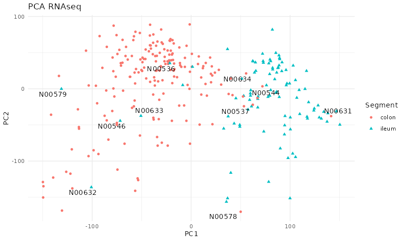

\afterpage{\setcounter{chapshift}{0}}

# (APPENDIX) Appendix {-}

# Online resources

Some links that we found useful on the thesis and could be useful if you are interested on the multi-omics field.

-   [Awesome multi-omics https://github.com/mikelove/awesome-multi-omics](https://github.com/mikelove/awesome-multi-omics) : An online repository of references to multi-omics methods. Reproduced here with their references [^references-1]:

    [^references-1]: Consulted on 2021/11/10 from <https://github.com/mikelove/awesome-multi-omics>

| Method                         | Publication                   |
| :----------------------------: | :---------------------------: |
| SCCA                           | [@parkhomenko2009]            |
| PCCA                           | [@waaijenborg2008]            |
| PMA                            | [@witten2009]                 |
| sPLS                           | [@lêcao2009]                  |
| gesca                          | [@hwang2009]                  |
| Regularized dual CCA           | [@soneson2010]                |
| RGCCA                          | [@tenenhaus_regularized_2011] |
| SNMNMF                         | [@zhang2011]                  |
| scca                           | [@lee2011]                    |
| STATIS                         | [@abdi2012]                   |
| joint NMF                      | [@zhang2012]                  |
| sMBPLS                         | [@li2012]                     |
| Bayesian group factor analysis | [@virtanen2012]               |
| RIMBANET                       | [@zhu2012]                    |
| FactoMineR                     | [@abdi2013]                   |
| JIVE                           | [@lock2013a]                  |
| pandaR                         | [@schlauch2017]               |
| omicade4                       | [@meng2014]                   |
| STATegRa                       | [@planell2021]                |
| Joint factor model             | [@ray2014]                    |
| GFAsparse                      | [@bunte2016]                  |
| Sparse CCA                     | [@chen2013]                   |
| CCAGFA                         | [@leppäaho2017]               |
| CMF                            | [@klami2014]                  |
| MOGSA                          | [@meng2018]                   |
| iNMF                           | [@yang2016]                  |
| BASS                           | [@zhao2015]                   |
| imputeMFA                      | [@voillet2016]                |
| PLSCA                          | [@beaton2016]                 |
| mixOmics                       | [@singh2019]                  |
| mixedCCA                       | [@yoon2019]                   |
| SLIDE                          | [@gaynanova2017]              |
| fCCAC                          | [@madrigal2017]               |
| TSKCCA                         | [@yoshida2017]                |
| SMSMA                          | [@kawaguchi2017]              |
| AJIVE                          | [@feng2018]                   |
| MOFA                           | [@argelaguet2020]             |
| PCA+CCA                        | [@brown2018]                  |
| JACA                           | [@zhang2020]                  |
| iPCA                           | [@tang2021]                   |
| pCIA                           | [@min2019]                    |
| sSCCA                          | [@safo2018]                   |
| SWCCA                          | [@min2017]                    |
| OmicsPLS                       | [@bouhaddani2018]             |
| SCCA-BC                        | [@pimentel2018]               |
| WON-PARAFAC                    | [@kim2019]                    |
| BIDIFAC                        | [@lock2020]                   |
| maui                           | [@ronen2019]                  |
| SmCCNet                        | [@shi2019]                    |
| msPLS                          | [@csala2020]                  |
| MOTA                           | [@fan2020]                    |
| D-CCA                          | [@shu2020]                    |
| COMBI                          | [@hawinkel2020]               |
| DPCCA                          | [@gundersen2020]              |
| MEFISTO                        | [@velten2020]                 |
| MultiPower                     | [@tarazona2020]               |
Table: (#tab:appendix-methods) Integration methods available and their references.

<!-- #Check https://github.com/mikelove/awesome-multi-omics -->

-   [Bookdown](https://github.com/rstudio/bookdown/): The book about how to write this type of books.

-   [Bioconductor](https://bioconducto.org "Bioconductor"): The project about bioinformatics on R mostly related to sequencing technologies.

-   [CRAN](https://cran.r-project.org "CRAN"): The main archive of R extensions/packages for R.

-   [GitHub](https://github.com "GitHub"): Company which allows to freely host remote [git](https://git-scm.com/ "git") repositories of many projects, including some used or developed on this thesis.

# Software

Along the years of this thesis several pieces of software have been generated as well as packages.
Here they are listed for easier retrieval.
They are listed on two ways, one with a brief explanation and another one ordered by what software piece is used on each analysis.

## STAR

The parameters and options used with STAR are:

    STAR \
        --outSAMtype BAM SortedByCoordinate \
        --outFilterIntronMotifs RemoveNoncanonical \
        --outSAMattributes All \
        --outReadsUnmapped Fastx \
        --outSAMstrandField intronMotif \
        --outFilterScoreMinOverLread 0.5 \
        --outFilterMatchNminOverLread 0.5 \
        --outFilterType BySJout \
        --alignSJoverhangMin 8 \
        --alignSJDBoverhangMin 1 \
        --outFilterMismatchNmax 999 \
        --outFilterMismatchNoverLmax 0.04 \
        --genomeDir "$genome/STAR" \
        --limitBAMsortRAM 10000000000 \
        --runMode alignReads \
        --genomeLoad NoSharedMemory \
        --quantMode TranscriptomeSAM \
        --outFileNamePrefix $output \
        --runThreadN "$threads" \
        --readFilesCommand zcat \
        --readFilesIn "$file1" "$file2"

The `$genome` is the path to the location on the computer where the genome is, `$output` is the prefix of the output file, `$threads` is the number of threads used and `$file1` and `$file2` are the paired fastq files.

## RSEM

Code used for RSEM where `$threads` is the number of threads used, `$rseminp` is the input file in BAM format, `$genome` is the path to the location on the computer where the genome is, and `$rsem` is the output file. 

    rsem-calculate-expression \
        --quiet \
        --paired-end \
        -p "$threads"  \
        --estimate-rspd \
        --append-names \
        --no-bam-output \
        --bam "$rseminp" "$genome/RSEM/RSEM" "$rsem"
        
        
## Listed

An improved/tested version of [`RGCCA`](https://github.com/llrs/RGCCA), some modifications on the internal functions to ease the maintenance as well as adding tests and sometimes improving the documentation.
Also modified so that it is possible to provide a vector of models so that the model of the first dimension is not the same as the model on the second dimension (not sure if mathematically speaking makes sense but from a biological one we think might be interesting to have it).

Designed to be used with `RGCCA` we wrote the package [inteRmodel](https:github.com/llrs/inteRmodel) to ease the bootstrapping and model selection.

A package to design batches to avoid batch effect [experDesign](https://cran.r-project.org/package=experDesign) and its website on [GitHub](https://github.com/llrs/experDesign).

Explore the effects of the hyperparameters on \acr{RGCCA} on the provided dataset of [gliomaData](https://github.com/llrs/gliomaData) (Originally provided [here](http://biodev.cea.fr/sgcca/)) there is this repository [sgcca_hyperparameters](https://github.com/llrs/sgcca_hyperparameters).

We used a pouchitis cohort published in this [article](https://dx.doi.org/10.1186/s13059-015-0637-x)[@morgan2015] that was used to compare how performs our method in other's dataset.
The code used can be found in [this repository](https://github.com/llrs/pouchitis).

Some functions used to explore the TRIM dataset ended up in the [integration](https://github.com/llrs/integration-helper) package.This include functions for correlation, network analysis, enrichment, normalization of metadata...

We developed a package to analyze sets and fuzzy sets [BaseSet](https://github.com/rOpenSci/BaseSet) (based on what we learned from a previous iteration of the [package](https://github.com/llrs/GSEAdv "GSEAdv package")).
This package was meant to be used with the probabilities that arise from bootstrapping the models.
However, due to the long times of calculation that it would require it was not used.

To analyze the \acr{BARCELONA} cohort (also named antiTNF) a [different repository](https://github.com/llrs/Barcelona "Barcelona repository") was created to analyze the data using the previously developed packages.

## By project/publication

All code of the analysis of the publications is available (in his messed state and complicated history) and a brief description as to why they were used:

[Multi-omic modelling of inflammatory bowel disease with regularized canonical correlation analysis](https://journals.plos.org/plosone/article?id=10.1371/journal.pone.0246367):

-   [TRIM](https://github.com/llrs/TRIM "HSCT dataset exploration code on github"): Mangle with the sample, dataset, explore several methods...
-   [Puget's](https://github.com/llrs/sgcca_hyperparameters "RGCCA exploration code on github"): Explore the effects of the hyperparameters on RGCCA on the provided dataset.
-   [inteRmodel](https://github.com/llrs/inteRmodel "Integration package on github"): Package for easy repeating the methodology developed on TRIM.
-   [Morgan's](https://github.com/llrs/pouchitis "Pouchitis code on github"): Work with the pouchitis cohort used in this article.
-   [Häsler's](https://github.com/llrs/Uncoupling "Uncoupling code on github"): Work with the \acr{UC}/\acr{CD} dataset used in this article.
-   [integration](https://github.com/llrs/integration-helper "Integration package on github"): Package with functions that we wrote or used on different parts of exploring the TRIM dataset ended up here.

BaseSet:

-   [BaseSet](https://cran.r-project.org/package=BaseSet "BaseSet landing page on CRAN"): Fuzzy logic implementation, available on [rOpenSci too](https://github.com/ropensci/BaseSet "BaseSet git repository") and its [documentation website](https://docs.ropensci.org/BaseSet "BaseSet") .

experDesign:

-   [experDesign](https://cran.r-project.org/package=experDesign "experDesign landing page on CRAN"): Help design experiments in batches. It has a [documentation website too](https://experDesign.llrs.dev/ "experDesign").


BARCELONA:

- [BARCELONA](https://github.com/llrs/Barcelona): Code to analyze the \acr{BARCELONA}'s dataset

Validation:

-  [Howell's](https://github.com/llrs/howell_2018): Work with Howell's 2018 dataset. 
- [Cristian's](https://github.com/llrs/cristian_mark): Work with Cristian's 2020 dataset. 


# Articles

Articles published on peer-review journals about this thesis:

## Multi-omic modelling of inflammatory bowel disease with regularized canonical correlation analysis {#app-multiomics}
<!-- Change header, https://texfaq.org/FAQ-runheadtoobig -->
\sectionmark{inteRmodel: paper}

Article peer-reviewed published on 2021, freely [available online](https://doi.org/10.1371/journal.pone.0246367).

```{r, echo=FALSE, eval=!knitr::is_html_output(excludes = "epub"), results='asis'}
cat("The same article can be find below.")
```


<!--Help page on https://texdoc.org/serve/pdfpages/0 -->
\includepdf[pages=-, pagecommand={}, templatesize={\textwidth}{\textheight  - 25pt}, trim=0 0 0 20pt,]{pdf/paper_multiomics.pdf} 

## experDesign: stratifying samples into batches with minimal bias {#app-experDesign}

\sectionmark{experDesign: paper}

Article peer-reviewed published on 2021, freely [available online](https://joss.theoj.org/papers/10.21105/joss.03358).

```{r, echo=FALSE, eval=!knitr::is_html_output(excludes = "epub"), results='asis'}
cat("The same article can be find below.")
```

\includepdf[pages=-, pagecommand={}, templatesize={\textwidth}{\textheight - \voffset}, trim=0 0 0 20pt,]{pdf/paper_experDesign.pdf}

## Randomized Controlled Trial Substudy of Cell-specific Mechanisms of Janus Kinase 1 Inhibition With Upadacitinib in the Crohn’s Disease Intestinal Mucosa: Analysis From the CELEST Study {#app-upa}

\sectionmark{CELEST: paper}

Article peer-reviewed published on 2021, freely [available online](https://joss.theoj.org/papers/10.21105/joss.03358). 
This article is not part of the PhD thesis, but included here for completeness.

```{r, echo=FALSE, eval=!knitr::is_html_output(excludes = "epub"), results='asis'}
cat("The same article can be find below.")
```

\includepdf[pages=-, pagecommand={}, templatesize={\textwidth}{\textheight - \voffset}, trim=0 0 0 20pt,]{pdf/paper_celest.pdf}


# Other datasets

## BARCELONA dataset {#barcelona}

<!--# Adapted from the ethical committee submission-->

All patients with an established diagnosis of \acr{IBD}, including Crohn's disease, ulcerative colitis, unclassified \acr{IBD}, indeterminate colitis, or pouchitis, starting treatment with a biologic agent were monitored following the schedule of clinical visits, laboratory tests, imaging procedures and biologic sampling at the beginning of their treatment with anti-TNF therapy and after 14 weeks and 46 weeks a biopsy from an ileocolonoscopy.
The protocol was approved by the Institutional Ethics Committee of the Hospital Clinic de Barcelona (Study Number HCB/2012/7845 and HCB/2012/7956).

Patients that were referred to the Hospital Clínic de Barcelona \acr{IBD} unit, who had already started treatment with a biologic agent in another center, were also included adapting to the corresponding time-schedule of their treatment.
In all patients, starting anti-\acr{TNF} treatment will be decided before the protocol entry decision according to medical clinical practice.

Anonymized identification of the patients, disease, sex age at diagnostic, age at the moment of the sample taking, time since the start of the treatment and sample segment was collected.

| Characteristic                           | BARCELONA  |
|------------------------------------------|------------|
| Individuals                              | 62         |
| Status (non\-\acr{IBD}/\acr{CD}/\acr{UC})                   | 8/33/21    |
| Sex (female/male)                        | 29/33      |
| Age at diagnostic (\<17/\<40/\>40 years) | 2/44/8     |
| Years of disease: mean (min-max)         | 7.6 (0-32) |
| Age: mean (min-max)                      | 41 (18-68) |
| Time (0/14/46 weeks)                     | 41/40/32   |
| Sample segment (ileum/colon)             | 39/87      |

Table: (#tab:BARCELONA) Samples included from the BARCELONA dataset characteristics.

<!--# Macrogen: 341f/785r not used/contaminated --->
The process of DNA extraction and sequencing was different for this dataset.
We used different 16S-V3V4 primers pair 341f/806r on a MiSeq Nano sequencing by the RTSF Genomics Core at Michigan State University, United State of America.
The sequence of the primers used was:

341f: 5'-CCTACGGGAGGCAGCAG-3'\
806r: 5'-GGACTACHVHHHTWTCTAAT-3'

The result of MiSeq Nano were processed with bcl2fastq (v1.8.4).

This dataset was processed as usual but as part of the quality controls of the dataset the diversity measures of the samples was analyzed and displayed in figure \@ref(fig:barcelona-diversity):

```{r barcelona-diversity, fig.cap = "Diversity indices of Barcelona according to the location and disease status. There is a lot of diversity between different groups but importantly the control samples overlap with the patients with inflammatory bowel disease.", fig.scap = "Diversity indices of Barcelona according to the location and disease status."}
knitr::include_graphics("images/barcelona-diversity.png")
```

Control samples diversity should be lower and not on the same range as with samples of patients with \acr{IBD}.
The dataset's \acr{16S} was sequenced several times by different platforms.
Despite the pilots and the negative controls on the sequencing process, each time there were different problems: contamination, low quality and then this suspicious diversity.
It does not seem to be a problem of the sequencing facility, so this data was abandoned as unreliable.

## Hernández' dataset {#hernandez}

This dataset was obtained from collaborators at Mount Sinai, Toronto, Canada [@hernández-rocha2021].

Patients with \acr{UC}, \acr{CD} were recruited when attending regularly scheduled visits or surveillance.
In addition, asymptomatic healthy controls (HC) were recruited during routine, age-related colorectal cancer screening by colonoscopy.
290 samples were collected together with information about the disease, age at diagnosis, age at the moment of the sampling, sex, sample location and smoking status.

| Characteristic                           | Hernández' |
|------------------------------------------|------------|
| Disease (non\-\acr{IBD}/\acr{CD}/\acr{UC})                  | 46/54/66   |
| Age at diagnostic (\<17/\<40/\>40 years) | 29/73/18   |
| Age: mean (min-max)                      | 40 (17-71) |
| Sex (female/male)                        | 81/85      |
| Smoking (never/ex/current)               | 115/34/16  |
| Sample Location (ileum/colon)            | 97/193     |

Table: (#tab:hernandez) Characteristics of samples included from Hernández's dataset. 

### Results {#results-hernandez}

It substitutes the \acr{BARCELONA} dataset (See section \@ref(barcelona)on it purpose to confirm the results on the previous datasets.
However, at the time of writing the process is not complete.

```{r, fig.scap="PCA of RNAseq of the Hernandez's dataset", fig.cap="PCA of RNAseq of the Hernandez's dataset. The plot shows a clear separation between colon and ileum for most samples except for some that seem mislabeled."}

```

There seems to be some samples that might be mislabeled as their corresponding RNA profile does not match those samples of the similar location. 
This could be from taking the sample from a region near a surgery, for which the expression profile might not match the usual patterns.

# Models output

<!--# TODO include files for these genes and otus?-->`

```{r handle}
format_models <- function(x, scap, cap){
  max_rows <- 30
  tables_n <- 2
  xx <- x[seq_len(max_rows*tables_n), ]
  a <- split(xx, rep(letters[seq_len(tables_n)], each = max_rows))
  y <- kable(a[[1]], align = rep("c", ncol(x)), caption.short = scap, caption = cap, 
             row.names = FALSE, booktabs = TRUE, longtable = TRUE)
  # dims <- dim(data)
  # nrow <- nrow(data)
  # ncol <- ncol(data) + as.numeric(!all(rownames(data) == seq_len(nrow(data))))
  # k <- kable_styling(x, latex_options = c("striped", "HOLD_position", "repeat_header"), 
  #                           full_width = FALSE, fixed_thead = TRUE)
  # k <- column_spec(k, column = 2, border_left = TRUE, bold = TRUE, include_thead = FALSE)
  # k <- column_spec(k, column = ncol, border_right = TRUE, bold = FALSE, include_thead = FALSE)
  # row_spec(k, row = 0, bold = TRUE, italic = TRUE)
  y
}

genes_names <- function(x) {
  x <- as.character(x)
  if (any(startsWith(x, "ENSG"))) {
    x <- strtrim(x, 15)
    EnsDb.Hsapiens.v86::mapIds(EnsDb.Hsapiens.v86, 
                               keys = ~ x[tx_biotype == "protein_coding"], 
                               keytype =  "GENEID", 
                               column = "SYMBOL")
  }
  
}

read_table <- function(dataset, model, option = 1) {
  path <- paste0("data/", dataset, "_m", model, ".RDS")
  model <- readRDS(path)
  m <- model$a[[option]][, 1, drop = FALSE]
  m <- m[m[, 1] != 0, , drop = FALSE]
  m <- as.data.frame(m)
  m$variables <- rownames(m)
  rownames(m) <- NULL
  m <- m[, c(2, 1)]
  max_width <- 20
  if (option == 1) {
    colnames(m) <- c("Gens", "Weight")
  } else if (option == 2) {
    colnames(m) <- c("Bacterias ID", "Weight")
    width <- nchar(m[, 1])
    m[, 1] <- ifelse(width > max_width, paste0(strtrim(m[, 1], max_width), "..."), m[, 1])
  }
  m[order(abs(m$Weight), decreasing = TRUE), ]
}
```

The following appendices show the top variables for models of each dataset and their weight according to a model. 

## HSCT
### Genes

```{r hsct-genes}
format_models(read_table("hsct", "0"), 
              scap = "HSCT genes weight in model 0", 
              cap = "HSCT genes weight in model 0. Genes (with the ENSEMBL ID) and their weight on the first dimension of model 0 in HSCT dataset.")
```

```{r hsct-genes-1-2}
format_models(read_table("hsct", "1.2"), 
              scap = "HSCT genes weight in model 1.2", 
              cap = "HSCT genes weight in model 1.2. Genes (with the ENSEMBL ID) and their weight on the first dimension of model 1.2 in HSCT dataset.")
```

```{r hsct-genes-2-2}
format_models(read_table("hsct", "2.2"), 
              scap = "HSCT genes weight in model 2.2", 
              cap = "HSCT genes weight in model 2.2. Genes (with the ENSEMBL ID) and their weight on the first dimension of model 2.2 in HSCT dataset.")
```

### Microbiome

```{r hsct-microbiome}
format_models(read_table("hsct", "0", option = 2), 
              scap = "HSCT microbiome weight in model 0", 
              cap = "HSCT microbiome weight in model 0. OTUs and their weight on the first dimension of model 0 in HSCT dataset.")
```
```{r hsct-microbiome-1-2}
format_models(read_table("hsct", "1.2", option = 2), 
              scap = "HSCT microbiome weight in model 1.2", 
              cap = "HSCT microbiome weight in model 1.2. OTUs and their weight on the first dimension of model 1.2 in HSCT dataset.")
```
```{r hsct-microbiome-2-2}
format_models(read_table("hsct", "2.2", option = 2), 
              scap = "HSCT microbiome weight in model 2.2", 
              cap = "HSCT microbiome weight in model 2.2. OTUs and their weight on the first dimension of model 2.2 in HSCT dataset.")
```

## Häsler

### Genes

```{r hasler-genes}
format_models(read_table("hasler", "0"), 
              scap = "H\u00E4sler genes weight in model 0", 
              cap = "H\u00E4sler genes weight in model 0. Genes and their weight on the first dimension of model 0 in H\u00E4sler dataset.")
```
```{r hasler-genes-1-2}
format_models(read_table("hasler", "1.2"), 
              scap = "H\u00E4sler genes weight in model 1.2", 
              cap = "H\u00E4sler genes weight in model 1.2. Genes and their weight on the first dimension of model 1.2 in H\u00E4sler dataset.")
```
```{r hasler-genes-2-2}
format_models(read_table("hasler", "2.2"), 
              scap = "H\u00E4sler genes weight in model 2.2", 
              cap = "H\u00E4sler genes weight in model 2.2. Genes and their weight on the first dimension of model 2.2 in H\u00E4sler dataset.")
```

### Microbiome

```{r hasler-microbiome}
format_models(read_table("hasler", "0", option = 2), 
              scap = "H\u00E4sler microbiome weight in model 0", 
              cap = "H\u00E4sler microbiome weight in model 0. ASVs and their weight on the first dimension of model 0 in H\u00E4sler dataset.")
```
```{r hasler-microbiome-1-2}
format_models(read_table("hasler", "1.2", option = 2), 
              scap = "H\u00E4sler microbiome weight in model 1.2", 
              cap = "H\u00E4sler microbiome weight in model 1.2. ASVs and their weight on the first dimension of model 1.2 in H\u00E4sler dataset.")
```
```{r hasler-microbiome-2-2}
format_models(read_table("hasler", "2.2", option = 2), 
              scap = "H\u00E4sler microbiome weight in model 2.2", 
              cap = "H\u00E4sler microbiome weight in model 2.2. ASVs and their weight on the first dimension of model 2.2 in H\u00E4sler dataset.")
```

## Morgan
### Genes

```{r morgan-genes}
format_models(read_table("morgan", "0"), 
              scap = "Morgan genes weight in model 0", 
              cap = "Morgan genes weight in model 0. Genes and their weight on the first dimension of model 0 in Morgan dataset.")
```
```{r morgan-genes-1-2}
format_models(read_table("morgan", "1.2"), 
              scap = "Morgan genes weight in model 1.2", 
              cap = "Morgan genes weight in model 1.2. Genes and their weight on the first dimension of model 1.2 in Morgan dataset.")
```
```{r morgan-genes-2-2}
format_models(read_table("morgan", "2.2"), 
              scap = "Morgan genes weight in model 2.2", 
              cap = "Morgan genes weight in model 2.2. Genes and their weight on the first dimension of model 2.2 in Morgan dataset.")
```

### Microbiome

```{r morgan-microbiome}
format_models(read_table("morgan", "0", option = 2), 
              scap = "Morgan microbiome weight in model 0", 
              cap = "Morgan microbiome weight in model 0. OTUs and their weight on the first dimension of model 0 in Morgan dataset.")
```
```{r morgan-microbiome-1-2}
format_models(read_table("morgan", "1.2", option = 2), 
              scap = "Morgan microbiome weight in model 1.2", 
              cap = "Morgan microbiome weight in model 1.2. OTUs and their weight on the first dimension of model 1.2 in Morgan dataset.")
```
```{r morgan-microbiome-2-2}
format_models(read_table("morgan", "2.2", option = 2), 
              scap = "Morgan microbiome weight in model 2.2", 
              cap = "Morgan microbiome weight in model 2.2. OTUs and their weight on the first dimension of model 2.2 in Morgan dataset.")
```

## Howell
### Genes

```{r howell-genes}
format_models(read_table("howell", "0"), 
              scap = "Howell genes weight in model 0", 
              cap = "Howell genes weight in model 0. Genes and their weight on the first dimension of model 0 in Howell dataset.")
```
```{r howell-genes-1-2}
format_models(read_table("howell", "1.2"), 
              scap = "Howell genes weight in model 1.2", 
              cap = "Howell genes weight in model 1.2. Genes and their weight on the first dimension of model 1.2 in Howell dataset.")
```
```{r howell-genes-2-2}
format_models(read_table("howell", "2.2"), 
              scap = "Howell genes weight in model 2.2", 
              cap = "Howell genes weight in model 2.2. Genes and their weight on the first dimension of model 2.2 in Howell dataset.")
```

### Microbiome

```{r howell-microbiome}
format_models(read_table("howell", "0", option = 2), 
              scap = "Howell microbiome weight in model 0", 
              cap = "Howell microbiome weight in model 0. OTUs and their weight on the first dimension of model 0 in Howell dataset.")
```
```{r howell-microbiome-1-2}
format_models(read_table("howell", "1.2", option = 2), 
              scap = "Howell microbiome weight in model 1.2", 
              cap = "Howell microbiome weight in model 1.2. OTUs and their weight on the first dimension of model 1.2 in Howell dataset.")
```
```{r howell-microbiome-2-2}
format_models(read_table("howell", "2.2", option = 2), 
              scap = "Howell microbiome weight in model 2.2", 
              cap = "Howell microbiome weight in model 2.2. OTUs and their weight on the first dimension of model 2.2 in Howell dataset.")
```
